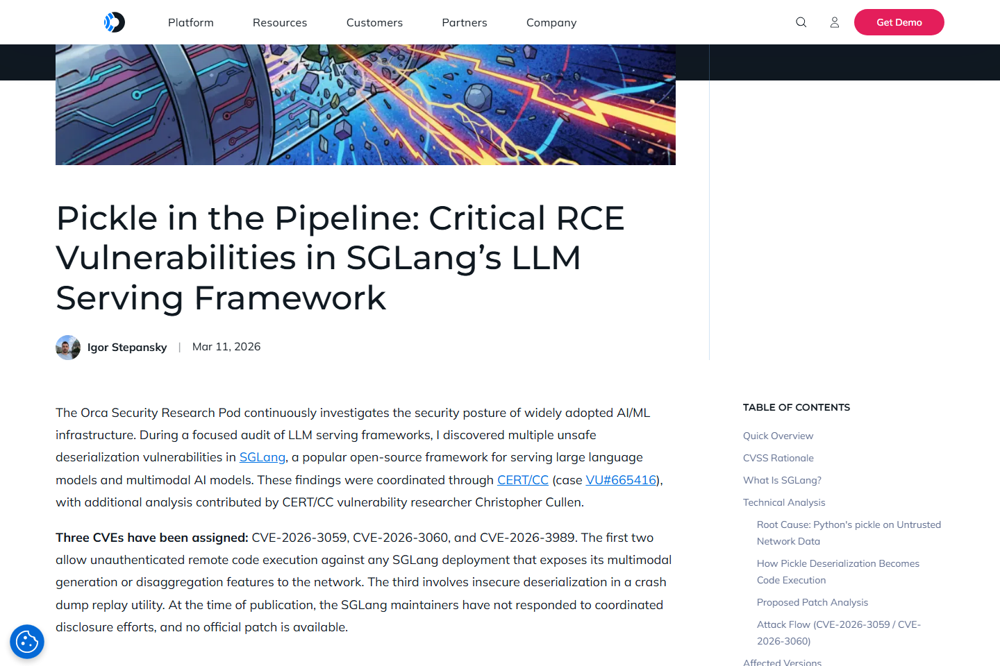
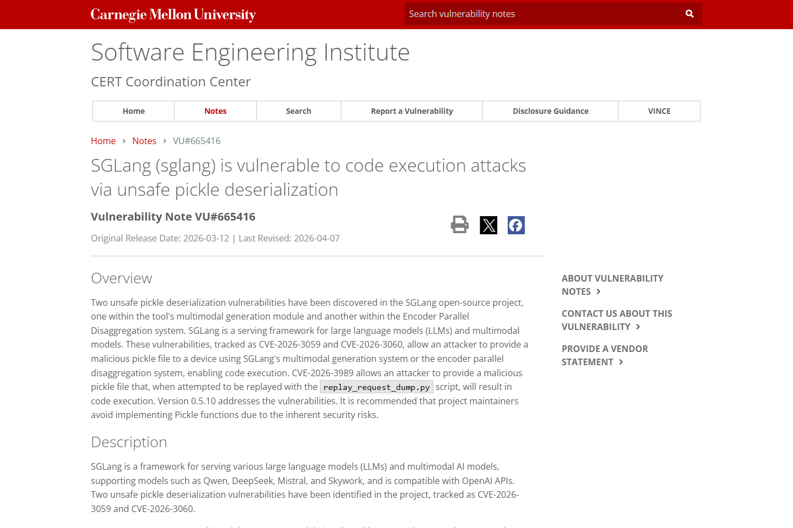
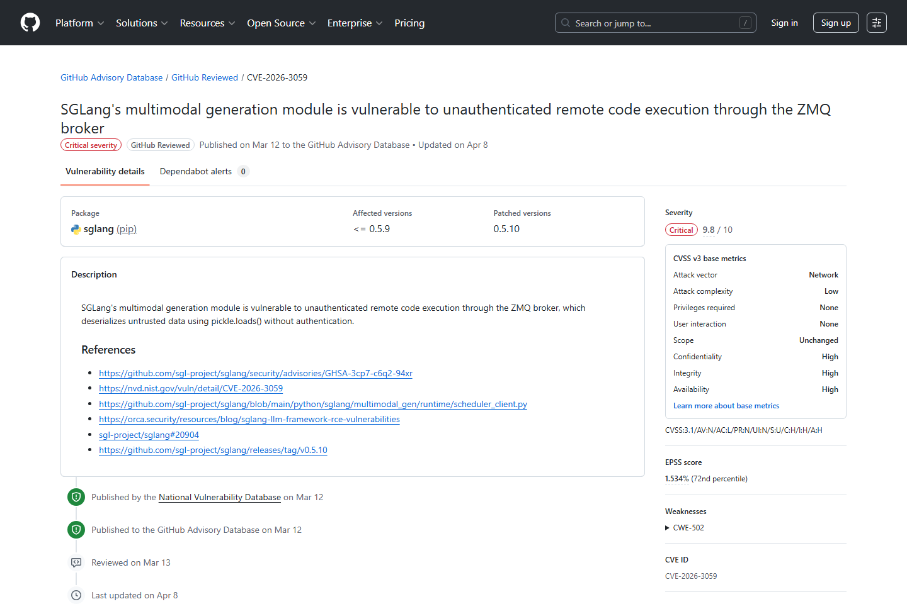
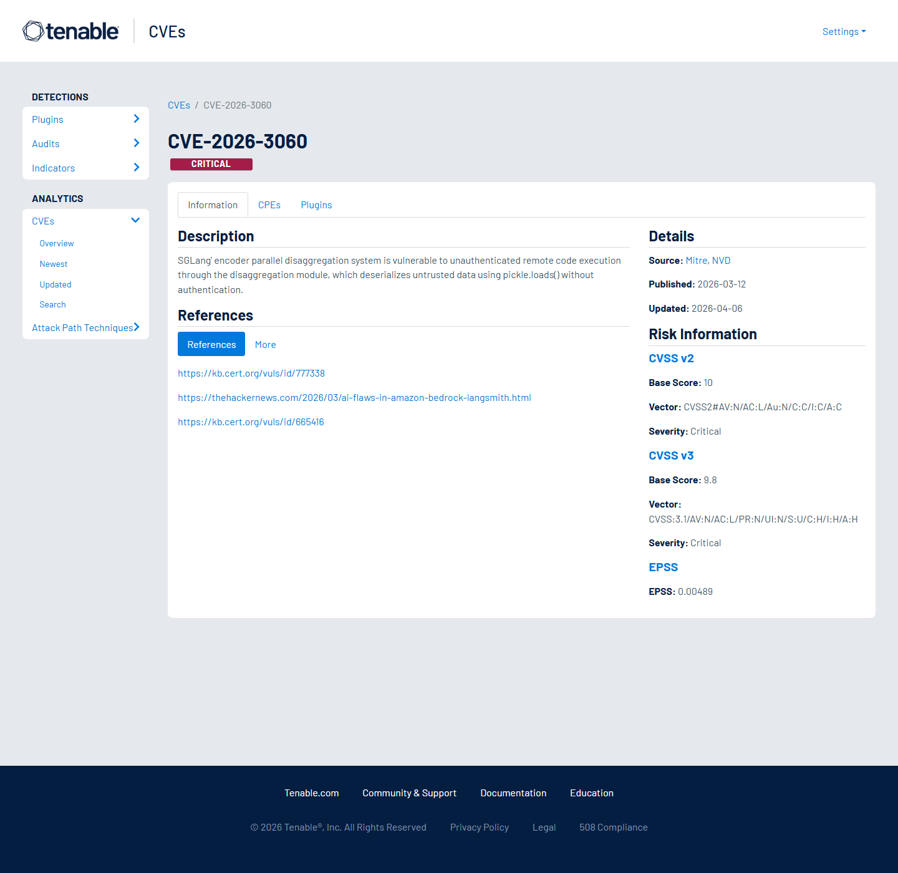
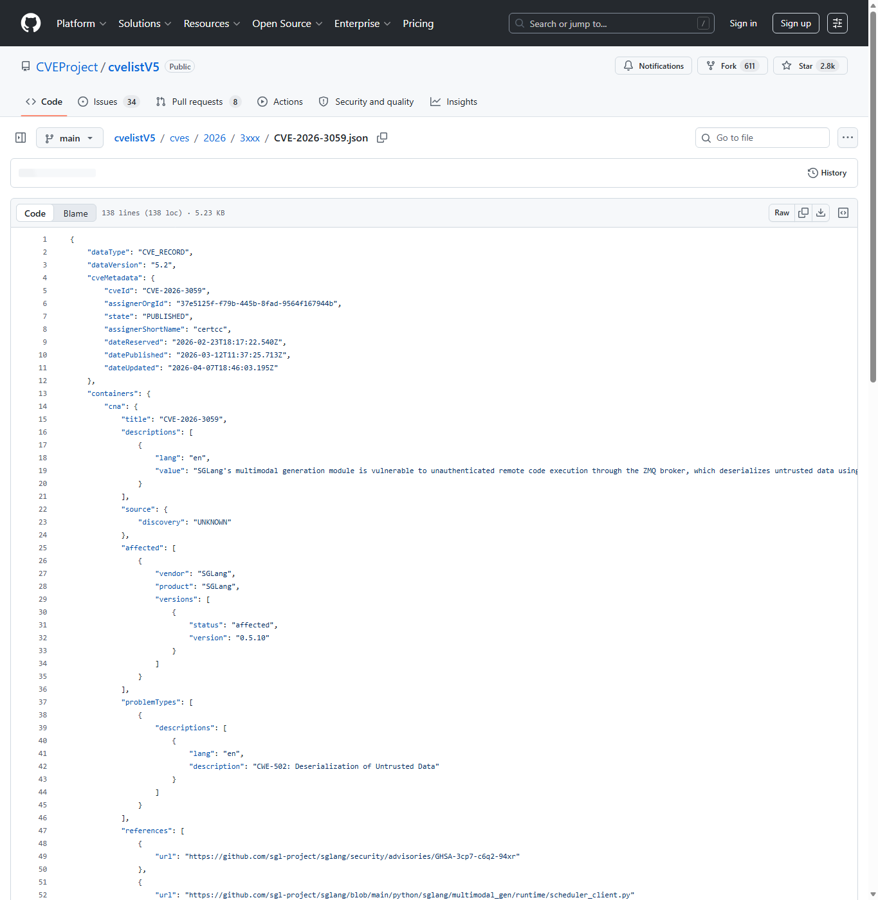
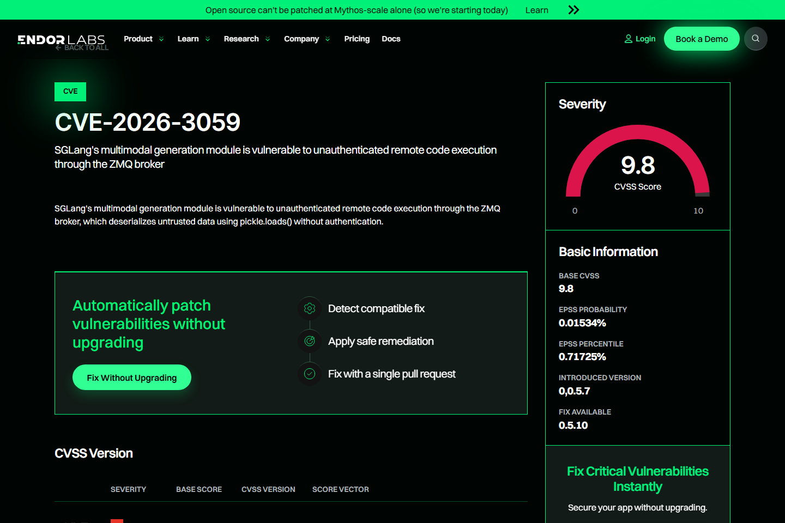

# SGLang ZMQ Pickle Deserialization RCE (2026)
> SGLang ZMQ Pickle 反序列化远程代码执行

| Field | Value |
|---|---|
| Category | domain-specific |
| Severity | Critical |
| AI Tool | SGLang, LLM serving framework, ZMQ broker, Multimodal generation runtime |
| Language | Python |
| Real Incident | Yes |
| Reproducible | Yes |
| Disclosed | 2026-03-12 |
| CVE | CVE-2026-3059, CVE-2026-3060 |
| CVSS | 9.8 |

## TL;DR
SGLang exposed unauthenticated ZMQ pickle deserialization paths in LLM serving components.
> SGLang ZMQ Pickle 反序列化远程代码执行：可在 SGLang 进程上下文执行任意代码，影响模型服务主机和推理基础设施。

---

## 基本信息

| 项目 | 内容 |
|---|---|
| 案例时间 | 2026-03-12 |
| 事件对象 | SGLang LLM serving framework 的多模态生成与调度相关组件 |
| 事件类型 | ZMQ broker 对不可信网络数据执行 pickle.loads 导致 RCE |
| 攻击入口 | 攻击者访问暴露的 ZMQ 端口，发送恶意 pickle payload。 |
| 主要影响 | 可在 SGLang 进程上下文执行任意代码，影响模型服务主机和推理基础设施。 |
| 修复方向 | 升级修复版本，禁止 pickle 处理不可信输入，并把推理内部端口限制在受控网络。 |

## 摘要

SGLang 案例是 LLM serving 基础设施中的经典反序列化风险。CERT/CC VU#665416 和 Orca Security 报告显示，SGLang 的 ZMQ 相关组件存在两个 unsafe pickle deserialization 漏洞，攻击者可在无需认证的情况下通过网络消息触发远程代码执行。
它的代表性在于漏洞位于模型服务的内部通信层，而不是公开推理 API 本身。很多推理框架为了性能会引入 scheduler、worker、broker 和 GPU 任务通道，这些组件在设计时常被当作内部可信环境处理。实际部署一旦把内部端口暴露到网络，性能优化路径就会变成远程攻击面。

## 一、公开材料概况

Orca、CERT/CC、GitHub Advisory、CVEProject cvelistV5 和 Endor Labs 对 CVE-2026-3059、CVE-2026-3060 给出了相互印证。公开材料可确认问题涉及 ZMQ broker、pickle.loads、缺少认证和 LLM serving 组件；现有记录没有给出特定企业被攻破清单，但清楚指向可远程触发的 AI 推理基础设施漏洞。
多来源材料都强调了同一个危险组合：无认证网络消息进入 Python pickle 反序列化。单独使用 pickle 已经需要强信任前提，单独暴露内部 broker 也会增加攻击面；二者叠加后，攻击者可以绕开模型 API 层，直接攻击服务框架的执行进程。

| 来源 | 类型 | 证明内容 |
|---|---|---|
| Orca Security: Critical RCE Vulnerabilities in SGLang LLM Framework | 技术证据 | 解释 ZMQ、pickle.loads 和 CVSS 9.8。 |
| CERT/CC VU#665416: SGLang code execution via unsafe pickle | 主证据 | 确认两个 unsafe pickle 漏洞。 |
| GitHub Advisory: CVE-2026-3059 | 主证据 | 确认多模态生成模块 RCE。 |
| Tenable: CVE-2026-3060 | 主证据 | 确认编码器并行组件 RCE。 |
| CVEProject cvelistV5: CVE-2026-3059 | 主证据 | 确认 CVE 描述。 |
| Endor Labs: CVE-2026-3059 | 生态证据 | 包生态层面的漏洞记录。 |

## 二、系统背景与触发条件

SGLang 用于服务多种大语言模型和多模态模型，兼容 OpenAI 风格 API。为了提高推理吞吐和组件通信效率，框架内部会使用调度器、worker 和消息通道。内部通道一旦暴露到网络，原本只面向受信任组件的序列化格式就会成为远程攻击入口。
生产推理环境通常部署在 GPU 节点、容器集群或多机服务池中。为了调试、扩容或横向通信，内部端口有时会被绑定到非本地地址，甚至被云安全组或容器网络暴露。攻击者并不需要理解模型推理逻辑，只要能向 broker 发送恶意序列化消息，就可能进入执行进程。

## 三、攻击链路与处置过程

攻击链从暴露的 ZMQ 端口进入。攻击者发送构造过的 pickle 数据，服务端在 scheduler 或多模态生成组件中调用 pickle.loads，payload 在反序列化阶段执行。Orca 的分析强调，相关 broker 可默认绑定到所有网络接口且缺少认证，这让攻击不需要有效账号或用户交互。
处置时应优先确认端口暴露范围，而不只是升级 Python 包。需要检查容器端口映射、Kubernetes Service、主机防火墙、云安全组和服务发现配置。若已经暴露，应排查推理进程异常子进程、模型目录改动、服务凭据读取、GPU 节点上的持久化文件和异常外联。

## 四、技术根因分析

根因是把 Python pickle 用在不可信网络边界。pickle 设计上可以执行对象构造逻辑，不适合处理外部输入；当它与无认证 ZMQ broker 结合，内部 RPC 就变成了远程代码执行面。LLM serving 框架追求性能时，容易把内部组件信任假设扩展到实际部署网络。
安全替代方案不只是“换一个序列化库”，还包括重新定义内部协议边界。消息格式应有明确 schema，broker 应校验来源和认证，反序列化过程不能触发任意对象构造。对于必须传递复杂对象的高性能路径，也应把对象构造限制在受控类型集合内，并用进程隔离承接失败影响。

## 五、AI 参与方式与风险归因

AI 参与方式体现在受影响对象是模型服务框架，漏洞发生在推理基础设施内部通信层。模型本身没有参与攻击决策，但模型服务主机、GPU 资源和推理 API 会受到执行层漏洞影响。归因应覆盖推理框架通信协议、部署网络和反序列化选择。
这类基础设施漏洞对 AI 服务可用性影响很大。攻击者控制推理节点后，不仅能读取本地配置和模型缓存，也可能篡改返回结果、植入后门服务或消耗 GPU 资源。对依赖统一推理网关的组织，单个 serving 框架漏洞可能影响多个上层应用。

## 六、与团队技术报告风险框架的关系

团队框架中关于 AI 基础设施供应链的风险，在 SGLang 中体现为推理服务内部组件成为攻击面。AI 系统安全不能只看应用 API，还要审查模型 serving 框架的内部端口、序列化格式和默认绑定策略。

## 七、影响范围与治理建议

CVSS 9.8 说明远程、低复杂度、无认证攻击可导致高机密性、完整性和可用性影响。对生产推理集群而言，攻击者可能执行任意命令、读取模型服务凭据、劫持推理结果或利用 GPU 节点进入更深层网络。

治理上应禁用 pickle 处理外部输入，使用 JSON、protobuf 或带 schema 的安全序列化格式。ZMQ 内部端口必须绑定到 loopback 或专用网络，启用认证和防火墙限制。模型服务主机应以低权限运行，并与数据存储和控制面隔离。
运维层面还应把推理框架端口纳入扫描和基线检查。很多组织只暴露统一 API 网关，却忽略 worker、scheduler 和监控端口。安全团队应定期核对实际监听地址、容器网络策略和服务发现记录，确保内部端口不会因为调试或扩容配置被意外发布。

## 八、结论

SGLang 案例说明，AI serving 框架的内部性能优化不能建立在隐含信任上。只要内部消息通道可能被网络访问，反序列化格式就必须按外部攻击面设计。
它给推理平台的直接启示是：模型 API 之外的基础设施同样是 AI 安全边界。序列化协议、broker 认证、端口绑定和节点权限都应进入上线检查清单，而不能被视为框架内部实现细节。

## 参考来源

1. [Orca Security: Critical RCE Vulnerabilities in SGLang LLM Framework](https://orca.security/resources/blog/sglang-llm-framework-rce-vulnerabilities/)
2. [CERT/CC VU#665416: SGLang code execution via unsafe pickle](https://www.kb.cert.org/vuls/id/665416)
3. [GitHub Advisory: CVE-2026-3059](https://github.com/advisories/GHSA-rgq9-fqf5-fv58)
4. [Tenable: CVE-2026-3060](https://www.tenable.com/cve/CVE-2026-3060)
5. [CVEProject cvelistV5: CVE-2026-3059](https://github.com/CVEProject/cvelistV5/blob/main/cves/2026/3xxx/CVE-2026-3059.json)
6. [Endor Labs: CVE-2026-3059](https://www.endorlabs.com/vulnerability/cve-2026-3059)
