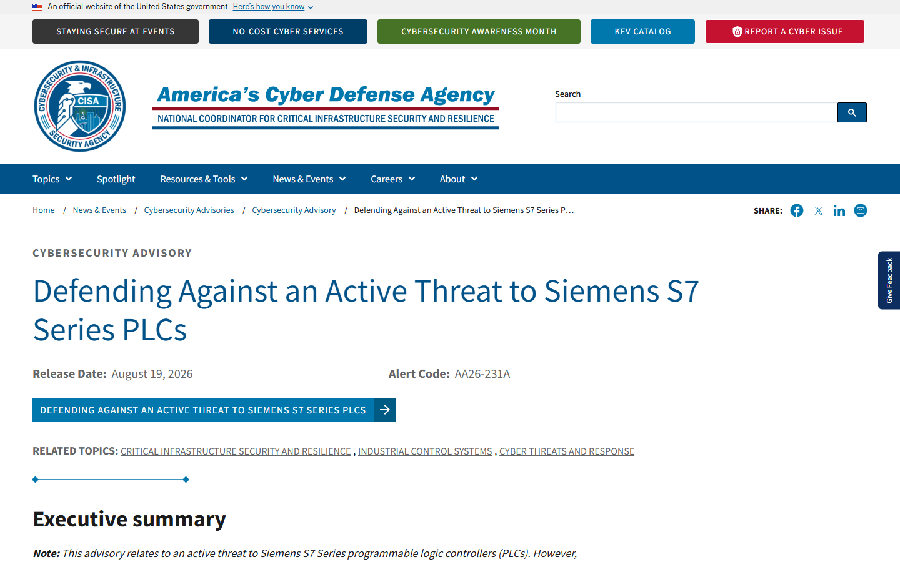
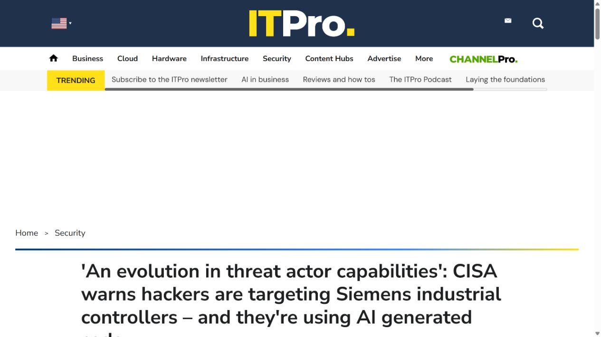
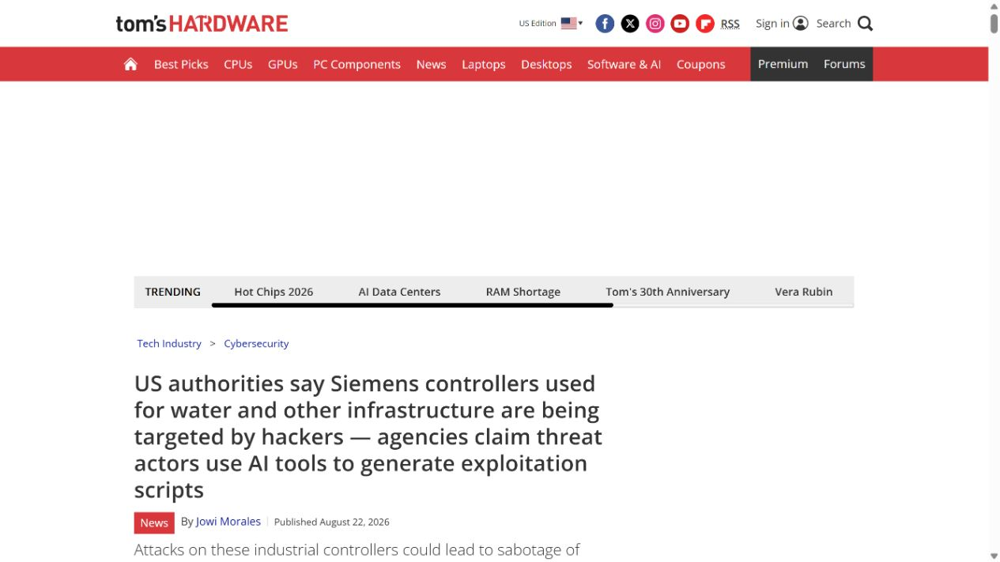
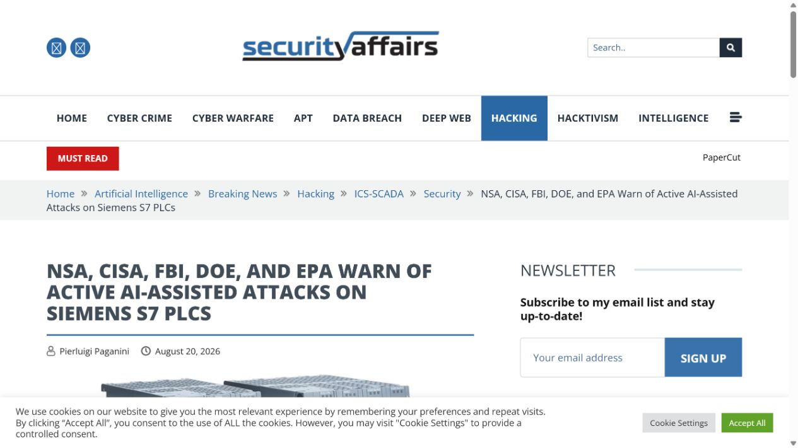
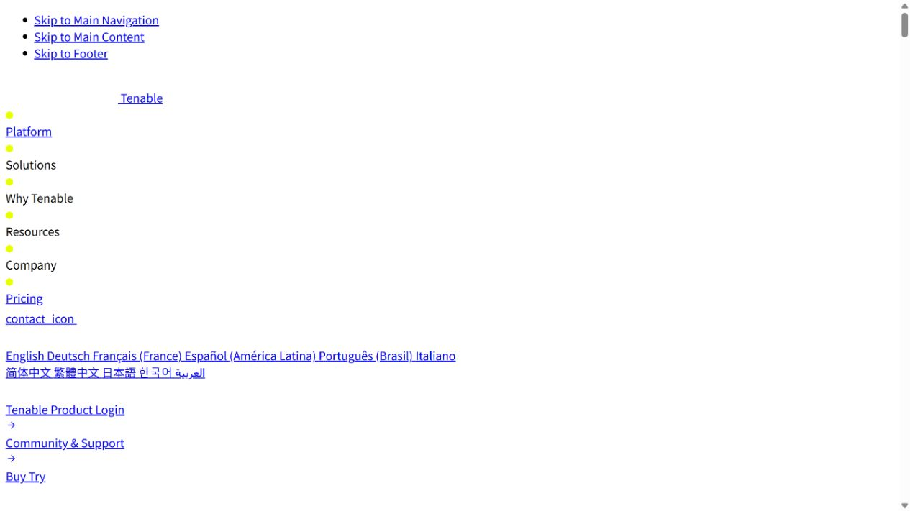

# AI-Generated Exploit Scripts Target Siemens S7 PLCs (2026)
> AI 生成利用脚本被用于探测西门子 S7 工控设备

| Field | Value |
|---|---|
| Category | malicious-use |
| Severity | Critical |
| AI Tool | Generative AI coding tools, AI-assisted scripting, python-snap7 |
| Real Incident | Yes |
| Reproducible | No |
| Disclosed | 2026-08-19 |

## TL;DR
美国五个机构联合警告，威胁行为者正用 AI 生成并快速调整针对西门子 S7 PLC 的利用脚本，把公开协议资料和 snap7 工具转成可访问控制器内存、配置与逻辑的攻击能力。

---

## 详细分析 / Full Analysis

## 一、事件概况

2026 年 8 月 19 日，CISA、NSA、FBI、美国能源部和环保署联合发布 AA26-231A，警告针对美国西门子 S7 系列 PLC 的持续侦察与能力建设。公告覆盖 S7-200 到 S7-1500 F 系列安全控制器，并将关键制造、能源、水务、化工、食品农业和商业设施列为主要目标。

联合公告称，行为者使用互联网扫描服务寻找直接暴露、固件过旧或保护薄弱的 PLC，并利用公开的 `snap7.dll` 与 `python-snap7` 等正常自动化库开发工具。与以往不同的是，机构明确观察到 AI 生成的利用脚本被伪装为合法 OT 监控软件，用来降低编写工业协议攻击工具所需的时间和专业门槛。

## 二、公开资料与事实核对

五机构联合公告是本案的主证据，直接确认威胁活动、目标产品、AI 生成脚本和处置建议。ITPro、Tom's Hardware、Security Affairs 与 Tenable 分别复核行业范围、S7comm 技术路径和防护重点。媒体报道中的归因措辞并不完全一致，因此报告不额外指定联合公告未明确给出的攻击组织。

“活动正在发生”来自政府公告，但公开材料没有列出具体受害设施、成功控制 PLC 的数量或实际物理损失。报告据此将事件定性为已确认的主动侦察与利用能力建设，而不把最坏情况下的停产、安全事故或设备损坏写成已经发生的结果。

| 来源 | 类型 | 主要核验内容 |
|---|---|---|
| [CISA Joint Cybersecurity Advisory AA26-231A](https://www.cisa.gov/news-events/cybersecurity-advisories/aa26-231a) | 政府联合公告 | 主动威胁与 AI 生成脚本 |
| [ITPro report](https://www.itpro.com/security/an-evolution-in-threat-actor-capabilities-cisa-warns-hackers-are-targeting-siemens-industrial-controllers-and-theyre-using-ai-generated-code) | 新闻复核 | 行业范围与处置 |
| [Tom's Hardware report](https://www.tomshardware.com/tech-industry/cyber-security/us-authorities-say-siemens-controllers-used-for-water-and-other-infrastructure-are-being-targeted-by-hackers-agencies-claim-threat-actors-use-ai-tools-to-generate-exploitation-scripts) | 新闻复核 | 目标设备与现实影响 |
| [Security Affairs report](https://securityaffairs.com/197566/ics-scada/nsa-cisa-fbi-doe-and-epa-warn-of-active-ai-assisted-attacks-on-siemens-s7-plcs.html) | 新闻复核 | 攻击活动复核 |
| [Tenable analysis](https://www.tenable.com/blog/frequently-asked-questions-about-the-active-threat-to-siemens-s7-series-plcs) | 安全公司分析 | S7 技术与缓解措施 |

## 三、攻击或事件过程

攻击者先通过互联网测绘定位 TCP 102 端口和可识别的 S7 设备，再结合公开固件信息与网络拓扑筛选保护薄弱的目标。snap7 原本用于工程与监控，能够读写 PLC 数据区、查询设备状态并处理 S7comm 通信。将这些库放进攻击脚本后，行为者不必从头实现工业协议。

生成式 AI 用于把设备文档、公开代码和目标反馈快速组合成 Python 脚本，并根据错误信息继续修改。联合公告认为，这种方式可帮助技术基础有限的操作者发现额外攻击向量，也能缩短对防守变化的适配时间。脚本被包装成监控工具，使其更容易混入日常运维。

一旦访问控制器，攻击者可能读取内存、配置和梯形图逻辑，并尝试改变工业过程。实际后果取决于 PLC 型号、固件、网络分区、工程站权限和安全联锁，不能仅凭端口暴露推断已经具备物理破坏能力。

## 四、技术根因

技术基础仍是经典 OT 暴露问题：控制器直接连接互联网、缺少强认证、固件陈旧，以及工程协议默认信任网络位置。AI 没有创造新的 S7comm 协议，而是把查资料、写脚本、调试和变体生成压缩进更短的循环。

这使传统依赖攻击者稀缺专业知识的风险判断失效。过去一些组织认为老旧 PLC 的协议复杂、攻击工具开发成本高，因此接受长期暴露；生成式工具把公开文档和现成库转成可运行代码后，这种成本不再是可靠防线。真正有效的控制仍是网络隔离、认证网关、补丁和异常操作监测。

## 五、AI 安全问题

AI 在本案中承担利用开发加速器的角色。联合公告明确记录了 AI 生成脚本以及根据公开资料快速开发工具的做法，影响集中在降低门槛、加快迭代和扩大可尝试的攻击向量。

这类恶意使用没有一个模型版本可供统一修补。模型提供商的滥用检测可以提高成本，却不能替代资产侧防护。安全团队需要评估公开文档被自动转成脚本并针对大量暴露设备试错的现实速度。

## 六、影响、处置与排查

处置第一步是盘点所有 S7 控制器与工程站，确认 PLC 不直接暴露在互联网，并关闭不必要的 TCP 102 访问。需要远程维护时，应通过受控跳板、VPN、多因素认证和细粒度访问列表进入，不能把工程协议端口直接交给公网。

运维团队还应升级固件，修改默认或共享凭据，禁用不需要的服务，并监测程序下载、运行模式变化、异常读写和短时间批量枚举。网络检测可以结合 S7comm 功能码、扫描节奏与来源信誉，识别伪装成监控的异常客户端。

历史排查应覆盖互联网暴露记录和控制器工程变更，检查是否出现未知工作站、陌生项目文件或非维护窗口的逻辑读取。联合公告没有发布单一恶意文件哈希，防守不能只依赖 IOC，行为与配置基线更重要。

## 七、治理建议

OT 资产管理应把“禁止公网直连”做成持续验证，而不是一次整改。外部攻击面扫描、现场网络清单和防火墙规则需要定期对账，任何临时远程维护都要有到期回收机制。安全联锁和生产控制网络还应分层，减少单台 PLC 失陷后的连锁影响。

开发与采购流程应评估公开 API、协议库和设备文档能否被快速自动化利用。厂商可以提供签名通信、更强认证、细粒度写操作控制和可审计的工程变更，降低脚本生成后直接可用的程度。

威胁情报报告在引用“AI 生成”时应保留证据来源。本案有五个政府机构的联合确认，可信度高；但成功入侵规模与物理影响仍未公开。把能力建设、尝试利用和实际破坏分开记录，才能支持准确的应急优先级。

## 八、结论

AA26-231A 把生成式 AI 用于工控攻击工具开发从实验室推测推进到现实威胁活动。防守重点应落在消除公网暴露、强化 S7 网络边界，以及监测脚本化工具对控制逻辑的异常访问。

### 参考来源

1. [CISA Joint Cybersecurity Advisory AA26-231A](https://www.cisa.gov/news-events/cybersecurity-advisories/aa26-231a)
2. [ITPro report](https://www.itpro.com/security/an-evolution-in-threat-actor-capabilities-cisa-warns-hackers-are-targeting-siemens-industrial-controllers-and-theyre-using-ai-generated-code)
3. [Tom's Hardware report](https://www.tomshardware.com/tech-industry/cyber-security/us-authorities-say-siemens-controllers-used-for-water-and-other-infrastructure-are-being-targeted-by-hackers-agencies-claim-threat-actors-use-ai-tools-to-generate-exploitation-scripts)
4. [Security Affairs report](https://securityaffairs.com/197566/ics-scada/nsa-cisa-fbi-doe-and-epa-warn-of-active-ai-assisted-attacks-on-siemens-s7-plcs.html)
5. [Tenable analysis](https://www.tenable.com/blog/frequently-asked-questions-about-the-active-threat-to-siemens-s7-series-plcs)
