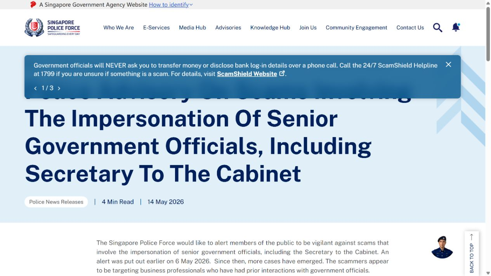
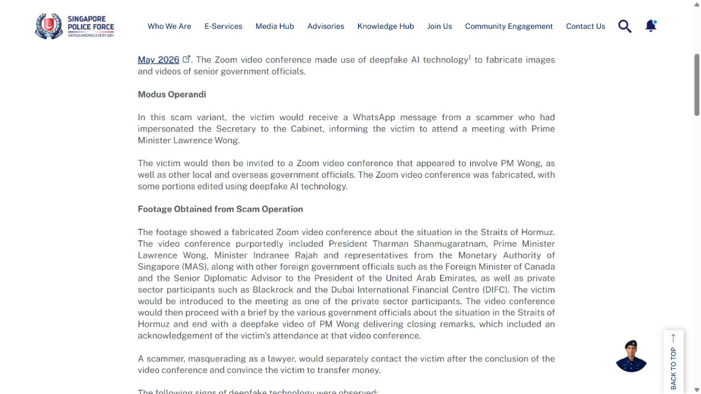
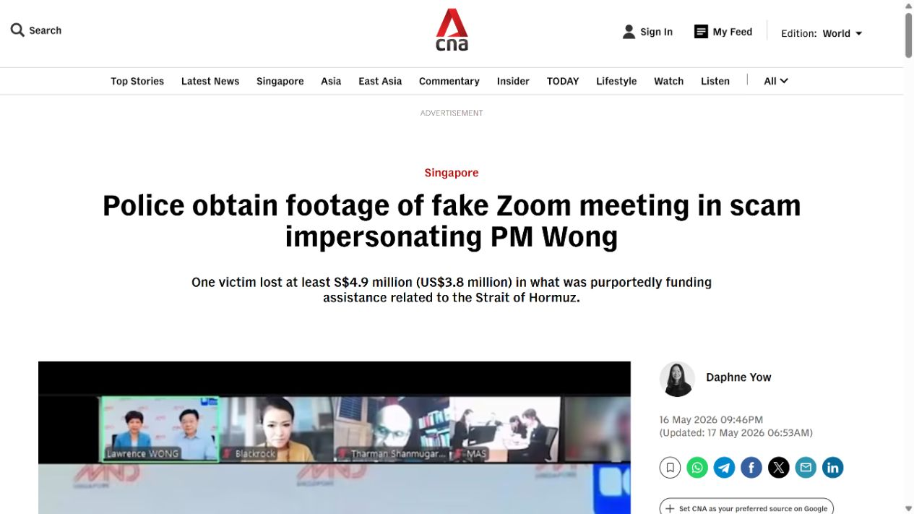
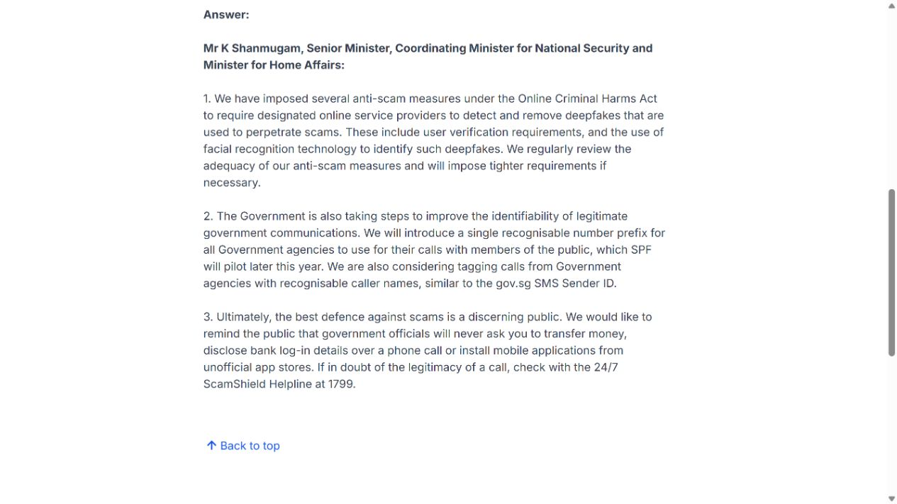
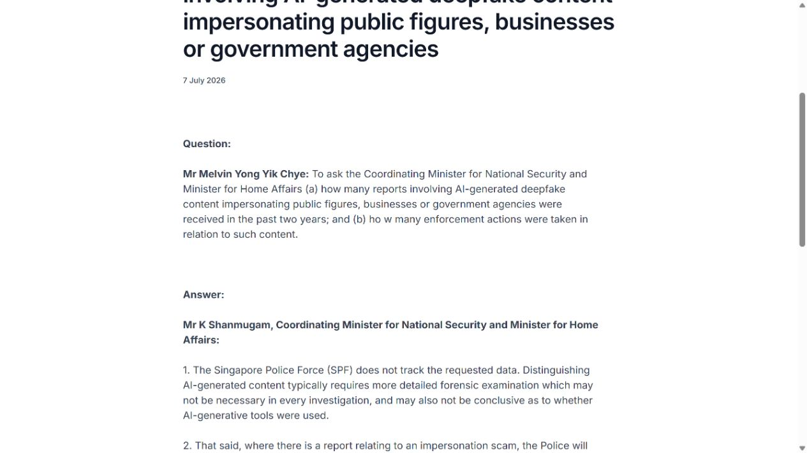

# Singapore Government Official Deepfake Zoom Scam (2026)
> 新加坡深度伪造政府官员 Zoom 诈骗案

| Field | Value |
|---|---|
| Category | human-factor |
| Severity | Critical |
| AI Tool | real-time face-swap, voice cloning, Zoom |
| Language | Multiple |
| Real Incident | Yes |
| Reproducible | No |
| Disclosed | 2026-05-14 |

## TL;DR
新加坡警方确认，一名受害者在与深度伪造总理及高级官员的 Zoom 会议后转出至少 490 万新元；诈骗同时利用伪造文件、保密要求和实时音视频冒充。

---

## 详细分析 / Full Analysis

## 一、事件概况

2026 年 5 月 14 日，新加坡警察部队通报一起冒充高级政府官员的诈骗。受害者先经 WhatsApp 和电子邮件接触，随后参加 Zoom 会议，画面中出现被伪造为总理及多名政府官员的人物。诈骗者以机密项目和资金保证为由要求转账，受害者累计损失至少 490 万新元，直到主动联系内阁秘书才发现受骗。

5 月 16 日警方发布会议片段并指出若干异常：嘴唇与声音不同步，声音似乎只从一个账户播放，背景边缘失真，部分 Zoom 标识被遮挡。官方材料因此不仅确认损失，还给出了深度伪造在实时会议中的具体表现。

## 二、公开材料与事实核对

两份警方公告是主证据，Channel NewsAsia 对受害经过、金额和会议画面进行新闻复核，内政部关于实时深度伪造检测与冒充内容执法的答复提供政策背景。5 月 9 日被捕的三人涉及此前同类案件的 SIM 卡犯罪，警方没有说他们就是 490 万新元案件的制作者，报告不作这种归因。

| 来源 | 类型 | 主要内容 |
|---|---|---|
| 5 月 14 日警方公告 | 官方通报 | 受害经过、金额和诈骗流程 |
| 5 月 16 日警方材料 | 官方取证说明 | 视频与音频异常特征 |
| Channel NewsAsia | 新闻复核 | 事件时间、金额和会议画面 |
| 内政部检测答复 | 政策资料 | 实时伪造检测能力 |
| 内政部执法答复 | 政策资料 | 冒充内容处置机制 |

## 三、攻击或事件链路

诈骗链没有只依赖一段假视频。攻击者先用文字沟通建立身份和项目背景，发送伪造的保密协议或保证文件，再安排视频会议增加可信度。会议中的多个“官员”强化权威感，并用保密要求阻止受害者向同事或政府机构核实。转账因此发生在一整套社会工程流程之后。

深度伪造负责跨过最难的一关：让受害者相信自己正在实时接触熟悉的公共人物。诈骗者仍需控制会议节奏、准备账户和处理资金。把损失全部归因于某个生成模型会忽略文本冒充、文件伪造和支付环节的共同作用。

## 四、技术根因

实时深度伪造通常将预先训练或快速适配的脸部模型叠加到操作者画面，并用语音克隆或预录音频模拟目标人物。网络压缩和小窗口会掩盖皮肤、边缘和光照缺陷；多人会议又让受害者难以持续观察每张脸。警方指出的单一音频来源和口型不同步，说明会议的音视频身份没有经过独立认证。

Zoom 只负责传输会议，并不会自动证明参与者与显示姓名或面孔相符。只靠“打开摄像头”作为高额付款的身份核验，在实时生成技术普及后已经失效。

## 五、AI 安全问题

这是生成式 AI 直接改变诈骗可信度的案例。过去冒充高级官员多依赖文字、录音或剪辑视频，受害者可以要求实时连线；现在攻击者能够在互动场景中维持相貌和声音，传统的“我亲眼看见”不再是独立证据。

AI 也降低了多角色协同的制作成本。一个操作者可以控制多个账户或预制不同角色片段，形成仿佛多名官员共同背书的效果。不过官方材料没有公开具体模型和工具，报告只描述已确认的深度伪造表现，不猜测厂商。

## 六、影响、处置与排查

至少 490 万新元的转账是已确认损失。警方还披露同一冒充模式此前出现过，并围绕 SIM 卡和通信基础设施采取执法行动，但各案件之间的人员归属需要分别判断。受害者最终通过线下可信渠道联系内阁秘书，说明独立回拨仍是阻断此类诈骗的有效步骤。

金融机构和企业排查时，应保存会议邀请、参会账户、聊天记录、文件、转账指令和银行流水。视频伪造检测结果可以提供线索，但付款审批是否绕过双人复核、收款账户是否新建、保密要求是否阻止核验，同样决定事件成败。

## 七、治理建议

高额转账、保密项目和政府身份相关请求应强制使用登记号码回拨，不能使用来信或会议中提供的联系方式。付款流程需要双人审批、收款账户冷静期和大额异常拦截；任何人都不能仅凭视频会议解除这些控制。

会议平台可提示新注册账户、显示音频实际来源并保留原始媒体供调查。组织培训应展示口型延迟、边缘变形和单一音频账户等迹象，但也要说明画面自然并不代表真实。最可靠的控制仍是跨渠道身份验证和与人物无关的交易规则。

## 八、结论

新加坡案件证明，实时深度伪造已经能够嵌入完整的高额诈骗流程，并造成可量化损失。警方材料确认了假冒对象、会议异常和至少 490 万新元转账。治理上不能把希望寄托在普通用户识别每一处画面瑕疵，而应让独立回拨、双人审批和银行风控在视频看起来完全真实时仍然有效。

### 参考来源

1. [Singapore Police Force advisory](https://www.police.gov.sg/media-hub/news/2026/05/20260514_advisory_on_scams_involving_impersonation_of_snr_govt_officials_incl_secy_cabinet)
2. [Singapore Police Force Zoom footage analysis](https://www.police.gov.sg/media-hub/news/2026/05/20260516_footage_from_zoom_video_conference_involving_impersonation_of_senior_government_officials)
3. [Channel NewsAsia report](https://www.channelnewsasia.com/singapore/impersonation-scam-fake-zoom-meeting-footage-lawrence-wong-tharman-indranee-police-6125691)
4. [MHA response on real-time deepfake detection](https://www.mha.gov.sg/media-room/newsroom/capabilities-to-detect-and-prevent-communications-of-real-time-deepfake-impersonations/)
5. [MHA response on AI-generated impersonation enforcement](https://www.mha.gov.sg/media-room/newsroom/reports-and-enforcement-actions-involving-ai-generated-deepfake-content-impersonating-public-figures-businesses-or-government-agencies/)
