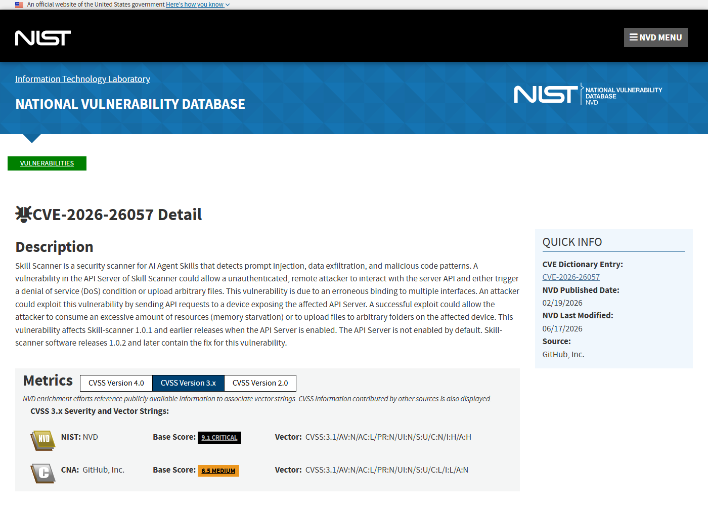
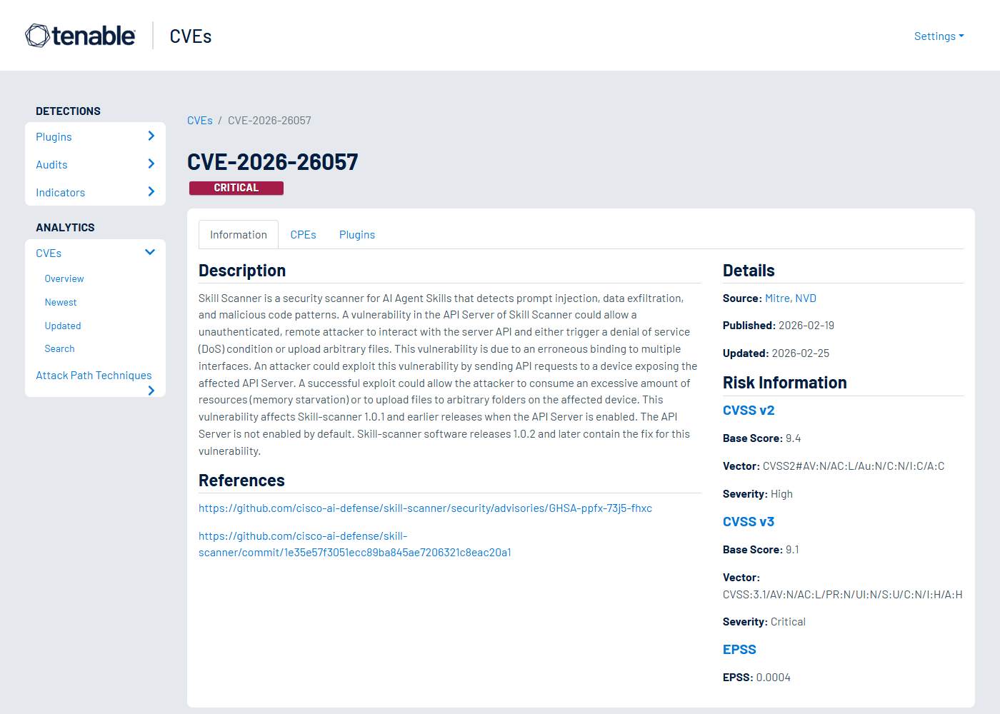
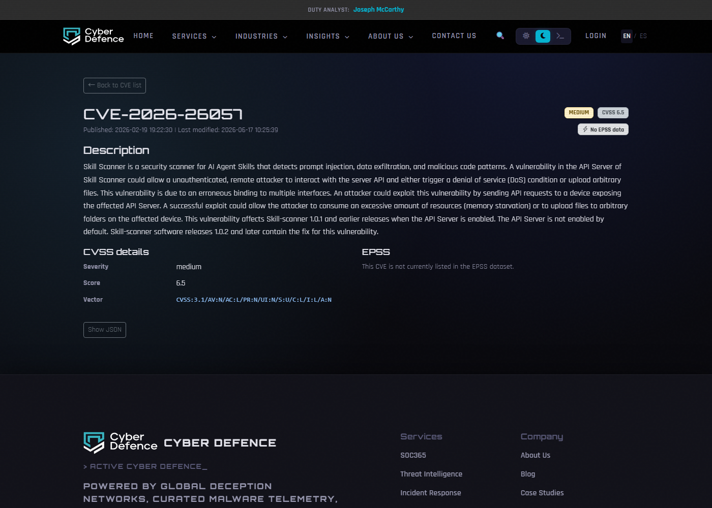
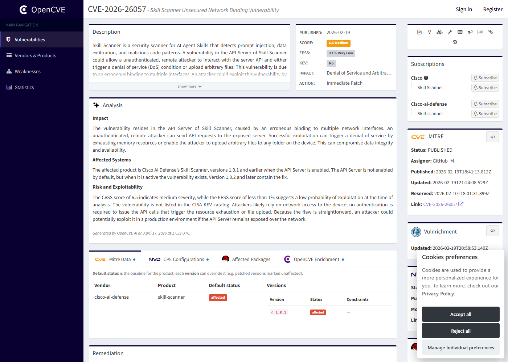

# Skill Scanner API Server Arbitrary File Upload (2026)
> Skill Scanner API Server 任意文件上传与拒绝服务

| Field | Value |
|---|---|
| Category | Supply Chain |
| Severity | Medium |
| AI Tool | Cisco AI Defense Skill Scanner, Skill-scanner API Server, AI Agent skills |
| Language | Python |
| Real Incident | Yes |
| Reproducible | Yes |
| Disclosed | 2026-03-04 |
| CVE | CVE-2026-26057 |
| CVSS | 6.5 |

## TL;DR
Skill Scanner's optional API Server bound too broadly, allowing unauthenticated remote interaction that could trigger DoS or upload files to arbitrary folders.
> Skill Scanner 可选 API Server 绑定到过多网络接口，暴露时未认证攻击者可触发资源耗尽或把文件上传到任意目录。

---

## 详细分析 / Full Analysis

## 一、基本信息

Skill Scanner 是 Cisco AI Defense 发布的 AI Agent skills 安全扫描工具，用于检测 prompt injection、数据外带和恶意代码模式。CVE-2026-26057 影响 1.0.1 及更早版本在启用 API Server 时的网络暴露方式：API Server 错误绑定到多个接口，未认证远程攻击者可以与服务 API 交互，造成内存资源耗尽，或把文件上传到受影响设备上的任意目录。该 API Server 默认未启用，但一旦为团队扫描、IDE 集成或自动化流水线打开，就会成为新的供应链检查入口。

## 二、事件核验与公开材料范围

NVD、Cisco AI Defense 的 GitHub advisory、GitHub Advisory Database 和 Red Hat 页面都确认该问题的条件：Skill-scanner 1.0.1 及更早版本、API Server enabled、错误网络绑定、DoS 或任意文件上传。Cisco 博客提供产品背景，说明 Skill Scanner 服务于 AI Agent skills 安全验证场景。本文据此把该案例归入 Agent 技能供应链防护工具自身暴露的风险。

### 证据矩阵

| 来源 | 类型 | 证明内容 |
|---|---|---|
| NVD: CVE-2026-26057 | 漏洞数据库 | API Server 暴露、DoS、任意文件上传和影响版本 |
| Cisco AI Defense Advisory: GHSA-ppfx-73j5-fhxc | 厂商公告 | API Server 绑定错误和修复建议 |
| GitHub Advisory Database: GHSA-ppfx-73j5-fhxc | 安全公告 | 漏洞描述和 CVE 关联 |
| Red Hat: CVE-2026-26057 | 发行版跟踪 | 受影响条件和漏洞描述 |
| Cisco Blog: AI Agent Security Scanner for IDEs | 产品背景 | Skill Scanner 面向 AI Agent skills 的安全扫描用途 |
| Tenable: CVE-2026-26057 | 漏洞数据库 | Skill Scanner API Server 漏洞的第三方记录 |
| Cyber Defence: CVE-2026-26057 | 漏洞数据库 | Skill Scanner API Server 文件上传和 DoS 的补充记录 |
| OpenCVE: CVE-2026-26057 | 漏洞数据库 | CVE 记录、描述和参考链接 |

## 三、系统背景与触发条件

AI Agent skills 是可复用指令、脚本和工具定义的组合，能改变 Agent 行为，甚至执行代码或访问外部系统。为了防止恶意 skill 进入开发者环境，扫描器本身变得重要。可一旦扫描器提供 API Server，安全工具也进入了网络服务模型。开发者可能为了方便 IDE 或 CI 调用而启用服务，却没有预料到它监听了不该监听的接口。安全工具在供应链中的位置越靠前，被利用后的影响也越容易扩散到多个项目。

## 四、攻击链路与处置过程

攻击者首先探测到启用了 API Server 的 Skill Scanner 实例。由于服务暴露在可访问网络接口上，攻击者可以发送未认证 API 请求。通过构造大量或特殊请求，攻击者可能耗尽内存造成拒绝服务；通过文件上传功能，攻击者可能把文件写入任意目录。若扫描器运行在开发者工作站、CI runner 或共享扫描节点上，写入位置可能影响后续扫描任务、构建流程或本地配置。

## 五、技术根因与 AI 风险归因

根因是可选 API Server 的网络绑定和访问控制不匹配。一个用于本地或受控集成的服务，如果绑定到多个接口，就必须同时具备认证、授权、路径限制和资源配额。该漏洞说明，AI 安全工具也不能默认安全；它们处理不可信 skill、prompt 和代码，往往还接入项目目录，因此服务边界需要比普通辅助工具更保守。

Skill Scanner 的案例值得注意，是因为它本身是安全工具。团队引入它，是为了检查 AI Agent skills 中的 prompt injection、恶意代码和数据外带风险；但一旦可选 API Server 暴露，扫描器就拥有了自己的攻击面。安全工具通常能访问项目目录、上传样本、读取扫描结果，并在 CI 或 IDE 中被频繁调用。未认证文件上传和资源耗尽发生在这种位置，影响的不只是扫描器进程，还可能波及被扫描项目和开发流水线。

AI Agent skills 的供应链特点让这个风险更微妙。skills 可能包含自然语言指令、脚本、工具描述、依赖和示例数据，扫描器为了分析它们需要处理大量不可信内容。开发者为了方便，会把扫描服务接到 IDE 插件、共享服务器或自动化平台。若 API Server 监听范围过大，攻击者可以绕过正常提交渠道，直接向扫描器发送请求或上传文件。这样一来，原本用于拦截恶意 skill 的组件，反而变成攻击者写入文件或拖垮扫描流程的入口。

## 六、影响范围与治理建议

该漏洞的直接影响是可用性和文件完整性，严重程度取决于 API Server 部署位置。CI 环境中，它可能让扫描任务中断或污染工作区；开发者工作站中，它可能写入配置目录或项目目录；集中扫描服务中，它可能影响多个团队的 skill 审查流程。治理上应升级到修复版本，保持 API Server 默认关闭，只监听 localhost 或受控网段，加入认证和文件路径 allowlist，并对上传大小、并发和内存使用设置限制。

复盘时应确认 API Server 是否曾经启用，以及监听地址是否只限本机。日志中可以关注异常上传路径、大文件请求、短时间重复扫描、内存占用飙升和来自非开发网段的访问。若扫描器运行在 CI runner 上，还要检查工作区是否被写入异常文件，因为这些文件可能影响后续构建、测试或发布任务。对于共享扫描节点，建议把每次扫描放进独立临时目录，任务结束后清理，避免上传文件跨任务残留。

后续治理应把 AI 安全工具纳入和业务服务相同的部署审查。默认关闭网络 API；确实需要 API Server 时，只监听 localhost 或受控内网，并加入认证、上传目录 allowlist、文件大小限制和并发限制。扫描器处理不可信 skill 时，还应采用只读项目挂载和低权限运行账户。这样可以让安全扫描继续发挥作用，同时避免安全工具因部署便利而成为供应链的新薄弱点。

安全扫描器的部署也应遵循最小信任原则。很多团队会认为扫描器处理的是“待检查的风险对象”，因此默认它比业务服务安全；但扫描器恰恰需要解析攻击者可能构造的样本，风险输入更多。API Server 暴露后，攻击者可以绕过正常 IDE 或 CI 调用路径，直接对扫描器施压。这个事实说明，安全工具不能因为目标是防护就跳过威胁建模。

在供应链治理中，Skill Scanner 这类工具最好作为隔离任务运行，而不是长期常驻高权限服务。每次扫描创建临时工作区，限制上传路径，扫描完成后销毁环境；中心化服务只负责排队、认证和结果存储。这样即使文件上传或 DoS 类问题再次出现，影响也被限制在单个扫描任务，而不会污染共享 runner 或多个项目的工作目录。

## 七、结论

CVE-2026-26057 的价值在于提醒团队，AI 安全供应链里的防护工具本身也需要威胁建模。扫描器可以识别恶意 skill，但如果它的 API Server 暴露，就会从防线变成攻击面。安全工具上线前同样要做网络绑定、认证和资源控制检查。

## 八、参考来源

- [NVD: CVE-2026-26057](https://nvd.nist.gov/vuln/detail/CVE-2026-26057)
- [Cisco AI Defense Advisory: GHSA-ppfx-73j5-fhxc](https://github.com/cisco-ai-defense/skill-scanner/security/advisories/GHSA-ppfx-73j5-fhxc)
- [GitHub Advisory Database: GHSA-ppfx-73j5-fhxc](https://github.com/advisories/GHSA-ppfx-73j5-fhxc)
- [Red Hat: CVE-2026-26057](https://access.redhat.com/security/cve/cve-2026-26057)
- [Cisco Blog: AI Agent Security Scanner for IDEs](https://blogs.cisco.com/ai/introducing-the-ai-agent-security-scanner-for-ides-verify-your-agents)
- [Tenable: CVE-2026-26057](https://www.tenable.com/cve/CVE-2026-26057)
- [Cyber Defence: CVE-2026-26057](https://www.cyber-defence.io/tools/cve/CVE-2026-26057)
- [OpenCVE: CVE-2026-26057](https://app.opencve.io/cve/CVE-2026-26057)
