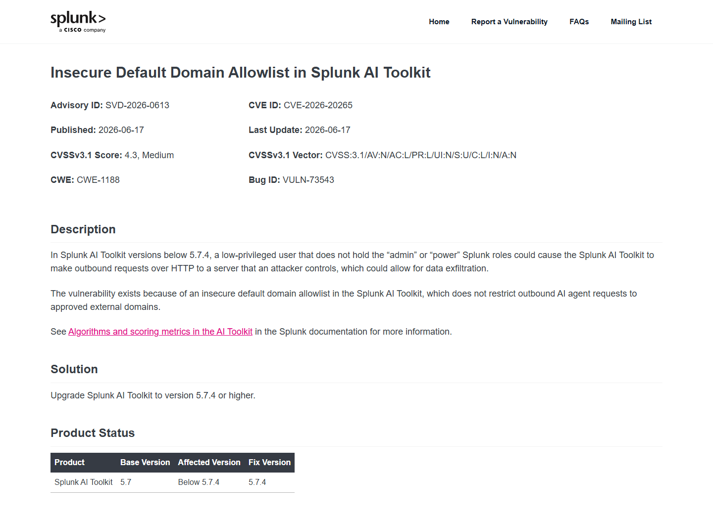
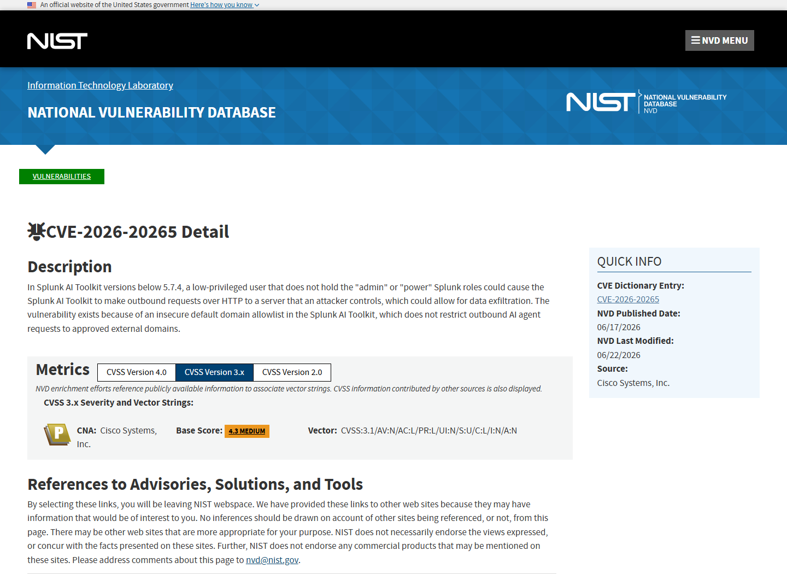
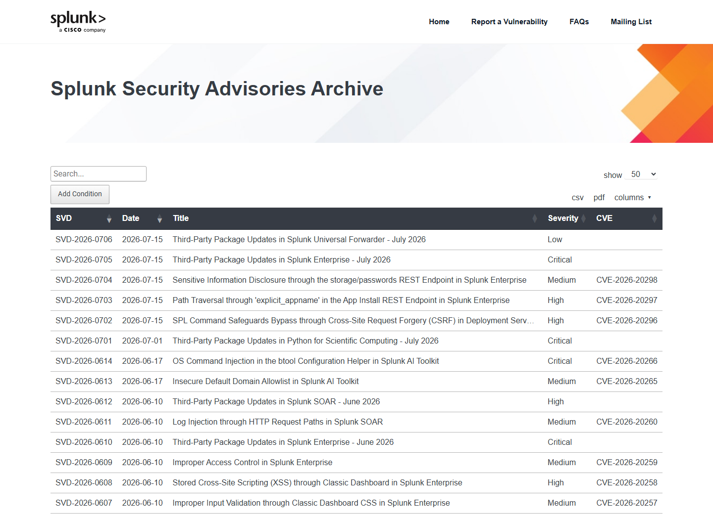
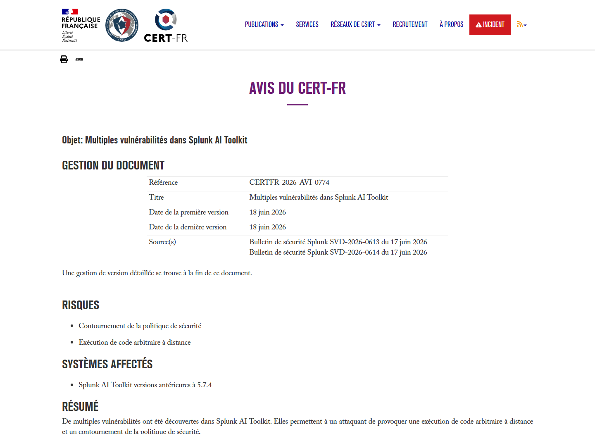
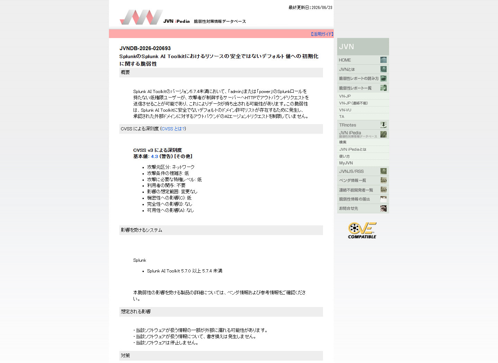

# Splunk AI Toolkit Outbound Request Data Exfiltration (2026)
> Splunk AI Toolkit 外联请求数据泄露

| Field | Value |
|---|---|
| Category | Domain-Specific Risks |
| Severity | Medium |
| AI Tool | Splunk AI Toolkit, Agent Builder, Splunk agents |
| Language | Splunk configuration / HTTP |
| Real Incident | Yes |
| Reproducible | Yes |
| Disclosed | 2026-06-17 |
| CVE | CVE-2026-20265 |
| CVSS | 4.3 |

## TL;DR
An insecure default domain allowlist let a low-privileged Splunk user make AI Toolkit agents send HTTP requests to attacker-controlled domains, creating a path for Splunk data to leave the platform.
> Splunk AI Toolkit 的默认域名白名单不安全，低权限用户可让 Agent 向攻击者域名发起 HTTP 请求，从而建立平台数据外带通道。

---

## 详细分析 / Full Analysis

## 一、基本信息与事件概况

CVE-2026-20265 影响 Splunk AI Toolkit 5.7.4 之前的版本。Splunk 在 SVD-2026-0613 中说明，既不具有 admin 也不具有 power 角色的低权限用户，可以促使 AI Toolkit 向攻击者控制的服务器发起 HTTP 请求，并可能借此外带数据。漏洞源于默认域名 allowlist 没有把 Agent 的外联限制在管理员批准的域名集合内。

Splunk 将问题评为 CVSS 4.3、Medium，原因是攻击者需要先拥有低权限 Splunk 账号，且官方评分中的机密性影响为低。不过，AI Toolkit 通常与安全日志、搜索结果、知识库和自定义工具连接，单次请求能够携带什么内容取决于 Agent 流程和用户可访问的数据，因此实际风险仍需要结合部署配置评估。

## 二、事件经过与公开材料

Splunk 于 2026 年 6 月 17 日发布 SVD-2026-0613，列出 CVE、CVSS、受影响版本、修复版本和配置级缓解措施。NVD 采用同一厂商描述，并把 5.7.0 至 5.7.4 之前的版本标为受影响。法国 CERT-FR 随后在 Splunk AI Toolkit 多漏洞公告中引用该编号，形成独立的国家级漏洞通报记录。

厂商给出的首选修复是升级到 5.7.4 或更高版本。无法立即升级时，应在 local/mlspl.conf 的 [ai:AllowedDomains] 中显式设置 approved domains，并确认 enforce_domain_validation=true；若该值为 false，Agent 会忽略域名列表。没有条件完成配置时，Splunk 建议关闭或移除 AI Toolkit。

### 证据矩阵

| 来源 | 类型 | 证明内容 |
|---|---|---|
| Splunk Advisory SVD-2026-0613 | 厂商公告 | 漏洞描述、CVSS 4.3、版本、修复和配置缓解措施 |
| NVD: CVE-2026-20265 | 漏洞数据库 | 厂商 CNA 记录、CWE、版本范围和评分 |
| CERT-FR: Multiple vulnerabilities in Splunk AI Toolkit | 国家级通报 | CVE-2026-20265 与 Splunk 公告的独立引用 |
| Splunk AI Toolkit Product Page | 产品资料 | Agent Builder、模型、知识库和外部集成的产品背景 |
| Splunk Security Advisories Archive | 厂商索引 | SVD-2026-0613 的发布时间、严重度和产品归属 |
| JVN iPedia: JVNDB-2026-020693 | 国家漏洞数据库 | CVE-2026-20265、不安全默认配置、影响版本和修复信息 |

## 三、系统背景与触发条件

Splunk AI Toolkit 把机器学习、生成式 AI 和 Agent Builder 带入 Splunk 数据平台。Agent 可以基于搜索结果和知识库进行分析，也可通过 HTTP 或 MCP 等方式调用外部能力。对安全运营环境而言，出站连接既是功能需求，也是数据离开 SIEM 边界的主要路径。

传统 Web 应用的出站请求通常由后端代码固定目标，而 Agent 平台允许用户在工作流、提示或工具参数中影响目标和内容。如果默认允许任意域名，低权限用户就能把 Agent 的网络权限当作代理使用。即使用户本身只能读取有限数据，也可能自动、持续地把可见内容发送到外部系统。

## 四、攻击链路或失效过程

攻击者先以普通 Splunk 用户登录并创建或影响 AI Toolkit 中的 Agent 行为，指定由自己控制的 HTTP 端点。Agent 执行任务时，后端依据默认配置允许该出站域名，随后把请求发往攻击者服务器。请求参数、提示上下文、搜索摘要或工具输出中若包含 Splunk 数据，外部服务器即可记录这些内容。

攻击不要求取得 Splunk 主机命令执行权限，也不需要绕过 admin 角色。它利用 Agent 服务自身被允许的网络出口，把低权限用户可操纵的内容与外部接收端连接起来。若流程会自动遍历事件或周期运行，影响可能从单次泄露扩展为持续外带。

## 五、技术根因与 AI 风险分析

根因是安全敏感的网络控制采用了宽松默认值。域名 allowlist 只有在列出明确目标并强制验证时才构成边界；空列表、通配规则或关闭 enforce_domain_validation 都会把“白名单”退化为全允许。AI Agent 的输入和上下文可由用户间接控制，因此外联目的地不能依赖 Agent 自身判断。

Splunk 角色只能解决部分权限问题。用户能否创建 Agent、Agent 可以读取哪些数据、请求允许发送到哪些域名，需要分别控制。如果只限制前两项而放开网络出口，仍然会留下完整的数据外传路径。

AI Agent 会把搜索结果、知识库片段和工具返回值组织成后续请求，并可能在一次任务中反复调用外部服务，因此宽松出口的风险高于普通页面发起的单次 HTTP 请求。即使初始用户只能读取有限数据，提示注入或恶意 Agent 定义也可能让系统持续选择、重组并发送这些数据。DLP 和域名控制应位于实际工具执行与网络出口处，而不能依赖模型判断某个目标是否可信。

## 六、影响范围与处置建议

直接影响是低权限用户可建立到攻击者服务器的外联，并把其 Agent 流程可访问的数据带出。受影响组织应升级到 5.7.4，显式配置最小域名集合并开启强制验证；对不需要外部模型或工具的环境，可以在网络层完全阻断 AI Toolkit 的互联网出口。

事件排查应检查 Agent 定义、mlspl.conf 变更、异常域名、DNS 和代理日志，以及历史任务中出现的外部 URL。对允许的第三方模型服务，应限制请求字段、去除敏感搜索结果和凭据，并将出站请求与发起用户、Agent 和任务 ID 关联记录。域名批准还应考虑重定向、DNS 变化和被接管的合法域名。

## 七、结论

CVE-2026-20265 不是高分 RCE，却触及安全数据平台最重要的控制之一：数据能否离开组织。Agent 能够自动组织并发送上下文，使宽松出站策略比普通应用中的单次 HTTP 请求更具持续性。默认拒绝、明确 allowlist 和可审计外联应成为企业 Agent 的基础配置。

## 八、参考来源

- [Splunk Advisory SVD-2026-0613](https://advisory.splunk.com/advisories/SVD-2026-0613)
- [NVD: CVE-2026-20265](https://nvd.nist.gov/vuln/detail/CVE-2026-20265)
- [CERT-FR: Multiple vulnerabilities in Splunk AI Toolkit](https://cert.ssi.gouv.fr/avis/CERTFR-2026-AVI-0774/)
- [Splunk AI Toolkit Product Page](https://www.splunk.com/en_us/products/ai-toolkit.html)
- [Splunk Security Advisories Archive](https://advisory.splunk.com/advisories)
- [JVN iPedia: JVNDB-2026-020693](https://jvndb.jvn.jp/ja/contents/2026/JVNDB-2026-020693.html)
