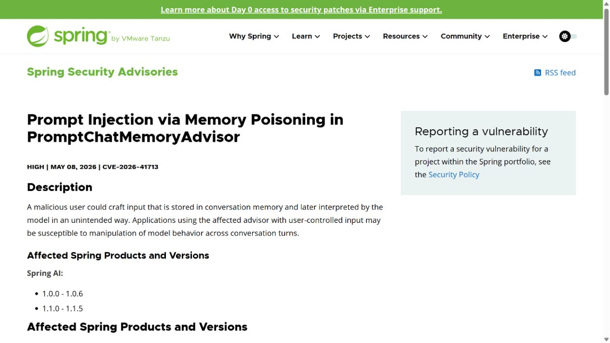
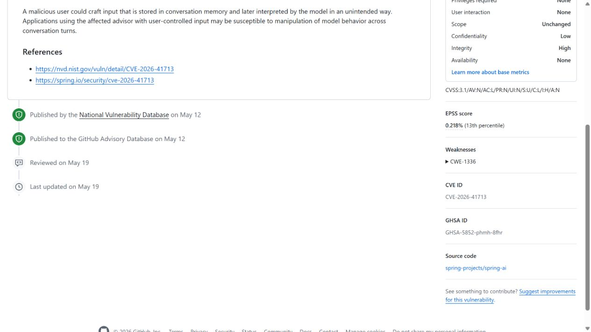
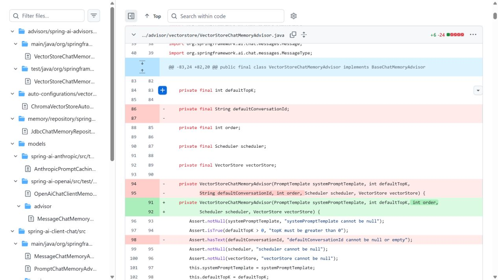
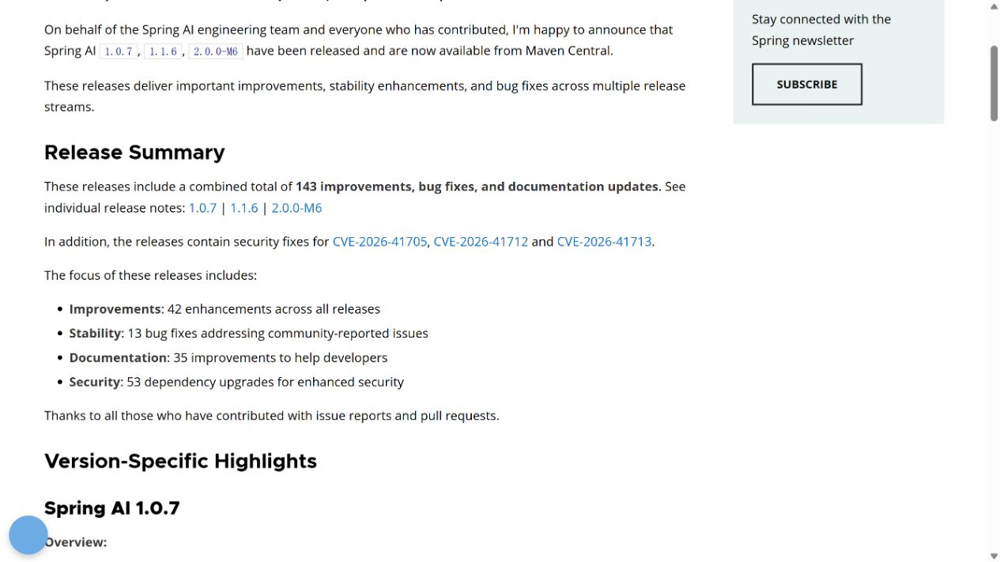
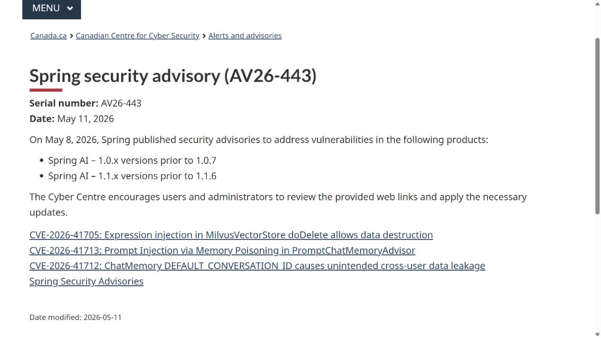

# Spring AI PromptChatMemoryAdvisor Memory Poisoning (2026)
> Spring AI PromptChatMemoryAdvisor 会话记忆投毒

| Field | Value |
|---|---|
| Category | agent-risk |
| Severity | High |
| CVE | CVE-2026-41713 |
| AI Tool | Spring AI, PromptChatMemoryAdvisor, ChatClient |
| Language | Java |
| Real Incident | Yes |
| Reproducible | Yes |
| Disclosed | 2026-05-08 |

## TL;DR
Spring AI 旧版 PromptChatMemoryAdvisor 会把攻击者构造的输入写入会话记忆，后续轮次重新组装提示时，模型可能把这段持久化内容当作指令执行。CVE-2026-41713 的修复进入 1.0.7 和 1.1.6。

---

## 详细分析 / Full Analysis

## 一、事件概况

2026 年 5 月 8 日，Spring 发布 CVE-2026-41713，标题直接指向 PromptChatMemoryAdvisor 的提示注入与会话记忆投毒。受影响范围是 Spring AI 1.0.0 至 1.0.6，以及 1.1.0 至 1.1.5；对应修复版本为 1.0.7 和 1.1.6。厂商给出的 CVSS 3.1 分数为 8.2，向量中网络攻击、低复杂度、无需用户交互和高完整性影响构成了主要风险。

问题出现在启用受影响 advisor、并允许外部用户控制聊天输入的应用中。攻击者提交的内容先作为一轮对话被保存，后续请求重新读取历史记忆时，这段内容再次进入模型上下文。它不再只影响当下的一次回答，而可能持续改变同一会话后面的判断、回答和工具选择。Spring 的公告没有给出在野利用数字，现有公开材料能确认的是漏洞、受影响组件、版本和可造成的跨轮次模型行为操纵。

## 二、公开材料与事实核对

Spring 厂商公告是漏洞描述和版本范围的主记录；GitHub Advisory Database 对包坐标、CVE、CVSS 和修复版本进行了复核。Spring AI 发布公告确认 1.0.7 与 1.1.6 已上线，并明确提到三个安全修复，其中包括 CVE-2026-41713。代码提交展示了聊天记忆接口的调整：删除默认会话标识，要求每次调用显式提供 conversation ID，同时将 PromptChatMemoryAdvisor 标记为弃用。加拿大网络安全中心的 AV26-443 又从政府告警角度核对了发布日期和升级版本。

| 来源 | 类型 | 主要内容 |
|---|---|---|
| Spring Security Advisory | 厂商公告 | 漏洞说明、影响范围、CVSS 与修复版本 |
| GitHub Advisory Database | 漏洞数据库 | Maven 包、CVE、评分与版本映射 |
| Spring AI 修复提交 | 代码记录 | 显式会话 ID、接口调整与迁移要求 |
| Spring AI 发布公告 | 厂商发布记录 | 1.0.7、1.1.6 已包含安全修复 |
| Canadian Centre for Cyber Security | 政府告警 | 对 Spring 公告及升级建议的独立复核 |

这些材料并非五次独立发现。GitHub 漏洞库和加拿大告警引用了厂商信息，代码提交与发布记录则提供了不同层面的可核对事实。报告据此采用厂商的 8.2 分数，不把第三方重新计算的分数混在一起。

## 三、攻击或事件链路

典型触发从一段看似正常的聊天输入开始。攻击者在文本中夹入希望模型以后继续遵循的指令，例如要求忽略既有任务、改变回答规则、索取会话中的其他内容，或者在具备工具的应用中诱导模型调用某项能力。PromptChatMemoryAdvisor 将该轮消息写入 ChatMemory，应用结束这次响应后，恶意内容仍留在会话历史中。

用户或后台任务发起下一轮请求时，advisor 取回先前消息并把它们加入新的模型请求。模型看到的上下文同时包含当前问题、应用指令和历史对话；如果历史中的攻击文本被重新呈现为可执行语义，模型就可能把旧输入继续当作当前指令。由此产生的效果取决于应用配置：纯问答服务可能出现回答偏转或信息泄露，连接搜索、数据库、邮件或业务动作的 Agent 则可能把偏转放大为实际工具调用。

这个 CVE 描述的是跨对话轮次的持久化操纵。另一个同期漏洞 CVE-2026-41712 涉及默认 conversation ID 造成的跨用户数据混用，两者不应合并成同一攻击事实。修复提交同时收紧了会话标识使用，因此排查时需要分别检查“恶意内容被保存”和“不同用户是否被错误分到同一记忆”两类问题。

## 四、技术根因

核心问题是记忆从数据存储变成提示组成部分时，原始信任级别没有随内容一起保留。聊天系统保存历史消息本来是为了延续语境，但模型无法只凭自然语言稳定判断某句话是旧的用户资料、引用文本，还是今天仍应执行的命令。PromptChatMemoryAdvisor 把历史内容重新带入提示后，一次低信任输入便获得了持续影响后续推理的机会。

持久化使问题比单轮提示注入更难发现。攻击文字可以在写入时保持安静，等到后续出现某个主题、某类数据或某项工具后再发挥作用。应用日志只看当前用户问题时，可能找不到导致模型行为变化的真正输入；只清理浏览器会话也未必删除服务端 ChatMemory。

Spring 的修复与迁移信息显示，显式 conversation ID 已成为调用方必须承担的责任，PromptChatMemoryAdvisor 也被弃用。显式标识能避免隐式作用域带来的混乱，但应用仍需决定哪些消息可以长期保存、以什么角色重放、何时清理，以及记忆内容能否参与高风险动作。版本升级关闭了已知实现问题，记忆治理仍然需要由应用补齐。

## 五、AI 安全问题

AI 在这里是攻击成立的执行环节。恶意字符串本身不会被 Java 虚拟机当作代码运行；真正产生影响的是模型在后续轮次读取它、解释它，并用它改变输出或工具决策。若移除模型的语义解释，这段历史文本只是一条数据库记录，无法完成公告所描述的行为操纵。因此该案例属于严格意义上的 AI 安全问题，而非给普通框架漏洞加上 AI 产品名称。

会话记忆还改变了信任关系。很多应用把“过去已经说过的话”视为连续上下文，却没有把“谁写入、从哪里获得、是否经过工具返回、是否仍应生效”编码进记忆。对模型而言，重复出现的文本往往比一次性输入更显眼；对审计人员而言，触发原因却可能埋在数十轮之前。

当 Agent 拥有外部动作时，模型行为完整性必须与数据访问控制分开。数据库权限可以阻止越权查询，却无法判断某次合法查询是否由被投毒的记忆诱导。反过来，仅靠提示词要求模型忽略恶意内容，也无法证明每个模型版本和每种上下文长度都能稳定执行。可靠的控制应落在记忆写入、角色隔离、工具授权和结果外发几个确定性环节。

## 六、影响、处置与排查

使用 Spring AI 1.0.x 的系统应升级到 1.0.7 或更高版本，1.1.x 系统应升级到 1.1.6 或更高版本，并按发布说明迁移受影响 advisor。升级前后都要确认每次聊天请求显式提供独立的 conversation ID，避免沿用默认值或把业务用户、浏览器 session 与会话标识简单混为一谈。

历史排查应从 ChatMemory 存储开始，而不是只翻看最终回答。可以检索长时间留存的指令式语句、要求忽略系统规则的内容、异常编码文本，以及在多个后续轮次反复出现的同一片段。随后把这些记录与模型响应、工具调用、数据读取和外发日志按 conversation ID 对齐，确认异常行为是否在某次记忆写入后开始。

CVSS 向量给出低机密性、高完整性、无可用性影响，说明厂商主要关注模型行为被操纵，而不是服务必然宕机或主机代码执行。具体业务后果仍由应用授予模型的能力决定。纯文本助手与能够发送邮件、修改工单或执行查询的 Agent，面对同一记忆投毒时会有完全不同的损失上限。

## 七、治理建议

聊天记忆应记录结构化来源信息，包括写入主体、消息角色、原始渠道、会话标识、保存时间和是否来自外部工具。历史用户内容重新进入提示时，可以作为带边界的数据段呈现，不应与系统指令拼成难以区分的连续文本。对工具响应、网页内容和上传文档，还应保留各自来源，避免它们经一次对话后获得更高信任。

高风险 Agent 可以把记忆分成事实、用户偏好和可执行计划三类。事实需要来源，偏好允许用户查看和撤销，可执行计划则设置短有效期并在调用工具前重新确认。任何长期记忆都不应直接授予发送、删除、付款或权限变更等动作；工具网关应根据当前用户身份和当前审批独立判断。

运行监控需要把当前请求与历史记忆同时纳入。告警可以关注陈旧消息突然主导回答、模型在无当前理由时调用新工具、同一历史片段跨多轮触发相似动作等现象。维护者还应提供会话记忆查看、导出和清除能力，使用户与调查人员能够处理已经写入的污染内容。

## 八、结论

CVE-2026-41713 把聊天记忆中的一个常见假设暴露得很清楚：保存过的内容并不会因为进入历史记录就变得可信。Spring AI 1.0.7 和 1.1.6 修复了已公开问题，并推动调用方显式管理会话标识。对采用长期记忆的 Agent，后续重点是保留来源、限制重放方式，并让工具授权只接受当前、可核验的用户意图。这样即使一段恶意输入已经进入记忆，也难以借后续轮次获得持续行动能力。

### 参考来源

1. [Spring security advisory CVE-2026-41713](https://spring.io/security/cve-2026-41713/)
2. [GitHub Advisory Database GHSA-5852-phmh-8fhr](https://github.com/advisories/GHSA-5852-phmh-8fhr)
3. [Spring AI explicit conversation ID fix](https://github.com/spring-projects/spring-ai/commit/13cde419e30042c663706f130dd65b80d92d4667)
4. [Spring AI 1.0.7 and 1.1.6 release announcement](https://spring.io/blog/2026/05/08/spring-ai-1-0-7-1-1-6-2-0-0-M6-available-now)
5. [Canadian Centre for Cyber Security AV26-443](https://www.cyber.gc.ca/en/alerts-advisories/spring-security-advisory-av26-443)
