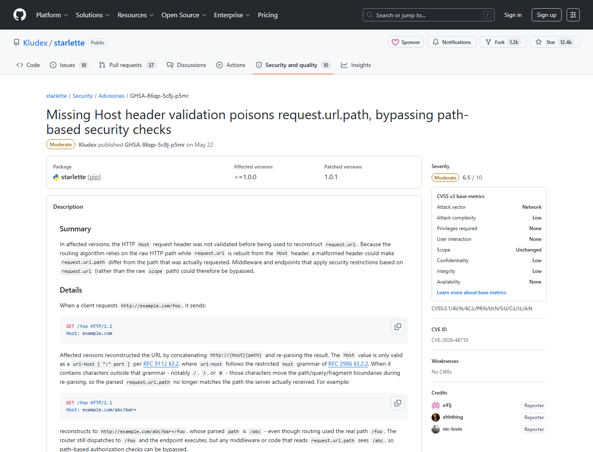
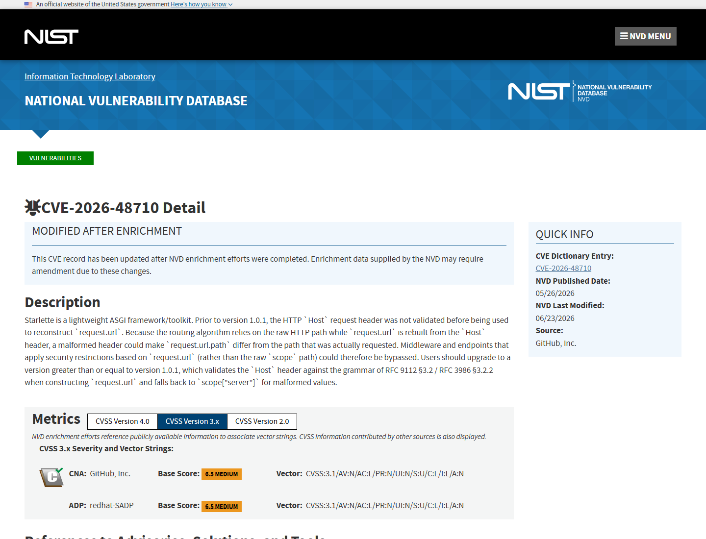
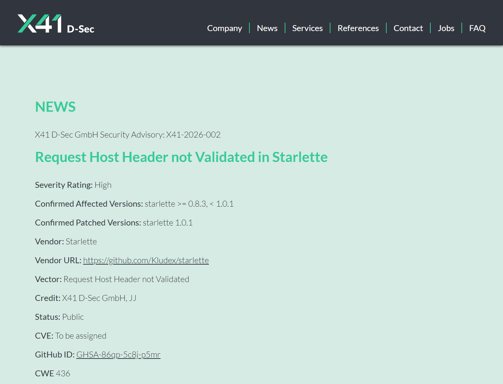
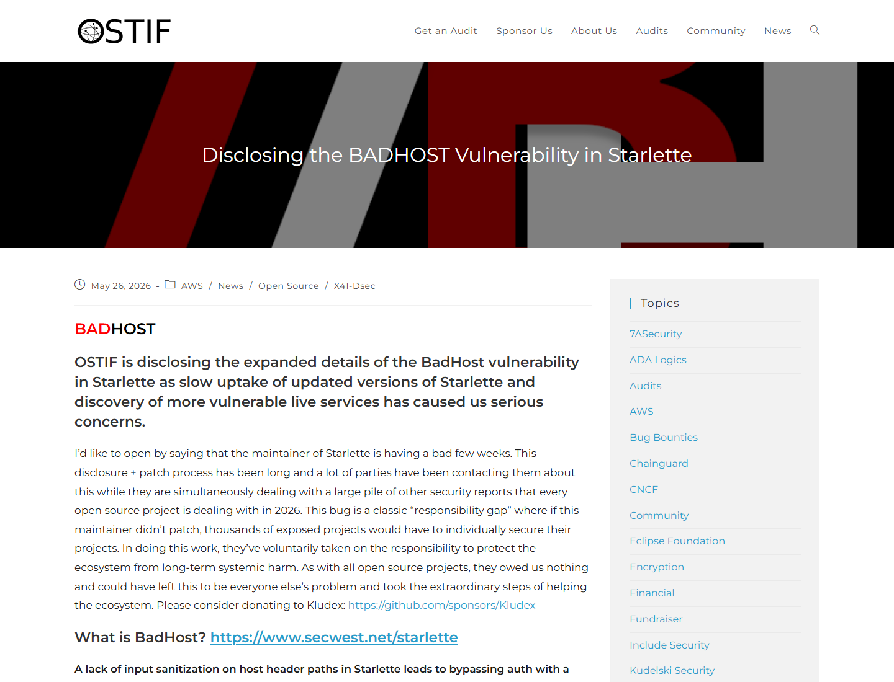
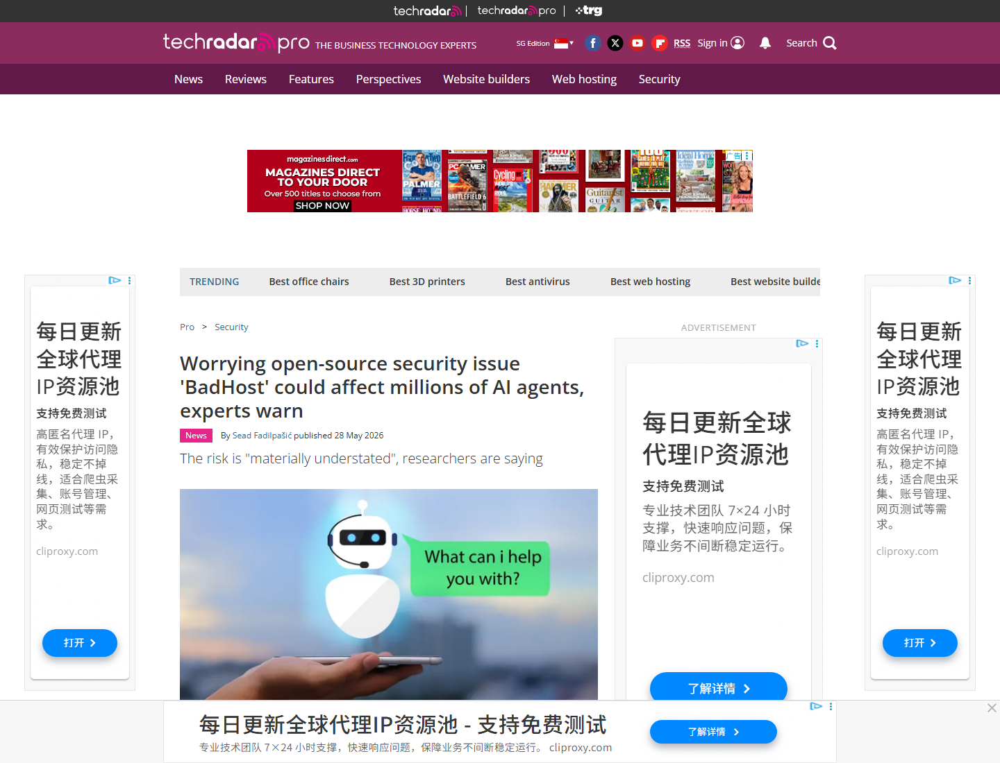
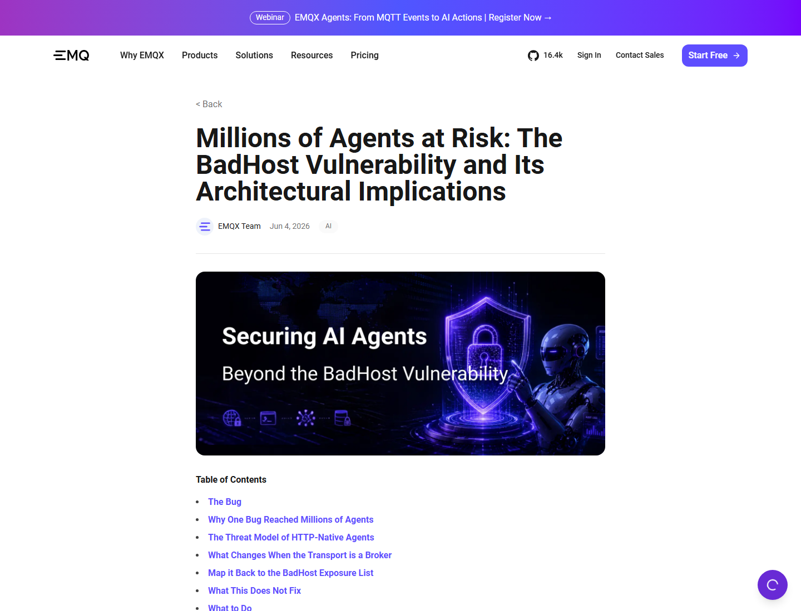

# Starlette BadHost AI Agent Auth Bypass (2026)
> Starlette BadHost AI Agent 认证绕过

| Field | Value |
|---|---|
| Category | Agent Risk |
| Severity | High |
| AI Tool | Starlette/FastAPI-based AI services, MCP servers, LLM gateways |
| Language | Python |
| Real Incident | Yes |
| Reproducible | Yes |
| Disclosed | 2026-05-26 |
| CVE | CVE-2026-48710 |

## TL;DR
BadHost made Starlette rebuild `request.url.path` from an unvalidated Host header; apps that used the reconstructed path for security checks could be tricked into protecting one path while routing another.
> BadHost 的危险在于路径判断错位。路由器按真实 HTTP path 分发请求，但中间件或 endpoint 如果看 `request.url.path` 做授权，就可能被恶意 Host header 带偏。

---

## 详细分析 / Full Analysis

# Starlette BadHost 案例分析：AI agent 服务中的 Host Header 认证绕过

## 基本信息

Starlette 是 Python ASGI Web framework，FastAPI 建立在 Starlette 之上。它被广泛用于 AI agent HTTP 服务、MCP server、LLM gateway、model-management UI、eval dashboard 和内部工具。2026 年 5 月披露的 BadHost，也就是 CVE-2026-48710，核心问题是 Starlette 1.0.1 之前没有在重建 `request.url` 前验证 HTTP `Host` header。

GitHub Advisory 的摘要说明，Starlette 的路由算法使用原始 HTTP path，但 `request.url` 是从 Host header 重建的。恶意 Host header 中如果包含 `/`、`?`、`#` 等 URI 分隔符，就可能让 `request.url.path` 和真实请求 path 不一致。依赖 `request.url.path` 做安全限制的 middleware 或 endpoint 因此可能被绕过。[GitHub Advisory](https://github.com/Kludex/starlette/security/advisories/GHSA-86qp-5c8j-p5mr)

## 一、事件核验与证据范围

### 证据矩阵

| 来源 | 类型 | 证明内容 | 备注 |
|---|---|---|---|
| GitHub Advisory / NVD | 主证据 | CVE-2026-48710、影响 Starlette <1.0.1、Host header validation、request.url.path desync | 漏洞记录 |
| X41 / Secwest | 原始研究 | BadHost 名称、路径边界错位、可绕过基于 path 的安全检查 | 原始技术来源 |
| OSTIF | 协调披露证据 | Starlette audit、披露过程、补丁背景 | 协调披露 |
| Ars Technica / TechRadar | 影响证据 | AI agents、MCP、LLM infrastructure、敏感数据暴露讨论 | 媒体复核 |
| EMQX | 技术/生态复核 | Starlette/FastAPI 生态、HTTP-native agents、MCP 和 LLM infrastructure 影响 | 行业复核 |

NVD 将该漏洞评分为 CVSS 6.5，并描述为 missing Host header validation 导致 `request.url.path` 被污染，从而绕过 path-based security checks。这个分数反映库层基础漏洞；在 AI agent 场景中，风险大小取决于具体服务是否把 `request.url.path` 用作鉴权、路由保护或敏感 endpoint 判断。[NVD](https://nvd.nist.gov/vuln/detail/CVE-2026-48710)

## 二、系统背景与触发条件

AI agent 生态大量使用 Python HTTP 框架。MCP server、OpenAI-compatible proxy、LLM evaluation dashboard、agent memory service、tool registry 和模型管理 UI，经常用 FastAPI/Starlette 快速构建。它们可能把 `/admin`、`/tools`、`/mcp`、`/keys`、`/metrics` 或 `/internal` 这类路径交给 middleware 保护。

触发条件是应用使用 Starlette 1.0.1 之前版本，并且有安全逻辑依赖 `request.url` 或 `request.url.path`，而不是使用原始 `scope["path"]` 或路由层安全机制。攻击者发送包含特殊字符的 Host header，使应用看到的 reconstructed path 偏离真实路由 path。若保护逻辑看错路径，敏感 endpoint 就可能被当作非敏感请求放行。

## 三、攻击链与处置过程

BadHost 的攻击链不需要模型参与。攻击者构造 HTTP 请求，把 Host header 写成能改变 URL 解析边界的形式。Starlette 先用这个 Host header 重建 `request.url`，middleware 根据 `request.url.path` 做判断；随后路由器按真实 path 把请求交给敏感 endpoint。安全检查和实际路由看到了两条不同路径。

Starlette 1.0.1 修复了该问题，在构造 `request.url` 时验证 Host header 是否符合 RFC 9112 / RFC 3986，并在 malformed Host 时回退到 `scope["server"]`。OSTIF 的披露说明把该漏洞放在 Starlette audit 背景中，补丁来自对 URL 重建行为的修正。[OSTIF](https://ostif.org/disclosing-the-badhost-vulnerability-in-starlette)

## 四、技术根因分析

根因是同一个请求的“真实路径”和“安全逻辑读取路径”来自不同解析源。路由器使用 ASGI scope 中的原始 path；应用代码或 middleware 可能使用 `request.url.path`；后者又依赖未经验证的 Host header 重建完整 URL。HTTP Host header 是攻击者可控字段，不能参与安全敏感路径判断。

AI agent 场景放大这个问题，是因为受保护路径后面可能不是普通业务页面，而是 MCP tool endpoint、模型 provider keys、agent memory、workflow execution、evaluation results 或内部数据连接。路径型鉴权一旦错位，攻击者可能越过登录墙或内外网分隔，读取高价值 agent 状态。

## 五、AI 参与方式与风险归因

BadHost 不是 prompt injection，也不是模型漏洞。它是支撑 AI 服务的 Python Web 框架漏洞。AI 参与方式在部署栈：Starlette/FastAPI 常被用于构建 agent HTTP API、MCP server、OpenAI-compatible gateway、vLLM 管理服务和评测面板。框架层 path desync 会影响这些 AI 应用的访问控制。

风险归因应落在框架版本、Host header trust、middleware 鉴权写法和 AI 服务暴露面上。Ars Technica 和 TechRadar 都强调，Starlette/FastAPI 在 AI agent 和 MCP 基础设施中的广泛使用，让这个看似中等 CVSS 的漏洞在实际部署中可能影响更大。[TechRadar](https://www.techradar.com/pro/security/worrying-open-source-security-issue-badhost-could-affect-millions-of-ai-agents-experts-warn)

## 六、与团队技术报告风险框架的关系

团队技术报告关注 AI agent 的运行时和工具基础设施。BadHost 说明，AI 安全还包括底层 Web framework 的请求语义一致性。Agent 系统的 prompt、memory、tools 和 credentials 往往通过 HTTP endpoint 暴露，框架层 host/path 解析错误会直接影响这些 endpoint 的访问控制。

这类案例也提醒安全团队，AI 服务的鉴权逻辑不能只靠字符串前缀和 URL 对象。应使用框架提供的认证依赖、路由级权限、反向代理规范化和明确的 raw path 判断，避免在 request URL 重建层做安全决策。

## 七、影响范围与社会后果

Starlette/FastAPI 是 Python AI 服务的常用底座。EMQX 的分析把 BadHost 放在 HTTP-native agents、MCP 服务和 LLM infrastructure 的部署模式中讨论：漏洞本身不是所有应用都会可利用，但一旦命中 path-based middleware，影响可能落到敏感 AI agent 基础设施上。

社会后果在于共享库风险穿透整个 AI 供应链。一个底层请求解析细节，会影响由不同团队构建的 agent server、model proxy 和内部 dashboard。组织若只盘点顶层 AI 应用，而不盘点 Starlette/FastAPI 依赖版本和鉴权模式，就可能漏掉真实暴露面。

## 八、治理建议

使用 Starlette/FastAPI 的 AI 服务应升级 Starlette 到 1.0.1 或更高版本，并确认传递依赖已经生效。安全检查不应依赖未经规范化和验证的 Host header，也不应基于 `request.url.path` 做高敏感授权判断；更稳妥的方式是使用路由级认证、ASGI scope 原始 path、反向代理统一 Host 校验和明确的 allowed hosts。

对 MCP server、LLM gateway、agent dashboard 和模型管理 UI，应扫描是否存在 path-based middleware、custom auth wrapper、proxy trust 配置和公网暴露。反向代理应拒绝 malformed Host header，应用应记录异常 Host 值和被拒请求。若曾经暴露 vulnerable 版本，应检查敏感 endpoint 访问日志，尤其是 `/mcp`、`/tools`、`/admin`、`/keys`、`/metrics` 和内部 API 路径。

## 九、结论

BadHost 的教训是，AI agent 基础设施仍然受传统 Web 请求解析影响。Starlette 对 Host header 的处理让 reconstructed `request.url.path` 与真实路由 path 出现错位，进而绕过某些 path-based 安全检查。对 AI 服务而言，这类底层框架漏洞可能暴露工具、凭据、memory 和管理接口；治理 AI 风险时，框架版本、Host 校验和鉴权写法必须进入同一张清单。

## 参考来源

- [GitHub Advisory: GHSA-86qp-5c8j-p5mr](https://github.com/Kludex/starlette/security/advisories/GHSA-86qp-5c8j-p5mr)
- [NVD: CVE-2026-48710](https://nvd.nist.gov/vuln/detail/CVE-2026-48710)
- [X41 / Secwest: Starlette BadHost advisory](https://www.x41-dsec.de/lab/advisories/x41-2026-002-starlette)
- [OSTIF: Disclosing the BadHost vulnerability in Starlette](https://ostif.org/disclosing-the-badhost-vulnerability-in-starlette)
- [Ars Technica: Millions of AI agents imperiled](https://arstechnica.com/information-technology/2026/05/millions-of-ai-agents-imperiled-by-critical-vulnerability-in-open-source-package/)
- [TechRadar: BadHost could affect millions of AI agents](https://www.techradar.com/pro/security/worrying-open-source-security-issue-badhost-could-affect-millions-of-ai-agents-experts-warn)
- [EMQX: Millions of agents at risk](https://www.emqx.com/en/blog/millions-of-agents-at-risk)
