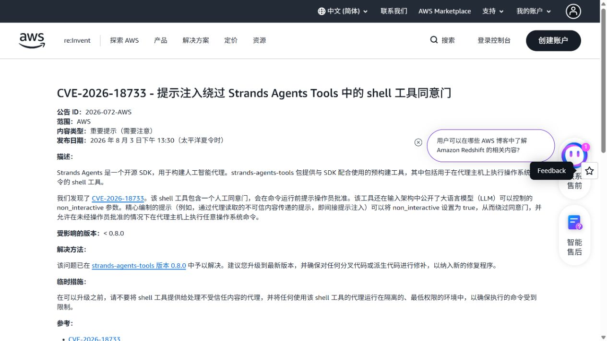
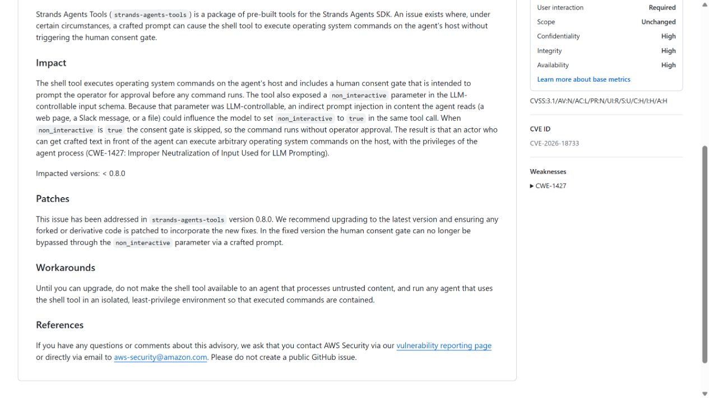
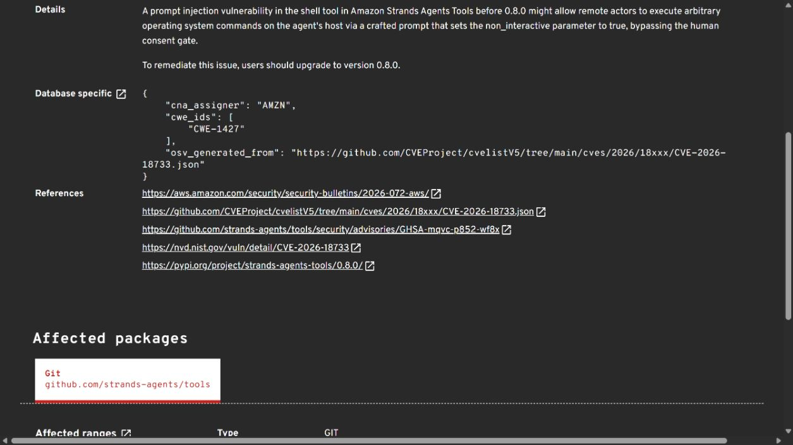
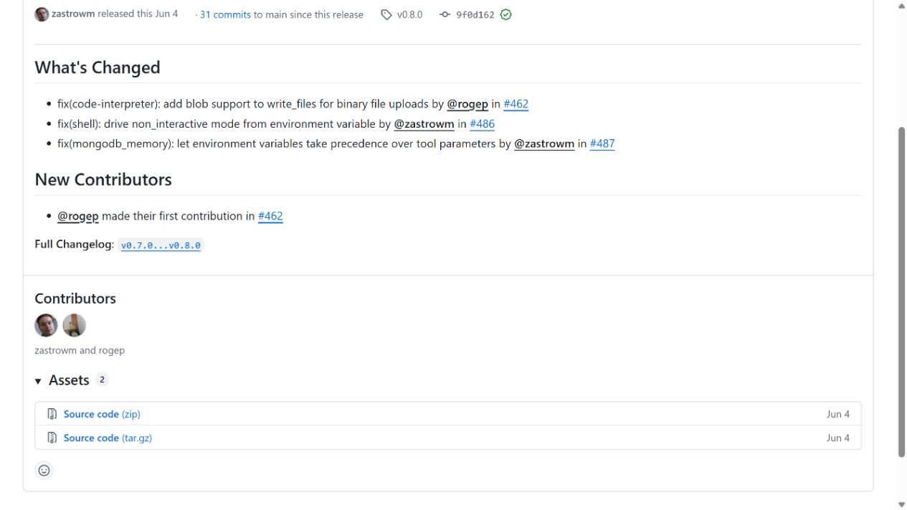
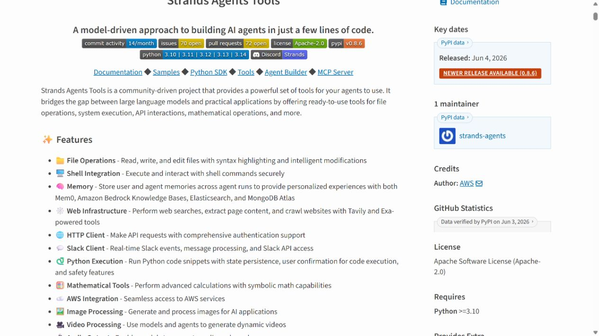

# Strands Shell Tool Consent Gate Bypass Through Prompt Injection (2026)
> Strands Shell 工具确认门可被提示注入绕过

| Field | Value |
|---|---|
| Category | agent-risk |
| Severity | High |
| CVE | CVE-2026-18733 |
| AI Tool | Strands Agents, Strands shell tool |
| Language | Python |
| Real Incident | Yes |
| Reproducible | Yes |
| Disclosed | 2026-07-15 |

## TL;DR
Strands 的 shell 工具把 non_interactive 作为模型可控参数，提示注入可借此跳过原本面向用户的命令确认并在代理进程权限下执行系统命令。

---

## 详细分析 / Full Analysis

## 一、事件概况

2026 年 7 月，AWS 发布 AWS-2026-072，确认 Strands Agents Tools 的 shell 工具存在确认机制绕过，漏洞编号为 CVE-2026-18733。GitHub Security Advisory 给出了受影响代码路径和修复版本，OSV 建立了对应漏洞记录。三份记录对入口、影响版本和修复方向的描述一致：0.8.0 之前的版本允许调用方把 `non_interactive` 设为真，从而在没有用户确认的情况下执行命令。

这不是一般意义上的 shell 注入。命令本来就是这个工具要执行的内容，真正失效的是人机授权关系。框架把是否询问用户也做成了工具参数，而参数恰好由模型生成。只要模型上下文被网页、文档、工单或其他工具返回内容污染，攻击文本就可能要求代理同时提交命令和静默执行开关。

## 二、公开材料与事实核对

公开材料形成了一条完整的版本链。AWS 公告说明风险、影响范围和升级建议；项目 advisory 展示触发方式；OSV 固化 CVE 与包生态映射；0.8.0 发布页和 PyPI 页面证明修复版本已经发布。GitHub advisory 使用 CVSS 3.1 得到 8.8，AWS CNA 使用 CVSS 4.0 得到 7.5，两者采用不同评分体系，不能择高写成同一个官方分数。

| 来源 | 类型 | 主要内容 |
|---|---|---|
| AWS 安全公告 | 厂商公告 | CVE、受影响版本、处置建议 |
| GitHub Advisory | 技术公告 | 可控参数与执行条件 |
| OSV | 漏洞数据库 | 编号、分类和包映射 |
| 0.8.0 Release | 修复记录 | 修复版本正式发布 |
| PyPI | 包生态记录 | 可安装版本及发布时间 |

## 三、攻击或事件链路

典型链路从一段不可信文本开始。代理读取包含隐藏指令的网页、仓库文件或问题描述后，模型把其中的操作要求误当成当前任务的一部分，生成对 shell 工具的调用。调用不但包含攻击者希望运行的命令，还把 `non_interactive` 置为真。旧版工具据此绕过交互确认，直接创建子进程。

攻击结果取决于代理进程已经拥有的权限。开发者工作站上的环境变量、SSH 配置、Git 凭据和云平台令牌，都可能成为后续命令的目标；在 CI 或远程开发容器中，影响则可能扩展到构建密钥和制品仓库。漏洞不需要模型本身被修改，问题出在模型可以决定安全开关，而下游执行器又把这个决定当成了有效授权。

## 四、技术根因

旧设计把 `non_interactive` 同时当作运行模式和授权证明。对普通程序调用者而言，这个参数可能是方便批处理的选项；对 AI 代理而言，它属于不可信输出，因为模型会受到任务文本和检索内容影响。安全敏感状态没有和工具参数分开保存，也没有由宿主应用独立签发一次性授权。

0.8.0 的修复价值不只在于删除一个开关，而在于恢复了正确的控制方向：是否需要用户确认，应由受信任的运行时策略决定，模型只能提出要执行什么。类似框架还要检查自动批准列表、危险命令白名单和“无人值守”模式，避免它们以普通参数形式暴露给模型。

## 五、AI 安全问题

这个案例体现的是代理系统特有的授权混淆。传统命令执行工具通常由确定性代码调用，参数来自开发者；Agent 工具的调用参数由概率模型生成，而模型上下文混合了系统指令、用户输入和外部资料。若执行器不区分这些来源，工具 schema 中任何能削弱防护的字段都会成为提示注入的落点。

仅在系统提示里写“危险操作前先询问”并不牢靠，因为同一个模型既负责判断危险，又负责生成绕过判断的参数。更稳妥的做法是把确认状态放在模型不可写的通道中，并根据命令、路径、网络目标和凭据访问逐项计算策略。这样即使模型已经被诱导，最后一层执行器仍能拒绝越权动作。

## 六、影响、处置与排查

公开材料证明漏洞可以复现，但没有给出大规模在野入侵统计。风险评估应建立在可达能力上：一旦提示注入进入代理上下文，攻击者可把自然语言影响放大为本地进程行为。CVSS 分数反映的是这一技术后果，不等于已有多少真实用户遭到攻击。

处置的第一步是升级到 0.8.0 或更高版本，并检查历史代理会话中无明确人工确认的 shell 调用。若旧版本曾在开发机、CI runner 或带云凭据的容器中运行，还应核对异常子进程、外联请求、凭据文件访问和非预期仓库改动，必要时轮换受影响令牌。

## 七、治理建议

框架维护者需要把授权上下文设计成独立对象，例如由宿主界面生成、绑定具体命令摘要并设置短时有效期，工具执行时再校验。调用日志应同时保留模型提出的参数、用户实际确认的内容和最终执行命令，避免审计时只看到一次成功的工具调用。

使用方可以将 shell 工具放进低权限容器，默认关闭外网和主机凭据挂载，并把包安装、密钥读取、Git 推送等动作设为单独审批。对来自网页、工单、README、日志和 MCP 返回值的文本，应在上下文中明确标注来源；来源标记不能替代强制策略，但能帮助界面向用户解释某条命令为何出现。

## 八、结论

CVE-2026-18733 的关键不在于模型是否会产生危险命令，而在于执行器让模型同时决定命令与审批方式。Strands 0.8.0 修复了这一具体入口，也给其他 Agent 框架提供了明确的设计教训：人类确认必须由模型之外的可信组件保存和验证。只要高权限工具仍把安全开关作为普通参数开放，提示注入就可能从内容层直接跨到执行层。

### 参考来源

1. [AWS Security Bulletin AWS-2026-072](https://aws.amazon.com/security/security-bulletins/2026-072-aws/)
2. [GitHub Security Advisory GHSA-mqvc-p852-wf8x](https://github.com/strands-agents/tools/security/advisories/GHSA-mqvc-p852-wf8x)
3. [OSV CVE-2026-18733 record](https://osv.dev/vulnerability/GHSA-mqvc-p852-wf8x)
4. [Strands Agents Tools 0.8.0 release](https://github.com/strands-agents/tools/releases/tag/v0.8.0)
5. [PyPI strands-agents-tools 0.8.0](https://pypi.org/project/strands-agents-tools/0.8.0/)
