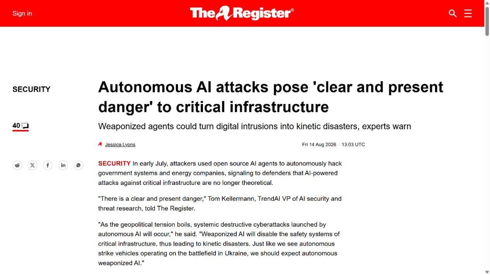
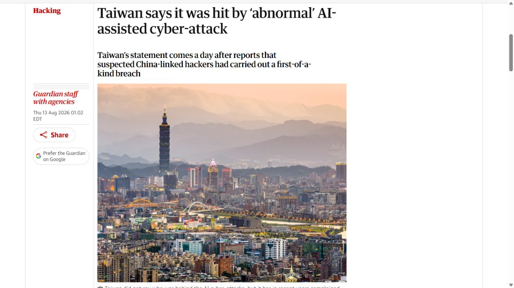
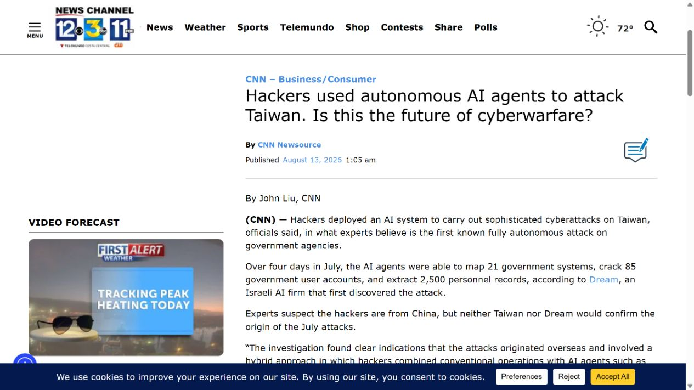
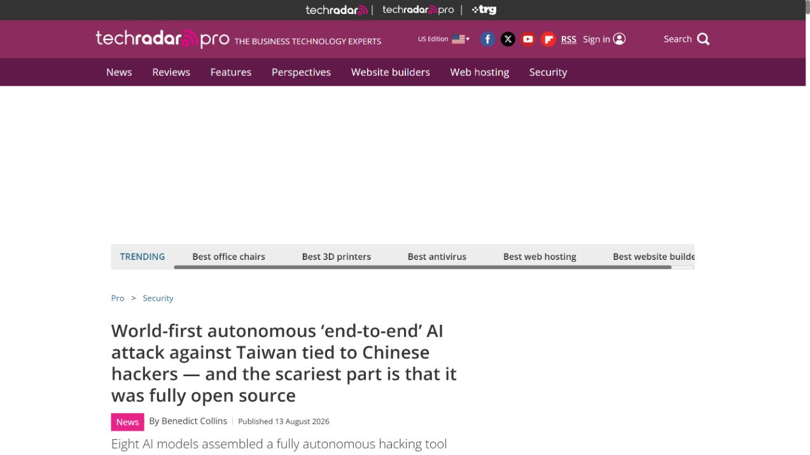
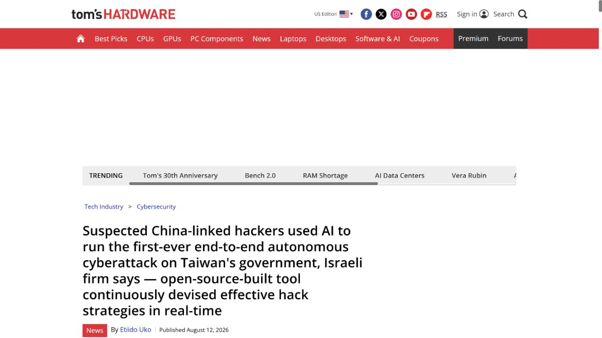

# Autonomous AI Agent Attack Against Taiwan Government Systems (2026)
> 台湾政府系统遭自主 AI 代理持续攻击

| Field | Value |
|---|---|
| Category | agent-risk |
| Severity | Critical |
| AI Tool | Hermes, OpenClaw, multiple autonomous agents |
| Language | Multiple |
| Real Incident | Yes |
| Reproducible | No |
| Disclosed | 2026-08-12 |

## TL;DR
2026 年 7 月针对台湾政府的攻击把多个开源 AI 代理用于持续侦察、漏洞利用和数据整理；台湾数位主管部门确认了境外来源的异常攻击及 OpenClaw 使用，但具体规模数字主要来自安全公司调查。

---

## 详细分析 / Full Analysis

## 一、事件概况

2026 年 8 月，多家媒体披露一场持续约四天、面向台湾政府系统的自动化攻击。最初调查称攻击者同时运行最多八个 AI 代理，使用 Hermes 与 OpenClaw 进行侦察、生成利用步骤、尝试凭据和整理窃取文件。报道列出的结果包括 21 个系统、85 个账户、超过 2,500 条人员记录，以及包含 1,395 个文件的约 160 MB 压缩包。

台湾数位发展主管部门随后确认，7 月监测到来自境外的异常攻击，手法混合人工操作与 OpenClaw，并从 7 月 20 日起持续通知相关单位。政府确认与安全公司调查在“使用 AI 代理”和“针对政府系统”上相互呼应，但规模数字来自调查方，不能写成政府逐项背书。

## 二、公开材料与事实核对

The Register、Guardian、TechRadar 和 Tom's Hardware 都追溯同一调查，CNN 的报道则直接引用台湾数位发展主管部门回应。媒体不是五次独立取证，核心技术数据共享同一原始研究；主管部门回应提供了独立的事件存在性和处置时间线。

| 来源 | 类型 | 主要内容 |
|---|---|---|
| The Register | 技术媒体 | 代理数量、攻击链和数据规模 |
| The Guardian | 综合复核 | 事件背景与政府回应 |
| CNN | 新闻复核 | 主管部门确认和告警时间 |
| TechRadar | 技术复核 | 开源代理及自动化程度 |
| Tom's Hardware | 技术复核 | 工具组合与攻击结果 |

## 三、攻击或事件链路

攻击从资产侦察和入口试探开始。代理持续收集页面、服务版本和错误反馈，根据前一步结果调整命令，而不是只生成一份静态脚本。取得访问后，其他代理负责搜索账户、整理人员资料、压缩文件并扩展到相邻系统。多代理并行让攻击者能够在较短时间内覆盖不同目标。

公开材料把过程描述为高度自主，但仍提到人工与自动化混合。更准确的理解是，人负责设置目标、提供初始工具和处理关键决策，代理承担大量连续操作。不能据此断言整场行动从选目标到外传都无人参与。

## 四、技术根因

技术上的变化不在某个全新漏洞，而在攻击编排。通用开源代理可以调用浏览器、shell、扫描器和脚本，并把错误信息反馈给模型继续尝试。传统自动化常因页面变化或命令失败而停止，Agent 则能根据文本输出改写下一步，使长链条更少依赖人工盯守。

这种方式也会留下不同痕迹：请求节奏可能跨多个代理并行，命令带有反复试错和自然语言生成特征，数据整理步骤比单一漏洞扫描更连贯。防守方若只按固定恶意样本或单个 IP 告警，可能看不到同一目标下的行为聚合。

## 五、AI 安全问题

本案与 AI 强相关，因为 Agent 不是报告辅助工具，而是直接参与侦察、利用选择、失败恢复和数据处理。开源模型与代理框架降低了连续操作成本，使较小团队也能维持多条攻击支线。风险不在模型“知道漏洞”，而在它能把知识与真实工具调用连接起来。

同时，公开研究对“首个完全自主端到端攻击”的表述带有行业判断。主管部门确认的是人工和 AI 代理混合手法，因此报告采用“自主 AI 代理参与的持续攻击”，不把宣传性标签当作无争议事实。

## 六、影响、处置与排查

调查方报告的账户和文件数量表明事件已越过概念验证，但这些数字仍需按来源引用。政府回应说明相关单位已收到通知，并提到加强监测和阻断。企业和机构排查类似活动时，应把登录、Web 请求、命令执行、文件打包和出站流量按时间聚合，寻找多个低强度行为在同一资产上的连续组合。

对已暴露账户要检查异常登录、权限提升和横向访问，人员资料被访问的系统则需核对查询与导出记录。由于代理会快速更换策略，IOC 不能只依赖具体命令字符串。

## 七、治理建议

防守重点是缩短从初次异常到阻断的时间。互联网资产应持续核对版本和暴露接口，管理入口启用强认证，服务账户按系统隔离。检测侧可建立行为链规则：同一来源或关联会话在短时间内完成枚举、反复失败、成功登录、批量查询和压缩外传时，提高优先级。

面向 AI 自动攻击，还要限制接口反馈的细节，避免错误页面持续向攻击者提供可用于自我修正的信息。蜜罐和速率控制可增加代理试错成本，但最终仍要靠补丁、身份隔离、最小权限和出站监控。

## 八、结论

台湾事件显示，Agent 已经从攻击前的信息助手进入实际操作链。公开证据能够确认 AI 代理参与和真实系统受影响，具体规模则应归于原始调查。对防守方而言，最重要的变化是攻击可以并行、持续并根据反馈调整；安全运营需要按完整行为链关联信号，而不是等待一个足够醒目的单次告警。

### 参考来源

1. [The Register investigation](https://assets.theregister.com/2026/08/14/20269/?td=keepreading)
2. [The Guardian report](https://www.theguardian.com/technology/2026/aug/13/taiwan-ai-assisted-cyber-attacks-overseas)
3. [CNN report citing Taiwan MODA](https://keyt.com/news/money-and-business/cnn-business-consumer/2026/08/13/hackers-used-autonomous-ai-agents-to-attack-taiwan-is-this-the-future-of-cyberwarfare/)
4. [TechRadar technical report](https://www.techradar.com/pro/security/world-first-autonomous-end-to-end-ai-attack-against-taiwan-tied-to-chinese-hackers-and-the-scariest-part-is-that-it-was-fully-open-source)
5. [Tom's Hardware report](https://www.tomshardware.com/tech-industry/cyber-security/suspected-china-linked-hackers-used-ai-to-run-the-first-ever-end-to-end-autonomous-cyberattack-on-taiwans-government-israeli-firm-says-open-source-built-tool-continuously-devised-effective-hack-strategies-in-real-time)
