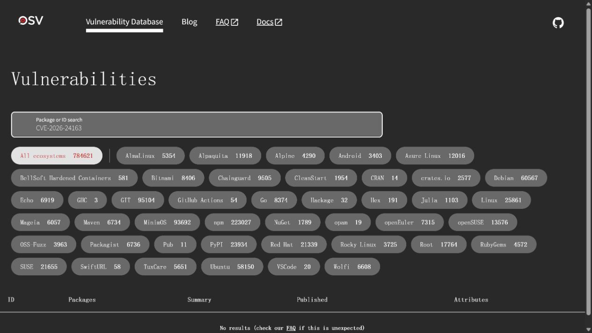
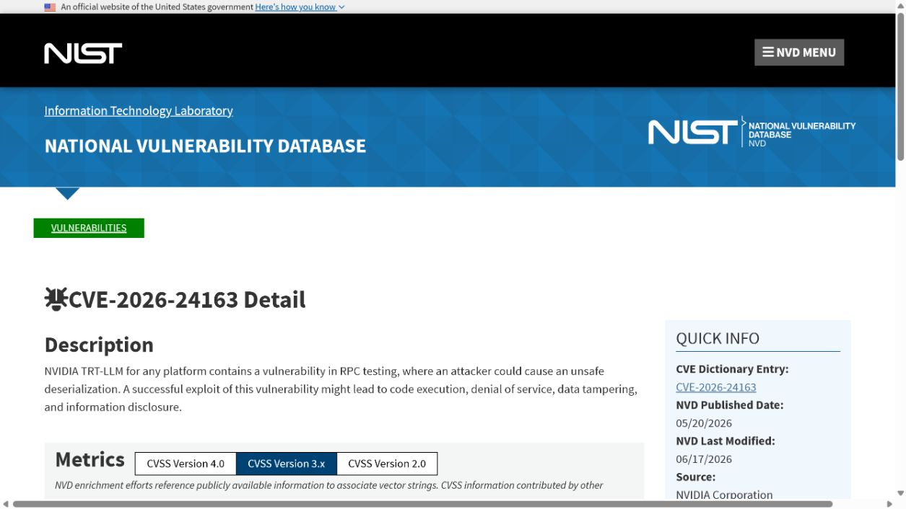
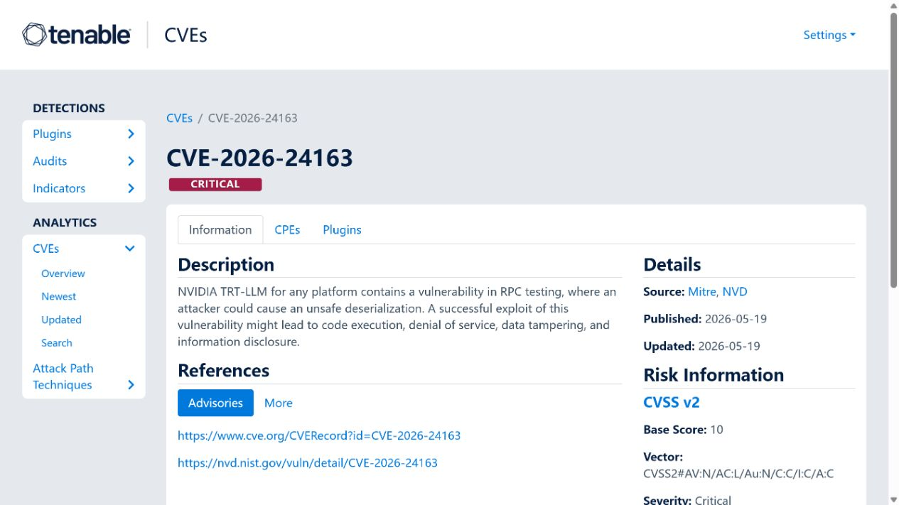
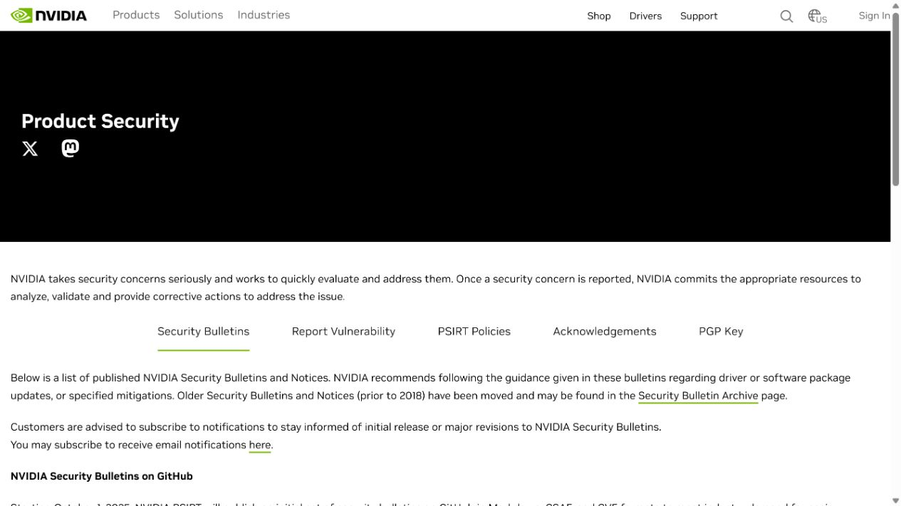
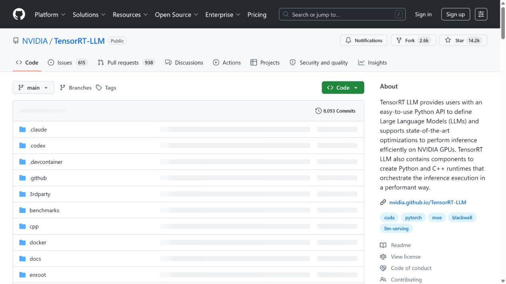

# TensorRT-LLM RPC Unsafe Deserialization Vulnerability (2026)
> TensorRT-LLM RPC 测试接口不安全反序列化漏洞

| Field | Value |
|---|---|
| Category | Code Vulnerabilities |
| Severity | Critical |
| AI Tool | NVIDIA TensorRT-LLM, RPC testing backend, LLM inference service |
| Language | Python / C++ / RPC |
| Real Incident | Yes |
| Reproducible | Yes |
| Disclosed | 2026-05-19 |
| CVE | CVE-2026-24163 |
| CVSS | 9.8 |

## TL;DR
TensorRT-LLM versions before 1.2 contained unsafe deserialization in an RPC testing path, allowing a successful exploit to affect code execution, integrity, availability, and confidentiality.
> 1.2 之前的 TensorRT-LLM RPC 测试路径存在不安全反序列化，成功利用可能影响代码执行、完整性、可用性和机密性。

---

## 详细分析 / Full Analysis

## 一、基本信息与事件概况

CVE-2026-24163 影响 NVIDIA TensorRT-LLM 1.2 之前的版本。NVIDIA 将问题定位在 RPC testing 功能中的不安全反序列化；NVD 的说明指出，成功利用可能带来代码执行、拒绝服务、数据篡改和信息泄露。TensorRT-LLM 是面向大模型推理优化的运行时，因此这一入口通常位于承载模型权重、推理请求和 GPU 资源的服务环境中。

公开评分存在差异：NVIDIA 在其 CVE 提交中给出高危本地高权限条件，而 NVD 后续分析给出了 9.8 的网络无认证向量。案例会并列记录，而不会把其中一个向量误写成唯一已证实的部署条件。最终暴露面取决于测试 RPC 是否被启用并可被不可信网络访问。

## 二、事件经过与公开材料

NVIDIA 于 2026 年 5 月 19 日发布 TensorRT-LLM 安全公告 5805，列出 CVE-2026-24163 和受影响的版本范围。CVE.org 与 NVD 随后收录该记录，NVD 在 6 月加入 CISA SSVC 与 CPE 分析。NVIDIA 产品安全索引仍将该 CVE 列在 May 2026 TensorRT-LLM 公告中。

公告没有报告在野利用，也没有公开可直接运行的攻击样本。本文据此把它写作已确认、可复现条件取决于部署的漏洞披露，不把“存在高 CVSS”叙述成已经发生的大规模入侵。

### 证据矩阵

| 来源 | 类型 | 证明内容 |
|---|---|---|
| OSV: CVE-2026-24163 | 厂商安全公告 | 受影响产品、版本范围和修复公告 |
| NVD: CVE-2026-24163 | 政府漏洞数据库 | 漏洞描述、CWE、NVD 分析和评分差异 |
| Tenable: CVE-2026-24163 | CVE 记录 | NVIDIA 作为 CNA 的原始记录 |
| NVIDIA Product Security index | 厂商安全索引 | TensorRT-LLM 公告和披露日期 |
| Snyk TensorRT-LLM package versions | 独立依赖安全数据库 | 包版本与部署生态背景 |
| NVIDIA TensorRT-LLM source repository | Project source | Official project context and release material |
| NVIDIA TensorRT-LLM documentation | Official documentation | Deployment and RPC-related product context |

## 三、系统背景与触发条件

大模型推理服务会在控制面、模型加载、缓存和工作进程之间传递结构化数据。为测试分布式或多进程行为而保留的 RPC 接口，常常被认为只在开发或基准环境使用；一旦其随容器镜像、端口映射或内部服务发现暴露，测试路径就可能成为生产攻击面。

反序列化边界的安全原则十分直接：外部数据应被限制在没有执行语义的编码格式中，并在进入对象构造或任务调度前接受严格模式验证。将可执行对象或不受信任字节流交给通用反序列化器，会使数据输入具备改变服务进程行为的能力。

## 四、攻击链路或失效过程

攻击前提是目标仍运行 1.2 之前的 TensorRT-LLM，并且攻击者能够到达或间接影响 RPC testing 路径。攻击者构造恶意序列化数据，服务在解析时触发不安全对象恢复。若该路径具有服务进程权限，后续影响可能包括执行代码、修改数据、读取运行时材料或使推理服务不可用。

公告没有公开完整函数调用、默认端口或所有部署方式，因此不能把所有 TensorRT-LLM 实例视为同等可利用。排查应从实际镜像版本、进程启动参数、RPC 监听地址、容器网络策略和服务访问日志入手。

## 五、技术根因与 AI 风险分析

根因是测试通信路径把不可信或可被影响的输入交给了不安全反序列化逻辑。测试组件往往拥有与主服务相近的运行权限，却缺少面向外部输入的身份校验、消息签名和最小化网络暴露。对推理系统来说，测试接口并不是天然安全边界，而应与模型管理和管理 API 一样受到隔离。

修复不能只依赖关闭单个端口。团队还应移除生产镜像中不需要的测试能力，确保内部 RPC 使用强认证或专用网络，并持续验证部署配置没有把调试端口暴露到负载均衡器或共享集群网络。

推理平台中的测试和运维接口往往部署在同一镜像、同一集群或相邻网络中，因此它们的实际权限可能远高于名称所暗示的范围。即便 RPC 服务最初只为性能验证或模型回归测试而设，只要它能够读取模型文件、访问 GPU 任务或继承服务账户环境，反序列化缺陷的后果就会延伸到推理工作负载本身。将这些接口作为“内部工具”而降低认证要求，会使部署拓扑成为攻击条件的一部分。

AI 基础设施的修复也需要与发布流程结合。升级依赖包之后，应检查容器镜像、Helm 配置、服务发现规则和负载均衡器是否仍会暴露旧端口；共享集群还要确认网络策略没有允许不相关的工作负载连接该 RPC 服务。这样做的目标不是给每个调试路径增加复杂性，而是确保模型服务、测试组件和管理平面各自拥有清晰且可验证的访问范围。

## 六、影响范围与处置建议

成功利用可影响承载推理服务的主机或容器，进而威胁模型权重、API 密钥、请求内容和 GPU 工作负载。没有公开证据证明该漏洞被广泛利用。用户应升级到 1.2 或更高版本，并把已部署实例的测试 RPC 暴露面作为独立清单核查。

事故响应还应检查反常序列化错误、未知 RPC 客户端、服务账号访问和容器内异常子进程。对于多租户推理平台，应将模型服务工作负载与控制平面、凭据卷和元数据服务隔离，减少单一 RCE 的横向价值。

## 七、结论

CVE-2026-24163 提醒部署者，推理框架中的测试代码同样可能处理高价值运行时数据。AI 服务的安全边界必须覆盖所有实际监听和解析路径，而不应假定“仅用于测试”的组件不会进入生产网络。

## 八、参考来源

- [OSV: CVE-2026-24163](https://osv.dev/vulnerability/CVE-2026-24163)
- [NVD: CVE-2026-24163](https://nvd.nist.gov/vuln/detail/CVE-2026-24163)
- [Tenable: CVE-2026-24163](https://www.tenable.com/cve/CVE-2026-24163)
- [NVIDIA Product Security index](https://www.nvidia.com/en-us/security/)
- [Snyk TensorRT-LLM package versions](https://security.snyk.io/package/pip/tensorrt-llm/versions)
- [NVIDIA TensorRT-LLM source repository](https://github.com/NVIDIA/TensorRT-LLM)
- [NVIDIA TensorRT-LLM documentation](https://nvidia.github.io/TensorRT-LLM/)
