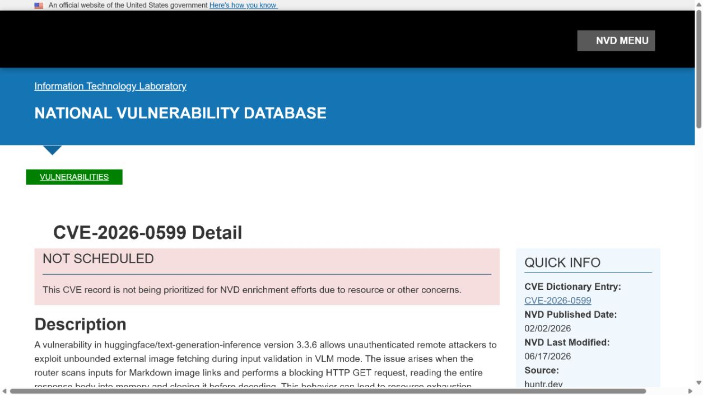
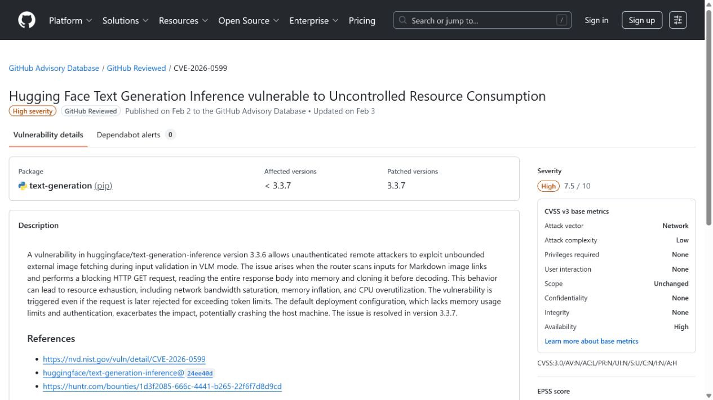
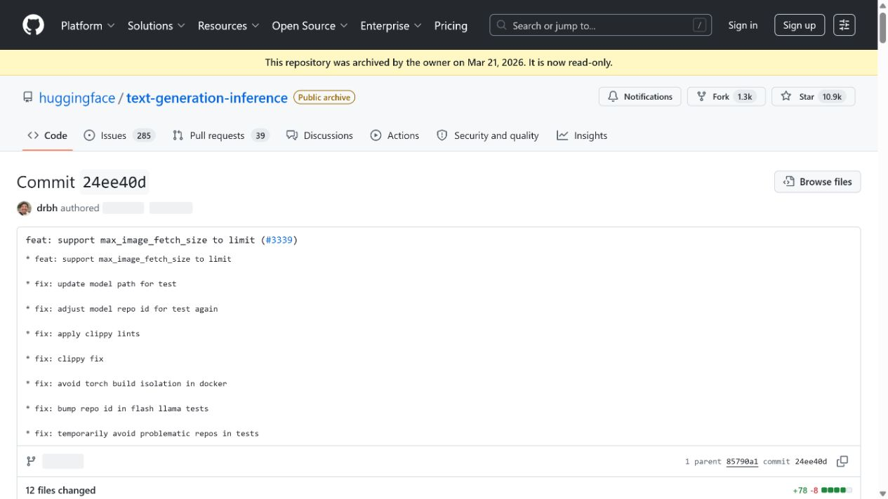
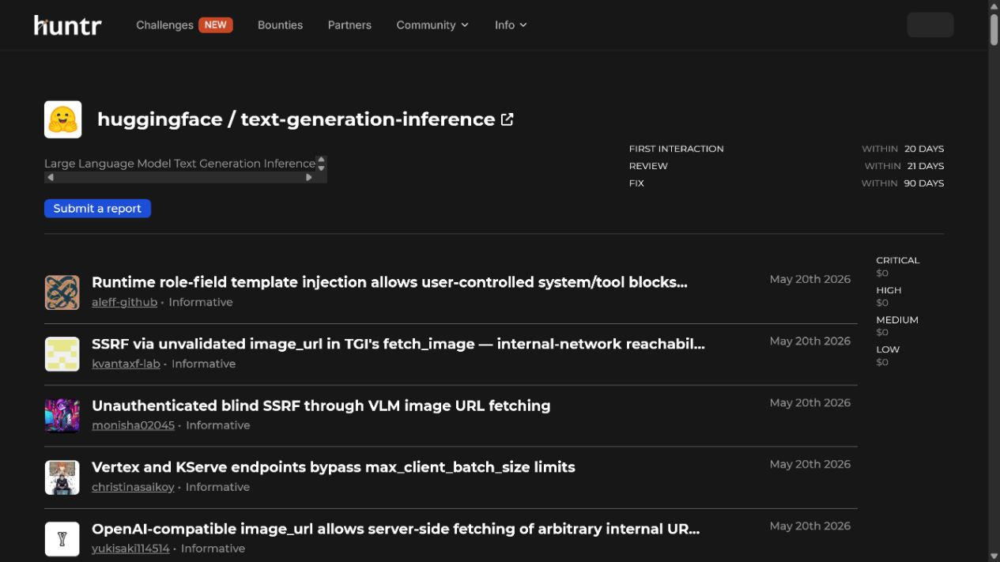
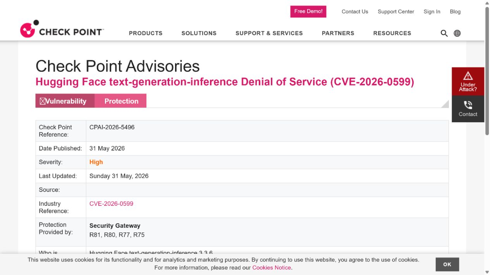

# Text Generation Inference VLM External Image Fetch DoS (2026)
> Text Generation Inference 视觉模型外部图片抓取拒绝服务漏洞

| Field | Value |
|---|---|
| Category | Domain-Specific Risks |
| Severity | High |
| AI Tool | Hugging Face Text Generation Inference, vision-language model endpoint |
| Language | Python / Rust / HTTP |
| Real Incident | Yes |
| Reproducible | Yes |
| Disclosed | 2026-02-03 |
| CVE | CVE-2026-0599 |
| CVSS | 7.5 |

## TL;DR
A Text Generation Inference VLM validation path allowed unauthenticated callers to trigger unbounded external image fetching, enabling denial of service against exposed inference endpoints.
> Text Generation Inference 的视觉模型校验路径允许未认证调用方触发无界外部图片抓取，可对暴露的推理端点造成拒绝服务。

---

## 详细分析 / Full Analysis

## 一、基本信息与事件概况

CVE-2026-0599 影响 Hugging Face Text Generation Inference 的视觉语言模型输入处理。受影响版本在验证图片输入时会抓取外部 URL，但缺少有效的数量、大小或资源限制。远程调用方可以持续提交包含外部图片地址的请求，使服务在正式推理前就消耗连接、带宽、CPU 或内存资源。

漏洞主要影响可被不可信调用者访问的 VLM 端点。它不是模型输出绕过，也不是任意文件读取；风险来自多模态服务把外部资源抓取纳入请求处理，却没有把该辅助步骤当成需要限流、超时和隔离的网络操作。

## 二、事件经过与公开材料

漏洞在 2026 年 2 月以 CVE-2026-0599 和 GHSA-j7x9-7j54-2v3h 公开。项目修复提交限制了相关输入处理，NVD、Huntr、Safety 和多个国家级安全通报随后收录。公开评分为高危可用性影响，尚无可靠公开材料显示被用于在野攻击。

因为端点暴露方式差异很大，升级记录之外还应检查推理 API 是否经认证、是否能访问互联网、反向代理是否限制请求大小，以及外部 URL 的解析和重定向是否被独立监控。

### 证据矩阵

| 来源 | 类型 | 证明内容 |
|---|---|---|
| NVD: CVE-2026-0599 | 政府漏洞数据库 | 受影响版本、未认证外部抓取和可用性影响 |
| GitHub Advisory: GHSA-j7x9-7j54-2v3h | 安全公告 | 项目 CVE 映射和修复信息 |
| Hugging Face fixing commit | 项目修复记录 | 上游代码修复存在 |
| Huntr: Text Generation Inference | 技术披露平台 | 漏洞类别和报告来源 |
| Check Point advisory for CVE-2026-0599 | 独立安全通报 | VLM 模式与外部图片获取的复核 |

## 三、系统背景与触发条件

多模态推理服务允许用户提交图片、视频或文件地址，以便在统一 API 中完成视觉理解。方便性背后包含一条额外的网络数据路径：服务代表调用者向远端站点请求资源。若该路径没有并发、尺寸、重定向和超时控制，攻击者无需耗费 GPU 推理预算，也能把资源消耗转移到下载和解码阶段。

对运行在 GPU 集群上的推理服务，少量异常请求也可能阻塞工作队列，使正常用户的模型调用长时间等待。外部抓取还应与内网访问控制结合审查，避免可用性问题与 SSRF 风险在同一入口叠加。

## 四、攻击链路或失效过程

攻击者向可访问的 VLM API 发送含外部图片 URL 的请求。服务进入输入验证并开始获取资源；攻击者通过大量、缓慢或异常大的外部内容维持资源占用。因为这一过程发生在模型推理前，GPU 侧的配额或 token 限制不一定能阻止它。最终服务可能超时、排队、崩溃或拒绝正常推理。

是否能达到高影响取决于服务的网络出口、代理限制和并发模型。公开公告并未宣称所有 TGI 部署都默认公网可达，因此排查应以实际 VLM 端点和请求日志为准。

## 五、技术根因与 AI 风险分析

根因是把外部图片 URL 当作普通模型输入，而没有为网络抓取建立资源边界。验证阶段往往被视为轻量操作，但一旦它触发任意远端请求，就必须继承下载代理的安全控制：可允许的协议和主机、最大体积、总并发、读取超时、重定向限制和缓存策略。

多模态产品应将外部抓取与模型执行分离，使用受限的下载服务或预签名对象存储，并将所有异常抓取记录到可观测性系统。这样即使模型服务暴露给大量用户，也不会把网络下载能力直接交给请求参数。

多模态推理服务把图片 URL 作为输入时，实际上同时承担了内容解析和网络客户端两种角色。模型请求量上升会放大这一差异：一个看似简单的图像参数，可能让服务反复建立远端连接、等待缓慢响应并占用下载缓冲区，随后还要进入解码和推理队列。对于面向外部用户的 VLM，这种资源消耗会与正常的 GPU 排队相互叠加，使可用性问题比单纯的网页抓取更难定位。

因此，图片输入的治理应从请求进入服务时开始，而非只在模型前处理格式。将远端下载放到独立、低权限的代理中，可以统一控制超时、重定向和缓存，也能避免主推理进程直接持有任意外连能力。运行指标应分别观察下载阶段的连接数、失败率和字节量，以及模型阶段的排队时间；两类指标同时异常时，才能较快识别由外部媒体输入引发的服务退化。

## 六、影响范围与处置建议

直接影响是推理服务可用性下降，严重时阻断业务中依赖视觉模型的自动化流程。团队应升级到包含修复的版本，限制未认证访问，并在网关、下载器和应用层分别设置资源上限。对于已经暴露的端点，应查看短时间内大量 URL 输入、长连接和异常下载失败记录。

没有公开数据说明该漏洞造成实际客户中断或数据泄露。本文因此不把可利用的拒绝服务面写成已发生的生产事故，而将重点放在暴露条件与可验证的缓解措施。

## 七、结论

多模态输入不仅是模型问题，也是网络资源管理问题。任何允许模型服务代表用户抓取外部内容的设计，都必须把下载路径纳入与推理本身同等严格的安全和容量控制。

## 八、参考来源

- [NVD: CVE-2026-0599](https://nvd.nist.gov/vuln/detail/CVE-2026-0599)
- [GitHub Advisory: GHSA-j7x9-7j54-2v3h](https://github.com/advisories/GHSA-j7x9-7j54-2v3h)
- [Hugging Face fixing commit](https://github.com/huggingface/text-generation-inference/commit/24ee40d143d8d046039f12f76940a85886cbe152)
- [Huntr: Text Generation Inference](https://huntr.com/repos/huggingface/text-generation-inference)
- [Check Point advisory for CVE-2026-0599](https://advisories.checkpoint.com/defense/advisories/public/2026/cpai-2026-5496.html/)
