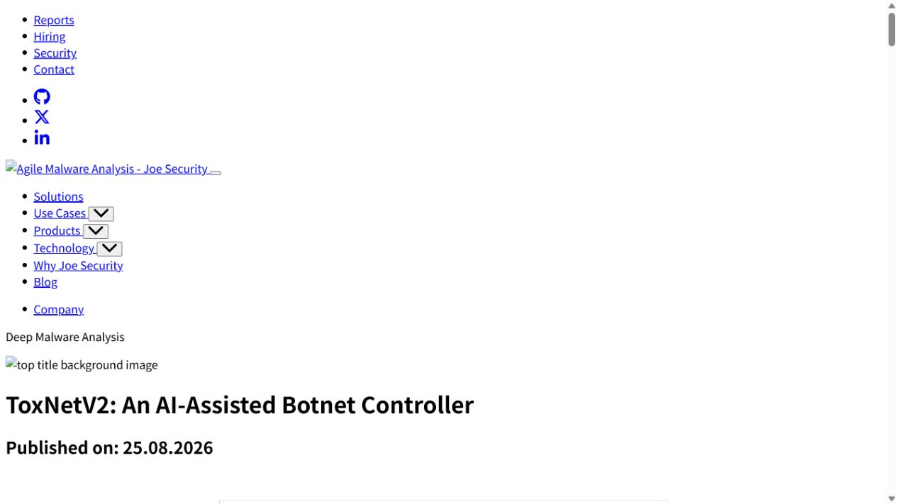
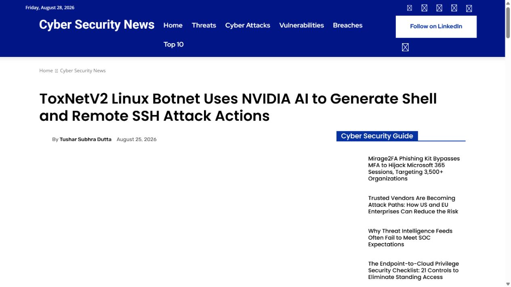
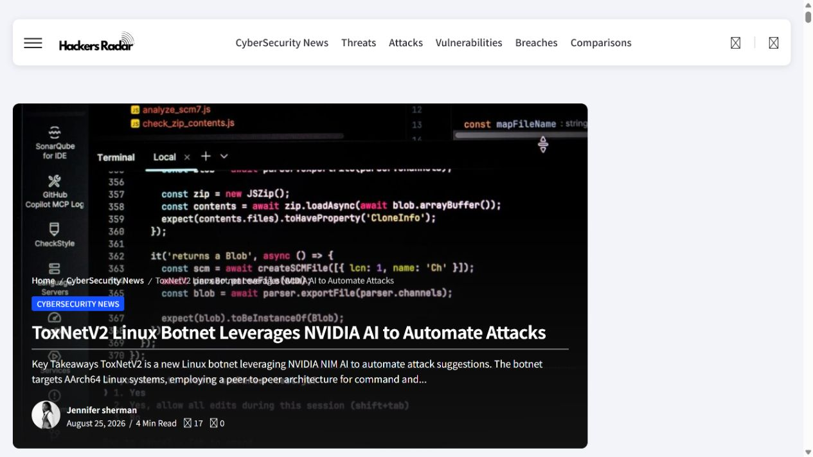
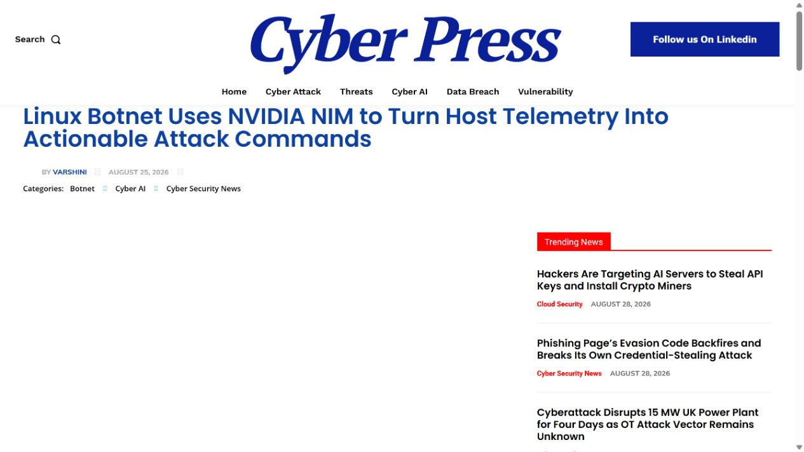
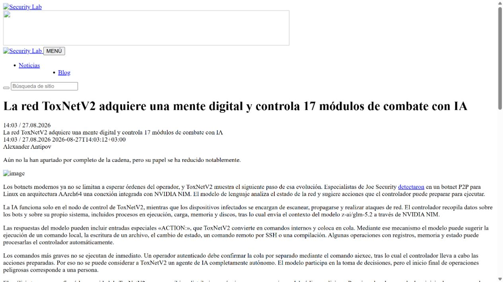

# ToxNetV2 NVIDIA NIM AI-Assisted Botnet Controller (2026)
> ToxNetV2 将 NVIDIA NIM 接入僵尸网络控制回路

| Field | Value |
|---|---|
| Category | malicious-use |
| Severity | High |
| AI Tool | NVIDIA NIM, z-ai/glm-5.2, ToxNetV2 |
| Real Incident | Yes |
| Reproducible | Yes |
| Disclosed | 2026-08-25 |

## TL;DR
ToxNetV2 在 Linux 僵尸网络控制器中调用 NVIDIA NIM 的 GLM-5.2，把主机与网络遥测转成结构化行动建议，并在操作者批准后连接到 shell、文件写入、SSH 和编译部署能力。

---

## 详细分析 / Full Analysis

## 一、事件概况

Joe Security 于 2026 年 8 月 25 日发布 ToxNetV2 逆向分析。样本面向 AArch64 Linux，使用 Tox 协议组织点对点通信；同一个二进制在恢复特定 `c2.data` 状态后进入控制器模式，否则作为普通 bot 运行。控制器会初始化 AI 子系统，将本机和僵尸网络状态发送给 NVIDIA NIM 上的 `z-ai/glm-5.2`。

研究人员从代码控制流中确认，模型响应中的特定 `ACTION:` 记录会被解析为待处理任务。动作集合既有日志、告警、权重调整等低风险项目，也包含 `shell_cmd`、`write_file`、`ssh_check` 和 `compile_deploy`。高影响动作仍需要操作者通过 `aiexec` 批准，所以把它称为完全自治僵尸网络并不准确；但模型输出已经进入真实攻击控制器的决策与执行队列。

## 二、公开资料与事实核对

Joe Security 是本案的原始逆向来源，公开了控制器角色、NIM 请求、提示内容、动作解析方式和 IOC。Cybersecurity News、HackersRadar、Cyber Press 与 SecurityLab 的报道均指向同一份样本分析，并一致保留“操作者最终批准”这一限制。由于没有厂商安全公告或 CVE，材料不能给出受影响软件版本，也不能据此推断感染规模。

公开信息能够确认的是恶意代码中存在完整 AI 调用和动作落地路径，而不是仅在字符串中出现某个模型名称。几篇报道主要用于复核原始分析的发布时间、技术摘要和外部表述是否发生偏差，事实判断仍以样本逆向结果为主。

| 来源 | 类型 | 主要核验内容 |
|---|---|---|
| [Joe Security technical analysis](https://www.joesecurity.org/blog/6764463444623599134) | 原始恶意软件分析 | 样本代码与控制逻辑 |
| [Cybersecurity News report](https://cybersecuritynews.com/toxnetv2-linux-botnet/) | 行业报道复核 | 模型调用与动作队列 |
| [HackersRadar report](https://hackersradar.com/toxnetv2-linux-botnet-leverages-nvidia-ai-to-automate-attacks/) | 行业报道复核 | 恶意软件架构 |
| [Cyber Press report](https://cyberpress.org/nim-powered-linux-botnet-emerges/) | 行业报道复核 | 攻击能力与 IOC |
| [SecurityLab report](https://www.securitylab.lat/news/576531.php) | 行业报道复核 | 样本行为复核 |

## 三、攻击或事件过程

普通 bot 负责扫描、传播、主机控制和网络攻击模块，并通过 Tox 网络与控制器交换状态。控制器收集进程、CPU 负载、内存、磁盘和 bot 计数等遥测，也可以纳入硬编码远程服务器提供的信息。随后它构造带有 ENI/VEIL 前缀的提示，请求托管模型分析当前环境。

该前缀的作用是降低模型拒绝，要求输出可执行、结构化建议。控制器并不会把所有自由文本都当作命令，只有符合指定格式的响应才进入 pending action 列表。这是一个明确的机器接口，而不是操作者把聊天回答手工复制到终端。

操作者检查并批准后，动作才调用本地 shell、文件系统、远程 SSH 或编译部署逻辑。这个审批点降低了误动作概率，也保留人的控制权，但它没有消除 AI 对目标选择、命令构造和行动排序的影响。攻击速度和覆盖面可能由模型批量处理遥测的能力显著放大。

## 四、技术根因

此案没有可统一修补的软件漏洞。攻击者主动把通用推理服务接到恶意控制平面，NVIDIA NIM 提供标准模型 API，ToxNetV2 则用自己的提示、解析器和执行器赋予输出实际含义。只要 API 凭据有效，托管服务看到的可能只是普通推理请求，恶意用途发生在客户端编排层。

风险控制因此不能只依赖模型拒绝。样本已包含专门的 jailbreak 前缀，而且最终执行器完全由攻击者控制。提供商可以通过凭据滥用检测、异常请求模式和威胁情报减少服务被利用，但阻断僵尸网络仍需要终端检测、网络封锁、凭据撤销和基础设施处置。

## 五、AI 安全问题

AI 与本案的联系是可验证且不可替代的：控制器把实时遥测提交给模型，解析模型输出并转成内部动作对象。移除这一环节后，ToxNetV2 仍是一套功能丰富的传统 botnet，但不再具备公开研究所描述的自动分析和行动建议回路。

这也说明“AI 恶意软件”需要更严格的判定。代码由模型协助编写、样本带有 AI 名称或攻击者在文档里宣传 AI，都不足以证明运行时使用模型。ToxNetV2 的证据来自实际 API 路径、模型标识、提示文本、响应解析和执行映射，因而比品牌包装更有研究价值。

## 六、影响、处置与排查

防守方可使用 Joe Security 公布的 IP、端口和下载地址进行历史检索，同时关注 AArch64 Linux 主机上异常 Tox 通信、陌生 `c2.data`、批量 SSH 探测以及编译部署行为。检测逻辑不应只匹配 NVIDIA 域名，因为攻击者可以更换模型提供商；更稳定的线索是 bot 控制流中遥测汇总、周期性 LLM 请求和结构化动作落地的组合。

云与模型服务提供商应检查泄露或异常使用的 NIM 凭据，识别短周期、高重复、包含主机清单和攻击术语的调用。终端侧则需要把模型 API 流量与后续 shell、文件写入、SSH 和扫描活动关联，单看其中任何一种都可能被误判为正常运维。

公开材料没有说明具体受害组织或感染数量，事件响应不能仅凭家族名称断言入侵。命中 IOC 后仍应保存样本、网络流量和进程树，确认设备角色是普通 bot 还是控制器，再决定是否存在 AI 调用及其实际执行结果。

## 七、治理建议

模型服务的滥用治理需要覆盖账户、请求和下游行为三个层面。账户层关注新建密钥、异常地域和调用突增；请求层检测反复要求输出 shell、SSH、持久化或攻击编排格式的模式；下游层与安全厂商共享已确认的样本和基础设施信息。任何单层都不足以识别客户端自定义的恶意编排。

组织内部也应清点哪些自动化程序可以访问外部模型 API。生产主机若同时具备模型密钥、SSH 私钥和编译工具，失陷后很容易被改造成类似控制节点。密钥应按应用和用途分离，设置费用与调用速率阈值，并避免长期凭据出现在可被普通服务读取的环境变量中。

研究报告在描述 AI 自治程度时应保留审批事实。把 ToxNetV2 说成完全自主会掩盖真正的设计：模型负责观察与建议，人负责放行高影响动作。这个结构已经足以提高攻击效率，也更接近现实中人机协同的恶意运营。

## 八、结论

ToxNetV2 的新意不在于模型替代操作者，而在于模型已经进入恶意控制器的闭环。现阶段最准确的处置方式，是同时追踪传统 botnet IOC、模型 API 凭据和由模型建议触发的后续主机行为。

### 参考来源

1. [Joe Security technical analysis](https://www.joesecurity.org/blog/6764463444623599134)
2. [Cybersecurity News report](https://cybersecuritynews.com/toxnetv2-linux-botnet/)
3. [HackersRadar report](https://hackersradar.com/toxnetv2-linux-botnet-leverages-nvidia-ai-to-automate-attacks/)
4. [Cyber Press report](https://cyberpress.org/nim-powered-linux-botnet-emerges/)
5. [SecurityLab report](https://www.securitylab.lat/news/576531.php)
