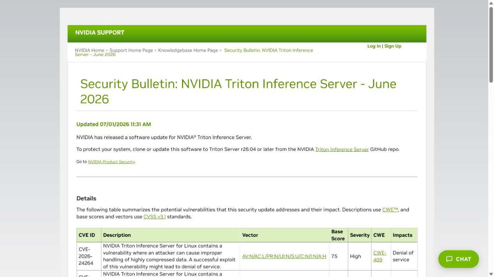
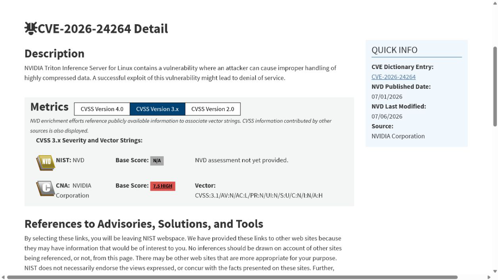
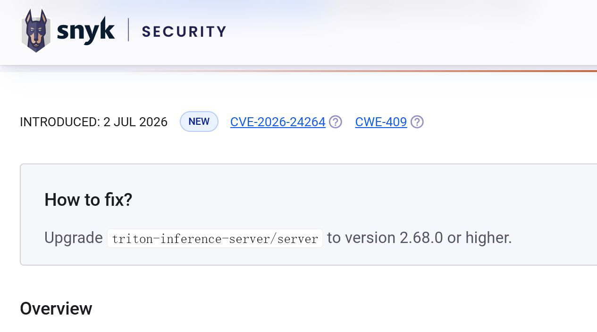
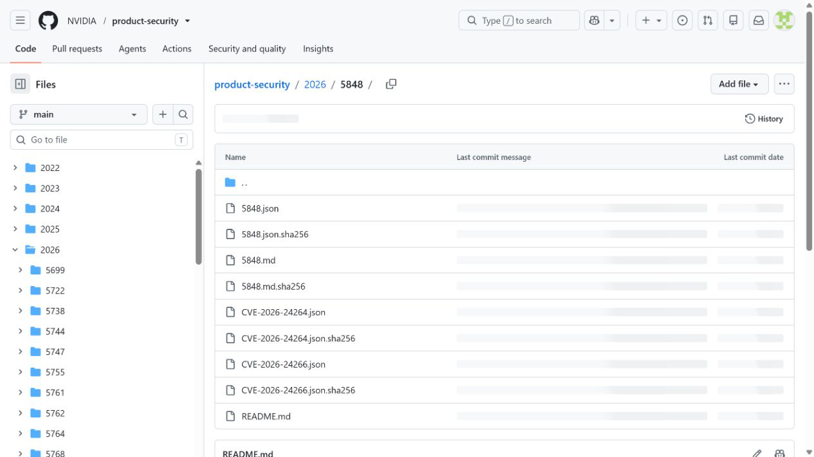
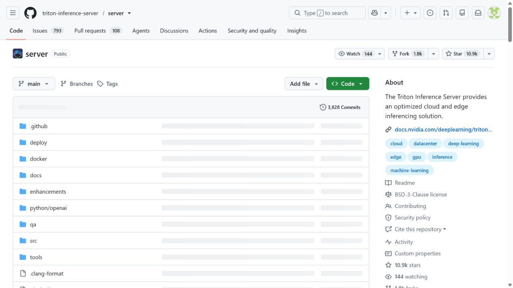

# NVIDIA Triton Inference Server Compressed Data Denial of Service (2026)
> NVIDIA Triton 推理服务器压缩数据拒绝服务漏洞

| Field | Value |
|---|---|
| Category | domain-specific |
| Severity | high（NVIDIA CVSS 3.1：7.5） |
| AI Tool | NVIDIA Triton Inference Server |
| Language | C++ |
| Real Incident | Yes（已公开确认的真实漏洞；不表示已有公开在野利用） |
| Reproducible | No |
| Disclosed | 2026-06-30 |
| CVE | CVE-2026-24264 |
| CVSS | 7.5 |

## TL;DR / 摘要

NVIDIA Triton Inference Server 0.0 至 26.03 在处理高度压缩数据时存在资源放大问题。远程攻击者无需认证或用户交互，即可通过网络发送特制输入，使服务器在解压或后续处理阶段消耗大量资源并造成拒绝服务。NVIDIA 将该问题登记为 CVE-2026-24264，CVSS 3.1 评分为 7.5（High），CWE 分类为 CWE-409，并要求升级到 Triton Server 26.04 或更高版本。

---

## 详细分析 / Full Analysis

### 一、事件概况与公开记录

NVIDIA 于 2026 年 6 月 30 日发布 Triton Inference Server 安全公告，次日更新公告内容。公告列出 CVE-2026-24264，说明 Linux 版 Triton 在高度压缩数据处理上存在缺陷，成功利用可能导致拒绝服务。受影响版本为 0.0 至 26.03，26.04 为包含安全更新的版本。NVD 随后收录该记录，并在 7 月 6 日加入 Triton Inference Server 与 Linux 的 CPE 配置。

Triton 是面向生产环境的 AI 推理服务，负责加载 TensorRT、PyTorch、ONNX Runtime 等后端模型，并通过 HTTP 或 gRPC 接收推理请求。它往往位于推荐、搜索、视觉识别、语音或生成式 AI 应用的在线服务路径上。一次进程崩溃、内存耗尽或长时间无响应，不只影响单个网页请求，而可能使一组模型端点失去服务能力。

### 二、攻击面与触发条件

厂商 CVSS 向量为 `AV:N/AC:L/PR:N/UI:N/S:U/C:N/I:N/A:H`：攻击从网络发起，复杂度低，不需要权限，也不依赖用户操作，主要影响可用性。公开公告没有发布可直接复现的载荷或具体协议字段，因此不能把漏洞限定为某一种模型格式、某个后端或某个单独 API。可以确认的是，问题与 Triton 接收到的高度压缩数据及其处理过程有关。

CWE-409 描述的是数据放大：输入本身体积较小，但展开后占用的内存、CPU、临时空间或处理时间显著增加。对于推理服务器，这类消耗还可能叠加模型张量分配、批处理队列、GPU 调度和请求超时。若多个工作负载共享同一 Triton 实例或节点，一个异常请求造成的资源压力可能挤占其他模型的推理容量。

NVD 的 CISA-ADP 补充记录将该漏洞标记为可自动化，公开利用状态为 none，技术影响为 partial。这表示攻击路径适合通过网络重复触发，但截至该记录时间没有公开确认的利用证据。案例因此按已确认漏洞处理，不把它写成已经发生的生产攻击或大范围中断事件。

### 三、为何属于 AI 基础设施安全

该问题出现在模型推理服务本身，而不是与 AI 偶然同机部署的通用组件。Triton 的职责是接收面向模型的输入、调度推理后端、管理批处理并返回模型输出。其网络端点的可用性直接决定上层 AI 功能是否能够响应。即使业务前端仍然在线，推理层失效也会表现为模型超时、结果缺失、队列堆积或回退策略被持续触发。

生产系统常把多个模型部署在共享 GPU 节点上，以提高硬件利用率。该架构降低成本，但也扩大了拒绝服务的影响范围：一个模型端点接收的异常压缩数据可能消耗进程或容器级资源，从而影响同一实例中的其他模型。自动扩缩容若只依据请求量或 GPU 利用率，还可能把恶意负载误判为正常增长并复制到更多节点，增加资源费用和恢复复杂度。

Snyk 将受影响的 Triton Server 映射到 2.68.0 之前，并建议升级至 2.68.0 或更高版本；该项目版本与 NVIDIA NGC 容器 26.04 对应。Snyk 给出了自己的 CVSS 4.0 评估，但本文严重性采用 NVIDIA CNA 的 CVSS 3.1 7.5，以免混用评分体系。两个来源对漏洞类型和修复方向的结论一致。

### 四、版本识别与影响判断

资产排查应从实际运行的容器镜像、二进制版本和部署清单入手。Triton 常通过 `nvcr.io/nvidia/tritonserver` 镜像部署，标签可能被 Helm、Kubernetes Operator、内部镜像仓库或平台模板再次封装。仅查看应用代码中的客户端依赖无法判断服务端是否受影响；`tritonclient` 的版本也不能替代服务器版本证据。

NVIDIA 公告列出的平台是 Linux，受影响版本上限包含 26.03，更新版本为 26.04。NVIDIA 同时在公开的 Product Security 仓库中保存公告记录与结构化安全数据，便于核对公告编号、CVE 归属和后续修订。该仓库与支持站属于同一厂商来源，因此只算厂商材料的两种公开载体，不把它们描述为彼此独立的漏洞发现。

评估具体环境时，还应确认端点是否直接暴露到公网、是否经过网关认证、请求体大小限制是否覆盖解压后的数据、容器内存和 CPU 是否有限额，以及 Triton 与其他模型是否共享节点。网络隔离与限流能够降低触发概率和爆炸半径，但不能代替修复版本，因为合法租户或已获网络访问的客户端仍可能提交异常数据。

### 五、修复与纵深防护

最直接的处置是升级到 Triton Server 26.04 或更高版本，并确认新实例实际拉取了更新镜像。使用可变标签的环境应检查镜像摘要，避免节点继续复用本地缓存的旧镜像。滚动升级期间需要观察旧版 Pod 是否仍在接收流量，并在完成后清理过期部署、离线镜像和应急回滚模板。

网关层可设置压缩格式白名单、请求体上限、解压后大小上限、并发配额和速率限制。服务层应配置容器内存、CPU、临时存储限制以及合理的请求超时，并用熔断和队列隔离防止单个模型拖垮整个实例。对于多租户平台，按租户或模型拆分配额比全局限流更有效，也便于从日志中识别异常来源。

官方 Triton 仓库说明该服务器通过 HTTP 或 gRPC 为所管理的模型提供推理服务，26.04 对应 Release 2.68.0。仓库材料确认产品功能、版本对应关系和升级来源；漏洞本身仍以 NVIDIA 安全公告为准。这样的分工可以避免把项目首页的一般功能介绍误写成安全结论。

### 六、监测与无害验证

本地验证应以版本、配置和资源隔离检查为主，不需要生成或发送高压缩比攻击数据。管理员可以读取运行容器的镜像标签和摘要，调用健康检查确认服务版本，检查入口网关是否限制请求大小，并在隔离测试环境中使用正常的小型压缩样本确认升级后推理功能没有回归。生产环境不宜直接进行资源耗尽测试。

监测指标应覆盖进程 RSS、容器 OOM、CPU 时间、临时磁盘、请求体大小、解压失败、HTTP/gRPC 错误率、推理队列时长和模型加载状态。若短时间内出现体积异常、压缩率异常的请求，并伴随内存快速上升、健康检查失败或 Pod 重启，应保留入口日志、容器事件和请求来源信息进行关联分析。

恢复方案不能只依赖自动重启。若攻击流量持续存在，新实例可能在启动后立即再次耗尽资源。应先在网关或网络层阻断异常来源和特征，再恢复推理实例，并核对是否有其他共享节点受影响。对关键 AI 服务，可配置独立的备用推理池和受控降级策略，避免所有模型同时依赖同一资源域。

### 七、证据材料

| 来源 | 类型 | 证明内容 |
|---|---|---|
| NVIDIA Triton Inference Server June 2026 Security Bulletin | 厂商安全公告 | CVE、漏洞描述、CVSS、受影响版本、修复版本与披露时间 |
| NVD: CVE-2026-24264 | 政府漏洞数据库 | CVE 状态、CWE、CPE、时间线及 CISA-ADP 补充信息 |
| Snyk: CVE-2026-24264 | 独立漏洞库 | 数据放大机理、项目版本映射与升级建议 |
| NVIDIA Product Security record 5848 | 厂商安全数据仓库 | 公告编号、CVE 记录与厂商材料归档 |
| NVIDIA Triton Inference Server repository | 官方项目仓库 | 产品定位、网络推理接口、26.04 与 2.68.0 版本对应 |

`assets/` 中的五个 HTML 文件是各来源服务器返回的原始页面，没有添加离线渲染脚本或改写正文；五张图片来自浏览器对相应真实页面的访问。GitHub 等动态页面离线打开时可能无法加载外部资源，但原始 HTML 仍保留服务器返回内容，截图用于直观核对页面当时显示的关键信息。

### 八、结论

CVE-2026-24264 是 AI 在线推理层的可用性漏洞。高度压缩输入在服务器端被放大处理，远程未认证攻击者因此可能用较低的入口成本消耗较高的计算与内存资源。Triton 集中承载模型的部署方式又会把单个端点的问题扩展为多个 AI 功能的共同故障。

处置时应把版本升级、网络访问控制、压缩数据限制、资源配额和多租户隔离同时纳入。升级到 26.04 或更高版本解决已知缺陷，网关和容器层控制则限制未来类似输入解析问题的影响。对依赖推理服务的组织而言，模型安全不仅包括输出质量与提示词攻击，也包括保证推理基础设施面对恶意输入时仍能维持可控的资源消耗。

### 参考来源

- [NVIDIA Triton Inference Server June 2026 Security Bulletin](https://nvidia.custhelp.com/app/answers/detail/a_id/5848/~/security-bulletin%3A-nvidia-triton-inference-server---june-2026)
- [NVD: CVE-2026-24264](https://nvd.nist.gov/vuln/detail/CVE-2026-24264)
- [Snyk: CVE-2026-24264](https://security.snyk.io/vuln/SNYK-UNMANAGED-TRITONINFERENCESERVERSERVER-17879258)
- [NVIDIA Product Security record 5848](https://github.com/NVIDIA/product-security/tree/main/2026/5848)
- [NVIDIA Triton Inference Server repository](https://github.com/triton-inference-server/server)
