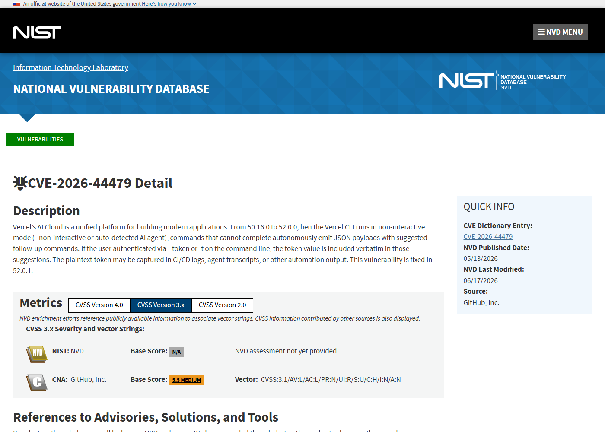
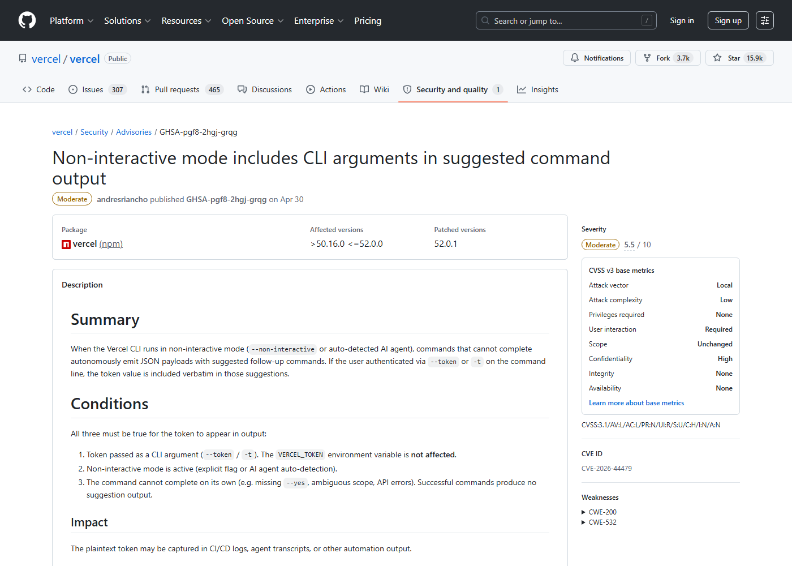
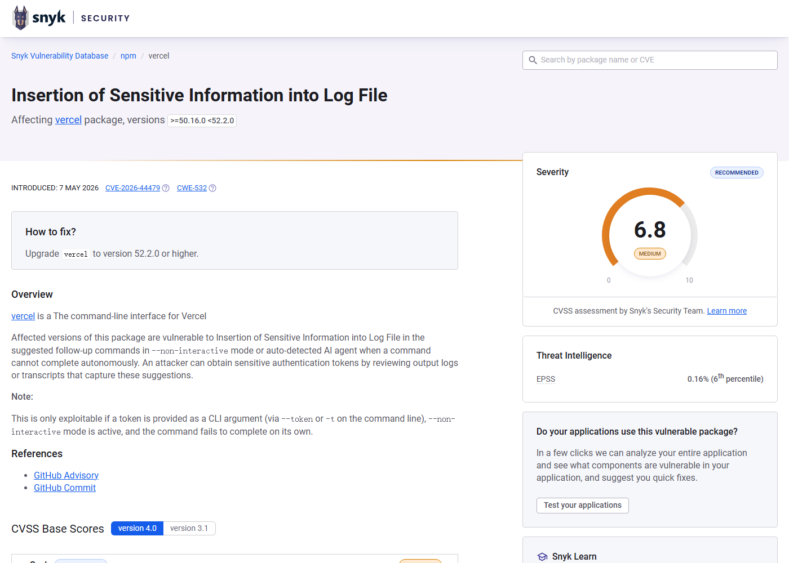
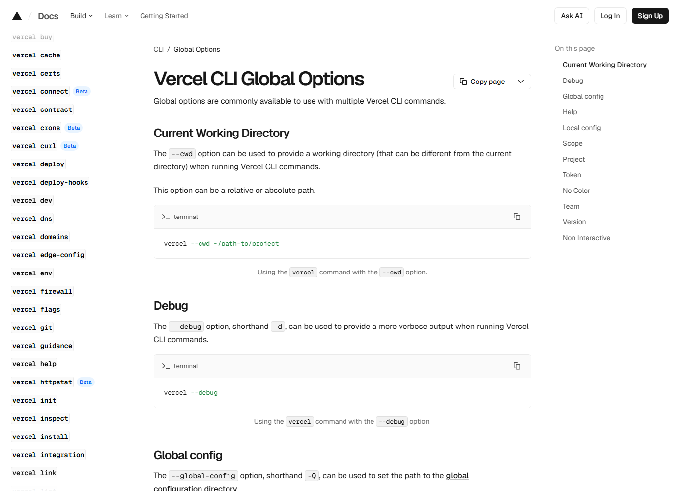

# Vercel CLI AI Agent Token Disclosure (2026)
> Vercel CLI AI Agent 非交互模式令牌泄露

| Field | Value |
|---|---|
| Category | Cloud / IaC |
| Severity | Medium |
| AI Tool | Vercel CLI, Vercel AI Cloud, CI/CD agent environments |
| Language | JavaScript / TypeScript |
| Real Incident | Yes |
| Reproducible | Yes |
| Disclosed | 2026-04-30 |
| CVE | CVE-2026-44479 |
| CVSS | 5.5 |

## TL;DR
Vercel CLI included command-line tokens in suggested follow-up command JSON when running non-interactively or under auto-detected AI agent conditions.
> Vercel CLI 在非交互或自动识别 AI Agent 模式下，会把命令行传入的 token 写入建议命令 JSON，可能进入 CI 日志和 Agent 记录。

---

## 详细分析 / Full Analysis

## 一、基本信息

Vercel CLI 是开发者和自动化系统管理部署、域名、环境和项目配置的常用入口。CVE-2026-44479 影响 50.16.0 到 52.0.0：当 CLI 运行在 --non-interactive 模式，或检测到自己处在 AI Agent 环境中时，部分无法自主完成的命令会输出 JSON，里面包含建议用户继续执行的命令。如果用户通过 --token 或 -t 在命令行传入 Vercel token，该 token 会被原样写入建议命令，从而进入 CI/CD 日志、Agent transcript 或自动化平台输出。

## 二、事件核验与公开材料范围

Vercel 项目自己的 GitHub security advisory、GitHub Advisory Database、NVD、GitLab Advisory 和 Snyk 都确认了这个问题，并给出相同的关键条件：非交互或 AI Agent 模式、命令行 token 参数、建议命令输出。修复版本为 52.0.1。Vercel 文档也说明 --non-interactive 面向 CI/CD、脚本和 Agent 环境，这让漏洞影响场景更加清晰。

### 证据矩阵

| 来源 | 类型 | 证明内容 |
|---|---|---|
| NVD: CVE-2026-44479 | 漏洞数据库 | 非交互模式、明文 token 输出和修复版本 |
| Vercel Advisory: GHSA-pgf8-2hgj-grqg | 厂商公告 | 影响条件、缓解建议和 52.0.1 修复 |
| GitHub Advisory Database: GHSA-pgf8-2hgj-grqg | 安全公告 | npm vercel 影响版本和修复版本 |
| GitLab Advisory: CVE-2026-44479 | 依赖库公告 | 依赖扫描视角下的版本范围 |
| Snyk: SNYK-JS-VERCEL-16638653 | 漏洞数据库 | 日志、自动化输出和 token 暴露影响 |
| Vercel Docs: CLI Global Options | 产品文档 | 非交互模式用于 CI/CD、脚本和 Agent 环境 |

## 三、系统背景与触发条件

AI coding agent 和 CI 自动化常把 CLI 输出作为可读上下文保存下来，方便模型判断下一步命令。传统命令行安全建议已经不鼓励把 token 放在参数里，因为进程列表和 shell history 可能泄露；在 Agent 场景中，输出记录又变成新的泄露位置。CVE-2026-44479 的特殊性在于，CLI 为了帮助非交互流程继续执行，把用户原本输入的认证参数复制进建议命令，于是敏感值从输入侧扩散到了输出侧。

## 四、攻击链路与处置过程

触发链路通常发生在部署自动化里。开发者或 Agent 调用 vercel 命令，并用 --token 或 -t 传入 token；CLI 处于非交互模式，遇到需要后续命令才能完成的场景；CLI 输出 JSON 建议，其中带有完整 token；CI 系统、任务日志、Agent 运行记录或协作平台保存该输出。随后，任何能读取这些日志的人或系统都可能拿到可复用 token。若 token 权限覆盖多个项目或组织，影响会扩展到部署、配置读取、环境变量管理等操作。

## 五、技术根因与 AI 风险归因

根因是非交互体验设计没有对敏感参数做输出级脱敏。AI Agent 模式为了可自动解析，往往更依赖结构化 JSON；但结构化输出同样会被长期保存、索引和传给模型。CLI 在生成 follow-up command 时保留了完整参数，没有识别 --token/-t 属于敏感字段，也没有强制推荐环境变量认证。这类问题不是模型生成错误，而是 AI 自动化运行环境改变了 CLI 输出的安全边界。

Vercel CLI 这个案例的细节很适合放在 Agent 自动化背景下理解。过去 CLI 把 token 放在参数里已经有风险，但泄露面主要是 shell history、进程列表和 CI 配置。AI Agent 加入后，命令输出会被更多系统读取：Agent 需要解析 JSON 判断下一步，平台可能保存完整 transcript，调试时会把输出贴进 issue 或聊天工具，失败任务还会被日志系统索引。CLI 把 token 复制进建议命令后，秘密就从“用户输入”扩散到“自动化上下文”，后者通常生命周期更长、可见范围更大。

这个问题也反映了“给 Agent 看的提示”与“给人看的提示”不一样。人看到建议命令时，可能会注意到 token 并手动删掉；Agent 或 CI 系统则会按结构化字段原样保存、转发或再次执行。非交互模式的设计目标是减少中断，让系统自己继续；但安全上需要相反的默认值：凡是涉及 token、password、secret、key 的参数，都应在输出层被替换成占位符，或者改成引用已配置的环境变量。否则越是 Agent 友好的工具，越容易把凭据暴露给围绕 Agent 的日志生态。

## 六、影响范围与治理建议

该问题的严重度为中等，但在真实 DevOps 环境里不应低估。token 一旦进入日志，常会被复制到构建缓存、错误追踪、Agent 记忆、工单或聊天记录中。治理上应升级到 52.0.1 或更高版本，停止在命令行参数中传 token，改用 VERCEL_TOKEN 环境变量或平台密钥管理；同时检索历史日志和 Agent 记录中是否出现过 --token/-t 输出，发现后立即轮换对应 token。对 AI Agent 运行平台，还应对 CLI 输出做敏感值扫描和最短保留。

处置时不能只升级 CLI。历史日志里可能已经出现过完整 token，尤其是包含 `--token` 或 `-t` 的失败命令、JSON 建议命令、Agent 推理记录和自动化平台调试输出。团队应按 token 作用域检索 CI 日志、构建制品、Agent 运行目录、错误追踪和协作平台附件，并对命中的 token 立即轮换。若同一 token 被多个项目复用，还需要检查相关 Vercel 项目的部署历史、环境变量修改、域名配置和团队成员变更。

后续建议把 CLI 凭据治理纳入 Agent 平台基线。Agent 执行命令前，平台可以拦截高风险参数形式，提示使用环境变量或密钥管理器；Agent 执行后，平台对 stdout/stderr 做敏感值扫描和掩码；保存 transcript 时区分“可长期保留的推理过程”和“应短期销毁的命令输出”。这样即使某个 CLI 再次在输出中回显敏感参数，也能在平台侧多一道防线。

这个案例也提示工具开发者重新审视“建议命令”功能。为了帮助用户继续操作，CLI 经常把当前参数拼进下一条命令；但一旦参数里有密钥，建议命令就成了二次泄露点。更好的做法是输出抽象动作，例如“请重新运行 deploy，并使用已配置的 VERCEL_TOKEN”，而不是输出可直接复制执行的完整命令。对 Agent 场景，结构化 JSON 里还应有字段级敏感性标注，告诉上游平台哪些值不应记录或回显。

企业可以把此类问题纳入 secret scanning 的规则库。传统扫描器常关注代码仓库中的 key pattern，但 Agent transcript、CI stdout、CLI JSON 和失败任务附件也应成为扫描对象。尤其是自动化平台引入 LLM 后，日志会被更多系统消费，密钥扫描范围也要跟着扩大。

## 七、结论

CVE-2026-44479 是一个典型的 AI 自动化时代凭据泄露案例。工具没有被攻破，模型也没有越权；真正的问题是 CLI 为 Agent 友好的结构化输出复制了秘密。未来的开发工具需要默认把“会被 Agent 保存和转发的输出”视为敏感数据面。

## 八、参考来源

- [NVD: CVE-2026-44479](https://nvd.nist.gov/vuln/detail/CVE-2026-44479)
- [Vercel Advisory: GHSA-pgf8-2hgj-grqg](https://github.com/vercel/vercel/security/advisories/GHSA-pgf8-2hgj-grqg)
- [GitHub Advisory Database: GHSA-pgf8-2hgj-grqg](https://github.com/advisories/GHSA-pgf8-2hgj-grqg)
- [GitLab Advisory: CVE-2026-44479](https://advisories.gitlab.com/npm/vercel/CVE-2026-44479/)
- [Snyk: SNYK-JS-VERCEL-16638653](https://security.snyk.io/vuln/SNYK-JS-VERCEL-16638653)
- [Vercel Docs: CLI Global Options](https://vercel.com/docs/cli/global-options)
