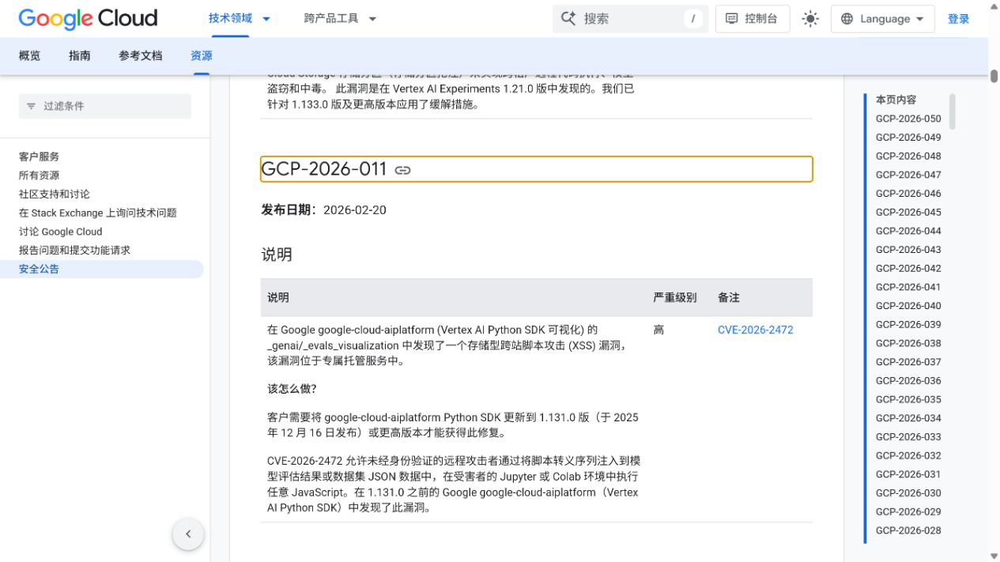
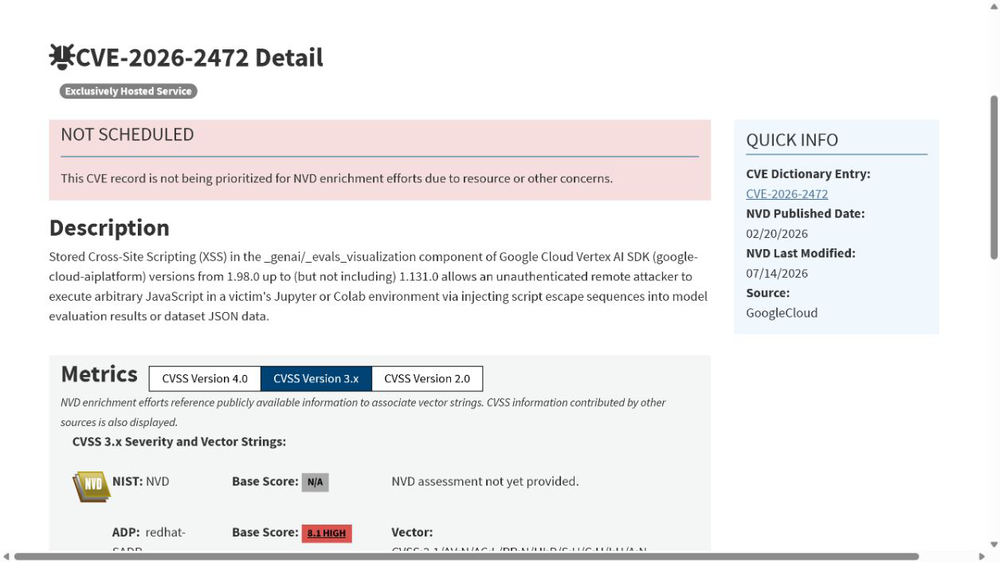
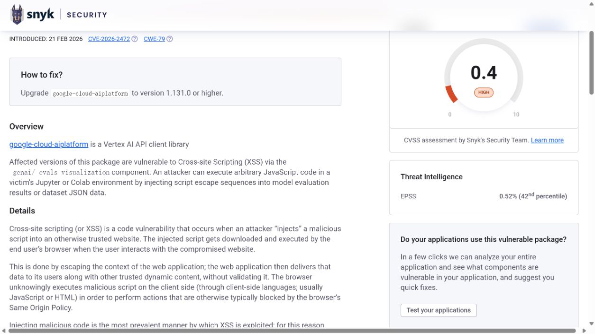
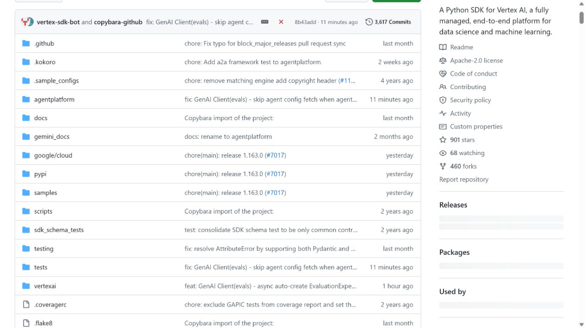
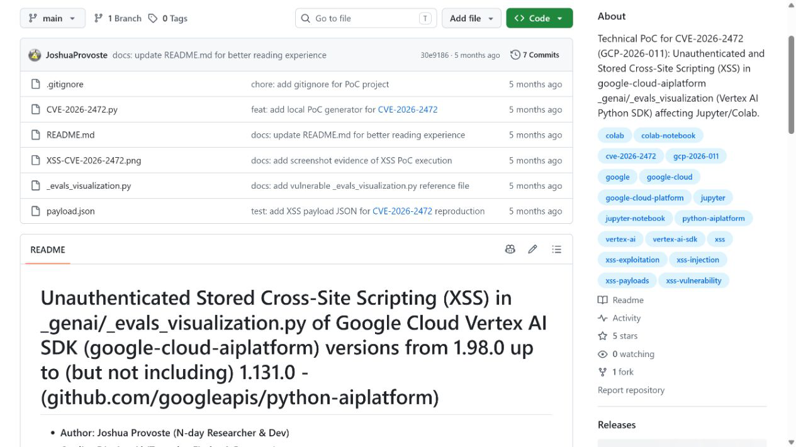

# Vertex AI SDK Evaluation Visualization Stored XSS (2026)
> Vertex AI SDK 评估结果可视化存储型跨站脚本漏洞

| Field | Value |
|---|---|
| Category | code-vulns |
| Severity | high（Google Cloud CVSS 4.0：8.6） |
| AI Tool | Google Cloud Vertex AI SDK for Python |
| Language | Python |
| Real Incident | Yes（已公开确认的真实漏洞；不表示已发生大规模利用） |
| Reproducible | No |
| Disclosed | 2026-02-20 |
| CVE | CVE-2026-2472 |
| CVSS | 8.6 |

## TL;DR / 摘要

Vertex AI Python SDK 的评估可视化组件在把模型评估结果或数据集 JSON 显示到 Jupyter、Colab 时，没有充分中和其中的脚本逃逸序列。攻击者只要能够影响被评估的数据或结果内容，就可能把持久化的恶意文本带入笔记本；当分析人员查看可视化结果时，文本会在其浏览器上下文中成为 JavaScript。Google Cloud 将该问题登记为 CVE-2026-2472，受影响版本为 `google-cloud-aiplatform` 1.98.0 至 1.131.0 之前，修复版本为 1.131.0。

---

## 详细分析 / Full Analysis

### 一、事件概况与公开记录

Google Cloud 在 GCP-2026-011 安全公告中披露了 Vertex AI SDK for Python 的存储型跨站脚本漏洞。公告把问题定位在 `_genai/_evals_visualization` 组件，并说明模型评估结果或数据集 JSON 中的脚本逃逸序列可以进入 Jupyter 或 Colab 的展示页面。NVD 收录的 CVE 记录与厂商公告一致，列出的受影响范围是 1.98.0（含）至 1.131.0（不含），CWE 类型为 CWE-79。

这不是普通网站评论区或后台表单中的 XSS。输入对象本身属于 AI 评估工作流：提示词、模型回答、参考答案、评分理由、检索上下文以及用户导入的数据集字段，都可能进入评估记录。分析人员通常会把这些字段当作待比较的数据，而不是可执行页面内容。漏洞恰好出现在“把 AI 产物变成可交互报告”的环节，改变了这类数据的安全属性。

### 二、AI 工作流中的攻击入口

Vertex AI 的评估工具用于比较模型输出、计算指标并呈现样本级结果。实际项目中，评估数据常来自外部数据集、红队样本、用户对话、在线反馈或其他模型生成内容。攻击者不一定需要接触笔记本，也不必拥有受害者的 Google Cloud 控制台会话；只要能够控制之后会被导入评估的数据字段，恶意内容就可以随着数据处理链进入可视化组件。

典型传播过程是：不可信内容先以字符串形式写入数据集或模型评估结果，评估任务正常完成并保存结果，研究人员随后在 Jupyter 或 Colab 中打开 SDK 生成的可视化。若组件把内容拼入 HTML 或脚本上下文而未采用与上下文匹配的编码，原本的数据就会闭合现有结构并执行脚本。由于载荷保存在结果或数据中，触发时间与注入时间可以分离，这也是“存储型”定性的关键。

NVD 记录给出的 CVSS 4.0 向量包含低攻击复杂度、受害者交互以及对后续系统的影响。这里的用户交互并非点击可疑链接，而是分析人员执行本职工作并打开评估结果。对模型评估平台而言，这种交互很自然，传统的“提醒用户不要点击未知链接”并不能解决问题。

### 三、技术成因与安全影响

可视化组件需要同时处理结构化数据、富文本和前端展示。安全实现应把每个模型输出和数据集字段视为纯数据，并根据最终落点采用 HTML 文本编码、属性编码或安全的 JSON 序列化。CVE-2026-2472 表明，受影响实现允许脚本逃逸序列突破原有数据边界。只在输入阶段删除 `<script>` 标签并不充分，因为事件属性、标签闭合、脚本上下文逃逸等形式都可能改变浏览器解析结果。

一旦脚本在笔记本页面中执行，它所处的上下文可能同时包含评估样本、尚未发布的模型回答、项目标识、页面可访问的接口以及研究人员当前会话能够操作的资源。实际可达影响取决于 Jupyter 或 Colab 的部署方式、浏览器隔离策略、认证状态和周边扩展。公开记录确认的是任意 JavaScript 执行能力，不能据此断言每个环境都会自动发生云账号接管，但也不能把它降格为单纯的页面显示异常。

Snyk 对 Python 包版本范围和修复建议进行了独立整理，其结论与 Google Cloud 的版本边界一致。它同时将问题归类为存储型 XSS，说明漏洞并非仅存在于即时预览，而是与被保存并再次展示的内容有关。该材料适合作为包管理视角的复核，但漏洞定性和官方评分仍以 Google Cloud CNA 记录为准。

### 四、版本范围与修复状态

`google-cloud-aiplatform` 1.98.0 至 1.130.x 处于公开记录列出的受影响范围，1.131.0 起为修复版本。使用方应同时检查锁文件、笔记本内核环境、共享镜像和长期运行的工作台实例；只更新项目根目录中的依赖声明，不代表正在运行的内核已经加载新版本。团队若维护多个 Vertex AI Workbench 模板，还需要核对模板构建时间以及用户实例是否会自动重建。

Google APIs 的 `python-aiplatform` 仓库说明该项目是 Vertex AI 的 Python SDK，并公开发布版本与更新记录。这个来源用于确认产品身份和官方发布渠道，不把仓库首页本身当成漏洞证明。漏洞事实由安全公告和 CVE 记录确认，仓库则说明修复版本应从哪个上游项目获得，避免把名称相近的 REST API、控制台服务或其他 Gemini SDK 混入受影响范围。

### 五、AI 安全问题分析

此案反映的是 AI 数据管线中的“内容重新解释”风险。模型输出和评估数据在前几个阶段只是文本，进入报告、笔记本或仪表板后却可能被浏览器当作代码。团队容易把模型评估环境视为内部研究工具，从而对输入信任度作出过高判断；但红队数据集、线上失败样本和第三方基准恰恰包含大量刻意构造的边界文本，风险往往比普通业务数据更高。

评估系统还会汇集不同信任域的数据。外部供应商提供的基准集、用户反馈、模型自动生成的解释和人工标注可能在同一个表格中出现。若可视化层没有保持字段来源与转义规则，攻击者可以通过一个低权限数据入口影响拥有更高权限的评估人员。安全审查因此不能只看模型 API 是否有内容过滤，还应检查结果存储、导出、富文本渲染和 notebook display hook。

公开技术复现仓库展示了研究者针对该 CVE 的测试思路，可用于理解输入如何经过评估数据进入展示层。该仓库是技术补充，不承担厂商确认作用。材料中没有使用其演示画面替代真实网页截图，也没有把研究者自述扩展为已发生攻击；案例对漏洞状态、版本范围和评分的表述均可回到 Google Cloud 与 CVE 记录。

### 六、处置与验证建议

首要措施是将 `google-cloud-aiplatform` 升级到 1.131.0 或更高版本，重启正在运行的 notebook 内核，并重新构建包含旧版 SDK 的基础镜像。暂时无法升级的环境应避免使用受影响组件打开不可信评估结果，将评估数据限定为纯文本导出，并在独立浏览器配置或隔离工作区中查看。Jupyter 和 Colab 的访问令牌、云凭据及数据权限也应按最小权限配置。

本地验证不需要执行攻击代码。管理员可用包管理器读取实际安装版本，检查依赖锁定是否落在受影响区间，并使用包含普通 HTML 特殊字符的无害样本确认展示结果保持为文本。测试时应观察渲染后的 DOM，而不能只检查原始 JSON；同时确认升级后历史评估文件重新打开时也不会恢复旧的危险展示逻辑。

日志排查可以关注异常评估数据、包含标签闭合或脚本相关转义序列的字段，以及评估页面访问时间附近的异常网络请求。由于载荷可能长期保存在数据集中，完成升级后仍应审查来源不明的历史数据与共享评估产物。对外部基准集建立来源登记、哈希校验和审阅流程，可降低类似问题再次通过数据供应链进入内部分析环境的概率。

### 七、证据材料

| 来源 | 类型 | 证明内容 |
|---|---|---|
| Google Cloud Security Bulletin GCP-2026-011 | 厂商安全公告 | 漏洞组件、攻击方式、受影响版本、修复版本与厂商评分 |
| NVD: CVE-2026-2472 | 政府漏洞数据库 | CVE 状态、CWE、时间、版本范围及 Google Cloud CNA 记录 |
| Snyk: CVE-2026-2472 | 独立漏洞库 | Python 包范围、存储型 XSS 分类与升级建议 |
| Google APIs Python AI Platform repository | 官方项目仓库 | SDK 产品身份、上游代码库和版本发布渠道 |
| Public technical reproduction for CVE-2026-2472 | 研究者技术材料 | 组件位置、输入传播与无害复核思路 |

`assets/` 保存上述五个来源抓取时返回的原始 HTML 文件，以及浏览器访问同一页面时截取的真实页面画面。HTML 未做重写、拼接或离线美化；动态站点离线打开时可能缺少外部样式，但原始响应仍可用于核对标题、正文、版本和链接。

### 八、结论

CVE-2026-2472 把模型评估数据的信任问题带到了研究人员日常使用的 notebook 界面。攻击者不需要直接入侵 Vertex AI 控制台，只需让恶意文本进入之后会被展示的评估结果，就可能在查看者的浏览器上下文中执行 JavaScript。其防护重点不仅是升级 SDK，还包括把模型输出、数据集字段和评估解释始终按不可信数据处理。

这起案例与一般 Web 表单 XSS 的区别在于输入来源和触发动作都嵌入 AI 评估链路。它说明 AI 安全审查应覆盖从数据进入、模型处理、结果存储到可视化展示的完整路径；任何把自然语言或模型产物重新解释为 HTML、代码或命令的环节，都需要独立的边界控制。

### 参考来源

- [Google Cloud Security Bulletin GCP-2026-011](https://docs.cloud.google.com/support/bulletins#gcp-2026-011)
- [NVD: CVE-2026-2472](https://nvd.nist.gov/vuln/detail/CVE-2026-2472)
- [Snyk: CVE-2026-2472](https://security.snyk.io/vuln/SNYK-PYTHON-GOOGLECLOUDAIPLATFORM-15338245)
- [Google APIs Python AI Platform repository](https://github.com/googleapis/python-aiplatform)
- [Public technical reproduction for CVE-2026-2472](https://github.com/JoshuaProvoste/CVE-2026-2472-Vertex-AI-SDK-Google-Cloud)
