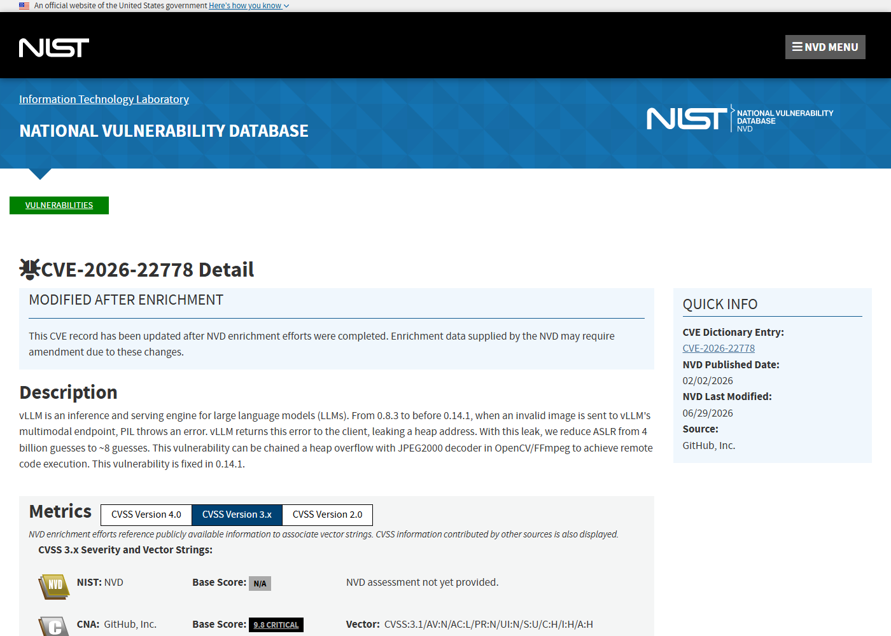
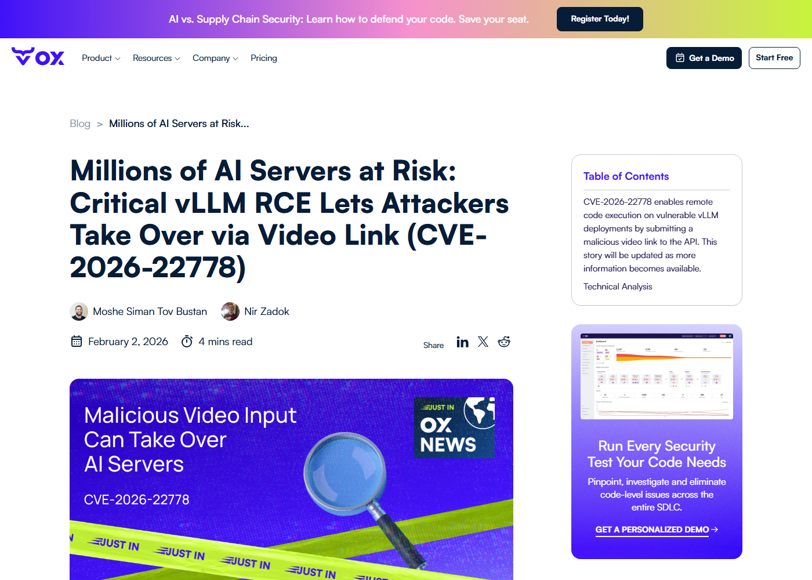
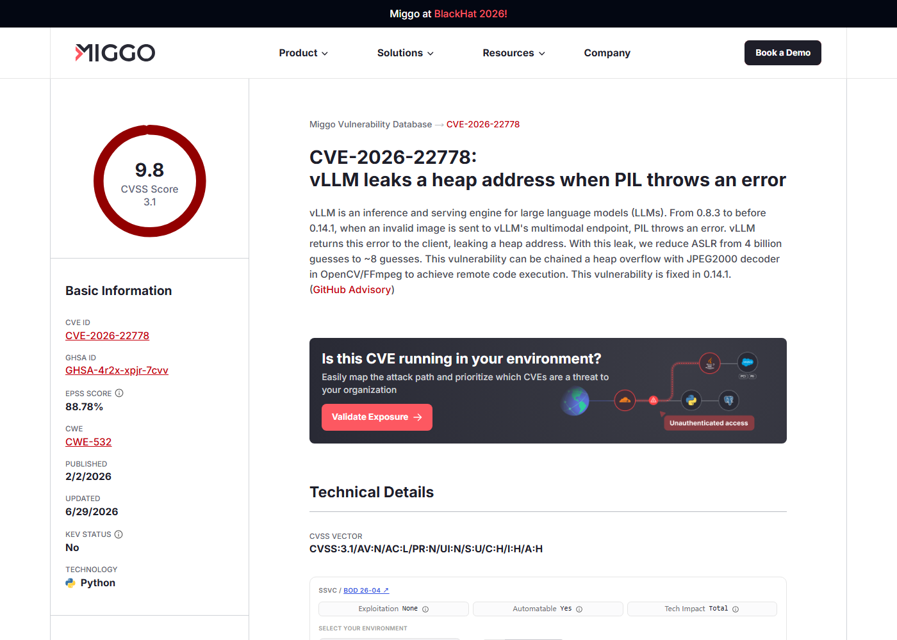
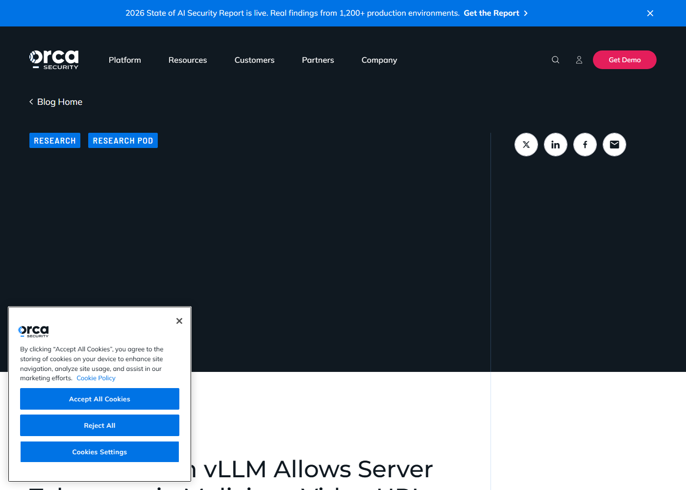

# vLLM Multimodal Video Processing RCE (2026)
> vLLM 多模态视频处理远程代码执行

| Field | Value |
|---|---|
| Category | Domain-Specific Risks |
| Severity | Critical |
| AI Tool | vLLM, Multimodal inference endpoint, Video model serving |
| Language | Python / C/C++ media stack |
| Real Incident | Yes |
| Reproducible | Yes |
| Disclosed | 2026-02-02 |
| CVE | CVE-2026-22778 |
| CVSS | 9.8 |

## TL;DR
A malicious video URL sent to vulnerable vLLM multimodal endpoints could chain an information leak with a media-decoder heap overflow to execute code on the inference server.
> vLLM 多模态端点处理恶意视频 URL 时，可把 PIL 信息泄露与 OpenCV/FFmpeg JPEG2000 堆溢出串联，最终在推理服务器上执行代码。

---

## 详细分析 / Full Analysis

## 一、基本信息

vLLM 是高吞吐 LLM 推理服务框架，很多团队用它提供 OpenAI-compatible API、部署私有模型并承接多模态请求。CVE-2026-22778 影响的是多模态视频处理路径：攻击者向服务提交恶意视频 URL，vLLM 获取并处理该媒体内容，随后触发图像/视频解析栈中的漏洞。GitHub Advisory 将链路拆成两个关键阶段：无效图像错误会把堆地址泄露给客户端，降低 ASLR 难度；再利用 OpenCV/FFmpeg 中 JPEG2000 解码路径的堆溢出，实现服务器侧命令执行。

## 二、事件核验与公开材料范围

NVD、GitHub Advisory 和多家安全研究机构都把该问题归入 vLLM 多模态输入处理风险，影响版本集中在 0.8.3 到 0.14.0，修复版本为 0.14.1。公开资料提供了足够的漏洞链路说明，但没有要求本文复现真实攻击流量或发布可用 exploit。基于这些材料，本文讨论的是公开披露的推理服务漏洞、可达攻击面和防护动作。

### 证据矩阵

| 来源 | 类型 | 证明内容 |
|---|---|---|
| NVD: CVE-2026-22778 | 漏洞数据库 | CVE、CVSS 9.8、影响版本和修复信息 |
| GitHub Advisory: GHSA-4r2x-xpjr-7cvv | 安全公告 | 信息泄露、JPEG2000 堆溢出和 RCE 链路 |
| Orca Security: vLLM RCE via malicious video | 研究文章 | 恶意视频 URL 对推理服务的攻击路径 |
| OX Security: CVE-2026-22778 | 技术复核 | vLLM 下载和处理视频输入导致服务器接管的风险 |
| Miggo: CVE-2026-22778 | 漏洞分析 | PIL 泄露、ASLR 绕过和媒体解码堆溢出细节 |

## 三、系统背景与触发条件

多模态推理服务和纯文本聊天服务的风险差异很大。视频模型通常允许用户传入 URL 或上传媒体，后端会下载、解码、抽帧并交给模型处理。这个过程把传统媒体解析库带入 LLM 服务边界，也让推理节点承担了图像、视频和压缩格式的历史攻击面。很多 vLLM 实例部署在 GPU 节点上，节点上还可能存在模型权重、缓存、推理日志、服务凭据和内部网络访问能力，因此媒体处理 RCE 的影响不只是一台普通 Web 服务器被打。

## 四、攻击链路与处置过程

攻击链从一次正常 API 调用开始。攻击者构造或托管恶意视频文件，把 URL 提交给运行视频模型的 vLLM endpoint。服务端为了完成多模态推理，会拉取并解析该视频。第一步通过异常处理泄露内存地址，为后续利用提供定位信息；第二步触发 JPEG2000 解码器中的堆溢出，绕过随机化后劫持执行流。成功后，攻击者获得推理服务进程权限，可以读取模型服务环境变量、访问本地模型缓存，或尝试横向移动到同一推理集群的其他组件。

## 五、技术根因与 AI 风险归因

这个案例的根因在于多模态模型服务把不可信媒体输入送入复杂 native 解码栈，而服务边界没有把“模型请求”视为可能携带二进制 exploit 的输入。错误回显还把地址信息暴露给远程客户端，使利用链更稳定。对 AI 平台来说，多模态功能越强，输入预处理越多，系统实际攻击面就越接近浏览器、媒体播放器和文件解析服务，而不能只按 REST API 字段校验来理解。

多模态推理服务的风险往往藏在模型之前。业务侧看到的是“上传视频、模型理解内容、返回答案”，工程侧实际经历了下载、容器内缓存、格式识别、解码、抽帧、图像预处理、张量转换和模型推理多个阶段。CVE-2026-22778 的关键就在这些前置阶段：攻击者不需要突破模型权重或推理调度，只要让服务端处理一个特制媒体文件，就能触发底层媒体库的内存安全问题。对运行 vLLM 的平台来说，输入校验不能只停留在 JSON schema 和 URL 格式，还要覆盖文件类型、大小、来源、解码路径和错误回显。

这类漏洞还改变了推理节点的安全等级。很多团队把 GPU 节点视为昂贵算力资源，重点管理配额和调度，却没有把它当成处理不可信二进制文件的边界服务。实际部署中，vLLM 进程可能和模型缓存、tokenizer、监控 sidecar、日志采集、对象存储挂载、NCCL 通信和内部服务发现处在同一运行环境。媒体解码 RCE 一旦成功，攻击者可以从推理进程出发接触这些资源。即便容器没有特权，模型权重、提示日志和内部网络拓扑也可能成为有价值的目标。

## 六、影响范围与治理建议

受影响环境主要是开放多模态 endpoint、允许远程 URL 或不可信媒体输入的 vLLM 部署。攻击成功后，推理节点上的 GPU 作业、模型权重、日志、密钥和内部网络访问都可能受到影响。治理上应升级到 0.14.1 或更高版本，限制远程 URL 拉取，优先采用隔离的媒体预处理沙箱，对解码库保持独立补丁节奏，并避免把推理服务进程赋予不必要的文件和网络权限。对曾经公网暴露的视频模型 endpoint，应检查异常请求、下载日志和容器逃逸迹象。

排查时应重点看视频模型 endpoint 的访问日志，而不是只看传统 Web 错误日志。可疑信号包括远程 URL 指向少见媒体格式、同一来源反复触发解码错误、响应中出现异常栈信息、推理进程崩溃后自动重启、GPU 节点在请求后发起未知外联等。对于已暴露服务，应保存样本 URL、下载缓存和崩溃转储，便于判断是否只是探测还是已经进入可利用路径。由于该链路涉及信息泄露和堆溢出，单纯没有看到 shell 命令并不等于没有风险。

长期治理上，多模态服务最好把“媒体获取/解码”和“模型推理”拆开。下载组件运行在低权限网络区，只允许访问明确域名或对象存储；解码组件运行在可丢弃沙箱，输出规范化帧或安全中间格式；推理进程只接收已验证张量或内部对象引用。这样即使媒体库再次出现漏洞，攻击者也难以直接接触模型服务主体。对生产 vLLM 集群，还应把模型 API token、对象存储凭据和监控凭据从推理进程环境变量中剥离，改用最小权限的短期身份。

对用户体验来说，允许直接传入视频 URL 很方便；对安全来说，这等于让推理服务主动访问攻击者控制的内容。更稳妥的架构是把远程 URL 先交给下载代理，代理做域名策略、大小限制、MIME 校验、杀毒或格式规范化，再把结果以内部对象 ID 交给推理服务。这样模型 API 不直接触碰公网 URL，也不会在错误信息里把底层解析细节回显给外部调用者。

在评估补丁效果时，团队不应只确认 vLLM 版本号，还应复查镜像里的 OpenCV、FFmpeg、Pillow 等依赖版本。多模态链路经常由 Python 包、系统库和容器基础镜像共同组成，应用层升级可能没有覆盖所有原生库。生产环境最好把媒体处理依赖纳入 SBOM，并在 CVE 通告发布后能快速定位哪些推理镜像包含受影响库。

## 七、结论

CVE-2026-22778 把“多模态输入就是代码执行攻击面”这个事实摆得很清楚。推理服务安全不能只关注 prompt、token 和访问控制；只要模型服务会拉取并解析图片或视频，它就继承了媒体解码器的内存安全风险。面向生产的多模态服务需要把媒体处理、模型推理和凭据访问拆到不同隔离层里。

## 八、参考来源

- [NVD: CVE-2026-22778](https://nvd.nist.gov/vuln/detail/CVE-2026-22778)
- [GitHub Advisory: GHSA-4r2x-xpjr-7cvv](https://github.com/advisories/GHSA-4r2x-xpjr-7cvv)
- [Orca Security: vLLM RCE via malicious video](https://orca.security/resources/blog/cve-2026-22778-vllm-rce-vulnerability/)
- [OX Security: CVE-2026-22778](https://www.ox.security/blog/cve-2026-22778-vllm-rce-vulnerability/)
- [Miggo: CVE-2026-22778](https://www.miggo.io/vulnerability-database/cve/CVE-2026-22778)
