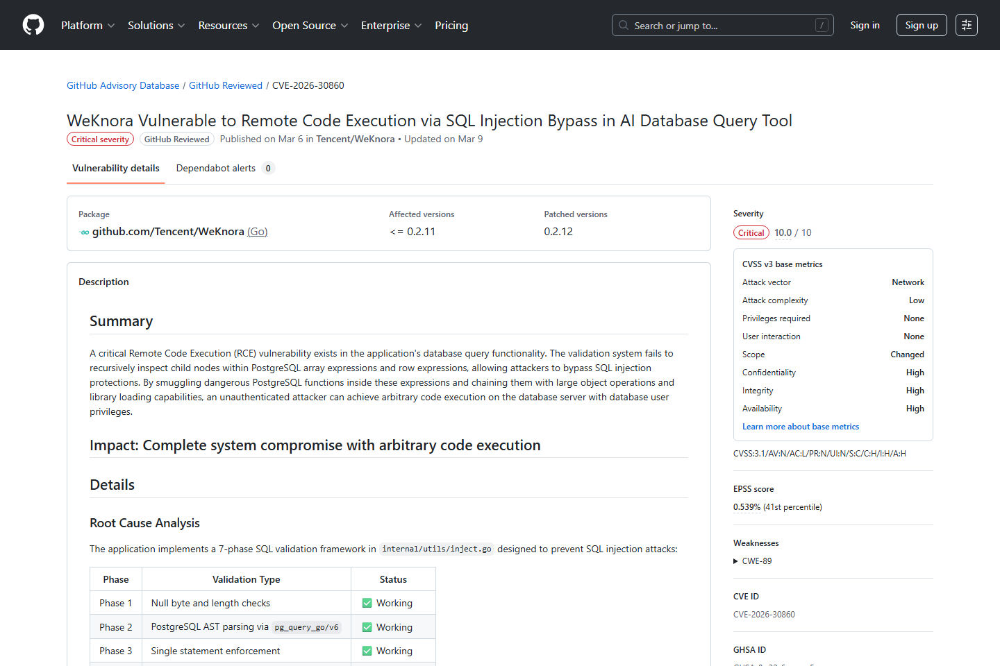
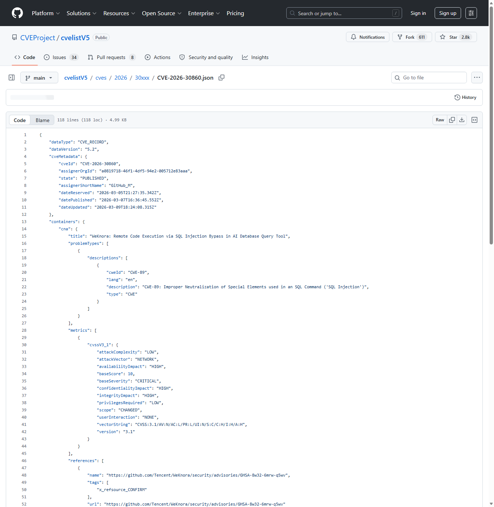
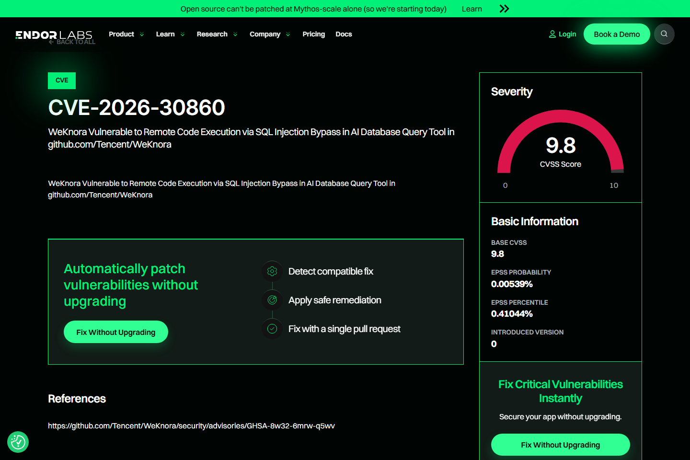
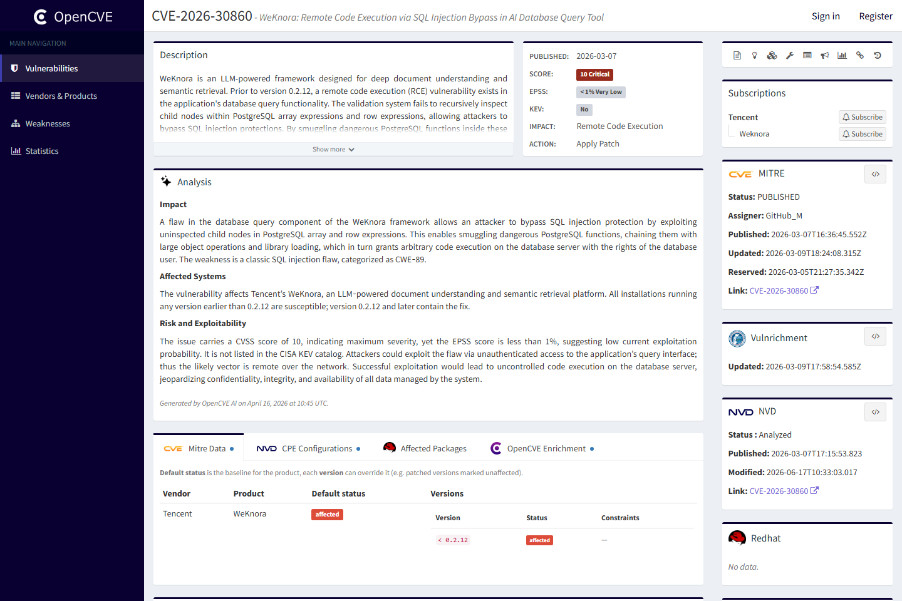
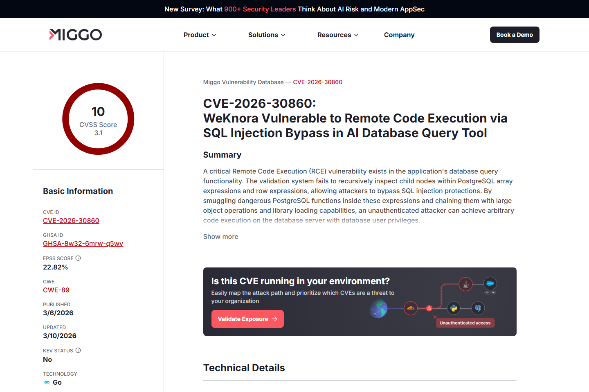
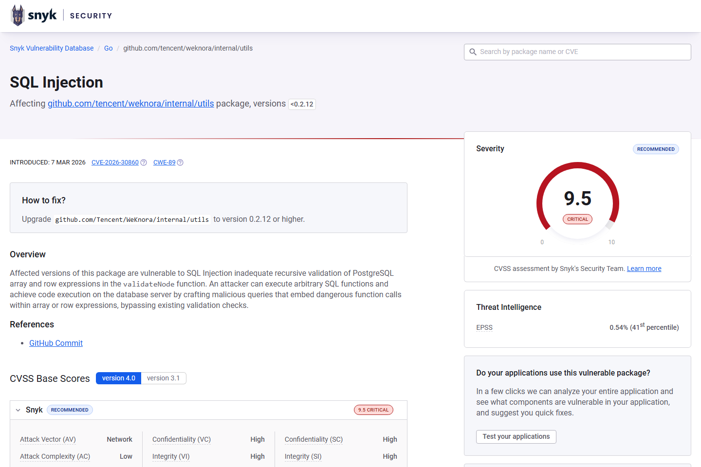

# WeKnora Database Query SQL Injection to RCE (2026)
> WeKnora 数据库查询工具 SQL 注入到远程代码执行

| Field | Value |
|---|---|
| Category | agent-risk |
| Severity | Critical |
| AI Tool | Tencent WeKnora, LLM-powered document understanding, Database query tool |
| Language | Go, PostgreSQL |
| Real Incident | Yes |
| Reproducible | Yes |
| Disclosed | 2026-03-07 |
| CVE | CVE-2026-30860 |
| CVSS | 9.9 |

## TL;DR
WeKnora's AI query validation missed nested PostgreSQL expressions, enabling SQLi-to-RCE.
> WeKnora 数据库查询工具 SQL 注入到远程代码执行：可在数据库服务器上下文执行任意代码，影响文档理解和语义检索平台的数据与主机安全。

---

## 基本信息

| 项目 | 内容 |
|---|---|
| 案例时间 | 2026-03-07 |
| 事件对象 | Tencent WeKnora 0.2.12 之前版本 |
| 事件类型 | 数据库查询功能中的 SQL 注入防护绕过并升级到 RCE |
| 攻击入口 | 攻击者构造包含 PostgreSQL array/row expression 的查询，使验证器漏检危险函数。 |
| 主要影响 | 可在数据库服务器上下文执行任意代码，影响文档理解和语义检索平台的数据与主机安全。 |
| 修复方向 | 升级到修复版本，并对 AI 查询工具实施参数化、AST 白名单和数据库最小权限。 |

## 摘要

WeKnora 是面向文档理解和语义检索的 LLM 框架，CVE-2026-30860 发生在其数据库查询功能。公开资料显示，验证系统没有递归检查 PostgreSQL array expression 和 row expression 的子节点，攻击者可以把危险函数藏入这些结构，绕过 SQL 注入防护并进一步触发数据库服务器侧代码执行。
这个漏洞的代表性在于，它把自然语言检索系统和数据库执行器之间的缝隙暴露出来。AI 应用希望让用户用更自然的方式查询知识库，但最终仍要落到数据库语句、索引和执行计划。只要中间的验证器不能完整理解数据库语义，AI 查询入口就会继承传统 SQL 注入风险。

## 一、公开材料概况

GitHub Advisory、CVEProject cvelistV5、Endor Labs、OpenCVE、Miggo、Snyk 和 Positive Technologies/DBugs 均记录了同一核心事实：受影响组件是 WeKnora 的数据库查询能力，缺陷位于 SQL AST 验证，修复版本为 0.2.12。现有公开材料主要说明可复现的框架漏洞和数据库执行链，没有提供真实受害者统计。
这些来源从不同角度补齐了同一条链路：漏洞库确认 CVE 和版本，Snyk 强调递归检查不足，Miggo 展开 PostgreSQL 表达式绕过和 RCE 路径。它们共同说明，问题不是简单的字符串拼接，而是“允许查询灵活性”与“限制危险语义”之间的校验失败。

| 来源 | 类型 | 证明内容 |
|---|---|---|
| GitHub Advisory: WeKnora RCE via SQL Injection Bypass | 主证据 | 确认漏洞、影响组件和修复版本。 |
| CVEProject cvelistV5: CVE-2026-30860 | 主证据 | 确认 CVE 描述和影响范围。 |
| Endor Labs: CVE-2026-30860 | 复核证据 | 复核 WeKnora 数据库查询 RCE。 |
| OpenCVE: CVE-2026-30860 | 生态证据 | 包生态漏洞记录。 |
| Miggo: WeKnora SQLi AST Bypass RCE | 技术证据 | 解释 PostgreSQL 表达式绕过和 RCE 链。 |
| Snyk: SQL Injection in github.com/tencent/weknora/internal/utils | 技术证据 | 说明 validateNode 递归检查不足。 |

## 二、系统背景与触发条件

AI 文档理解系统常把自然语言问题转译为检索、过滤和数据库查询。为了让用户以低门槛访问企业知识库，这类系统会在 LLM 工作流中加入查询生成、校验和执行组件。WeKnora 的问题说明，查询校验器一旦无法完整理解数据库语法树，AI 查询入口就会变成传统数据库攻击入口。
触发条件并不依赖模型产生恶意 SQL，攻击者也可以直接向查询功能提供构造输入。真正关键的是后端允许一部分表达式通过，并相信 AST 检查已经覆盖所有危险节点。对于文档理解系统来说，越是开放灵活查询能力，越需要把数据库语义限制成可证明的小集合。

## 三、攻击链路与处置过程

攻击者构造带有嵌套 PostgreSQL 表达式的查询，让表层校验看起来符合预期，实际危险调用藏在 array 或 row 表达式子节点中。通过大对象操作和库加载等 PostgreSQL 能力，攻击链可从 SQL 注入推进到数据库服务器代码执行。Miggo 和 Snyk 的分析都强调了递归验证缺失这一关键点。
处置时需要同时修补应用和数据库侧权限。即使应用升级后阻断了绕过路径，历史上被滥用过的数据库账户、扩展、函数和临时对象仍应检查。若数据库服务器与文档存储或检索索引处在同一信任域，攻击者还可能借由数据库执行能力读取文件、篡改索引或影响后续检索结果。

## 四、技术根因分析

根因是语法树验证与数据库真实执行语义之间存在差距。AI 查询工具通常试图允许一部分灵活查询，同时过滤危险语句；如果过滤只检查顶层节点，就会低估 PostgreSQL 表达式组合能力。数据库账户权限过宽时，注入缺陷还会放大为主机级执行风险。
安全的查询接口应采用白名单式语义，而不是黑名单式节点过滤。允许哪些表、哪些字段、哪些操作符、哪些聚合函数，都应在服务端显式定义。对于确实需要复杂查询的场景，也应把生成、验证和执行拆开，用数据库最小权限和只读事务降低单点校验失败后的影响。

## 五、AI 参与方式与风险归因

AI 参与方式体现在查询工具嵌入了 LLM 文档理解流程。即便漏洞本质是 SQL 注入，攻击入口位于 AI 应用为了语义检索而开放的数据库查询层。归因应覆盖自然语言查询到 SQL 的转换边界、查询验证器和数据库权限。
这类风险在企业知识库场景中尤其敏感，因为查询结果往往会回到模型上下文，再影响后续回答和自动化动作。如果攻击者能污染检索结果或读取不该暴露的文档，影响就会从数据库层扩展到 AI 输出层。治理时应把查询安全和 RAG 数据完整性放在一起看。

## 六、与团队技术报告风险框架的关系

团队框架指出，AI 应用把传统软件组件重新组合为新工作流，旧漏洞会在新边界上重现。WeKnora 案例正是数据库安全和 AI 检索系统交汇后的风险：语义查询越接近真实数据库执行，验证器越需要形式化和白名单策略。

## 七、影响范围与治理建议

CVSS 9.9 反映出该漏洞对机密性、完整性和可用性的高影响。对于承载企业文档、知识库和检索索引的部署，数据库服务器 RCE 可能导致文档泄露、索引污染、凭据读取或进一步横向移动。

治理上应限制 AI 查询工具的 SQL 能力，优先使用参数化查询和固定模板，禁止模型或外部请求直接生成可执行 SQL。数据库账户应去除扩展加载、大对象写入等危险权限，并把查询执行放入网络和文件系统都受限的隔离环境。
监控上应关注异常函数调用、数组或 row 表达式中的危险节点、非常规大对象操作以及数据库进程触发的文件或网络行为。对 AI 检索系统，还应记录自然语言请求、生成查询、验证结果和执行结果之间的映射，便于在发现异常后追溯是哪一层放行了危险语义。

## 八、结论

WeKnora 案例说明，AI 检索系统的数据库接口不能只做表层语法检查。只要 LLM 工作流能触达真实数据库执行器，传统 SQL 注入防线就需要按数据库语义完整建模。
它也说明，RAG 和语义查询平台不能把数据库当作简单后端存储。数据库权限、查询模板、AST 校验和模型上下文污染共同决定最终风险。安全设计越早把这些层打通，越能避免“自然语言入口”变成高权限数据库入口。

## 参考来源

1. [GitHub Advisory: WeKnora RCE via SQL Injection Bypass](https://github.com/advisories/GHSA-8w32-6mrw-q5wv)
2. [CVEProject cvelistV5: CVE-2026-30860](https://github.com/CVEProject/cvelistV5/blob/main/cves/2026/30xxx/CVE-2026-30860.json)
3. [Endor Labs: CVE-2026-30860](https://www.endorlabs.com/vulnerability/cve-2026-30860)
4. [OpenCVE: CVE-2026-30860](https://app.opencve.io/cve/CVE-2026-30860)
5. [Miggo: WeKnora SQLi AST Bypass RCE](https://www.miggo.io/vulnerability-database/cve/CVE-2026-30860)
6. [Snyk: SQL Injection in github.com/tencent/weknora/internal/utils](https://security.snyk.io/vuln/SNYK-GOLANG-GITHUBCOMTENCENTWEKNORAINTERNALUTILS-15470409)
