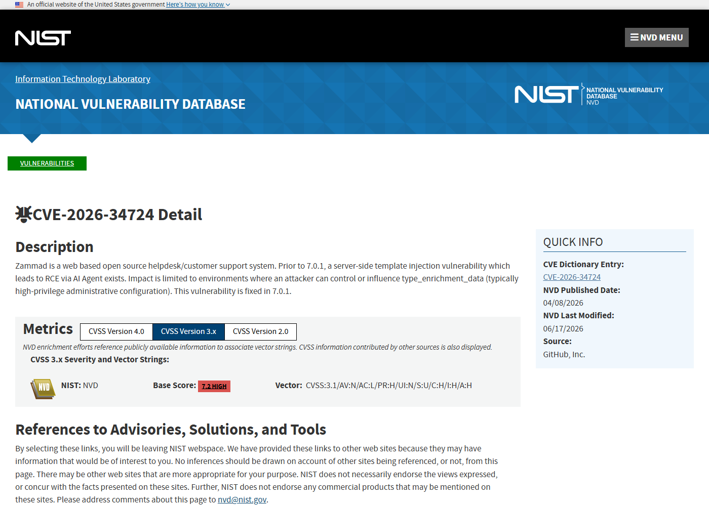
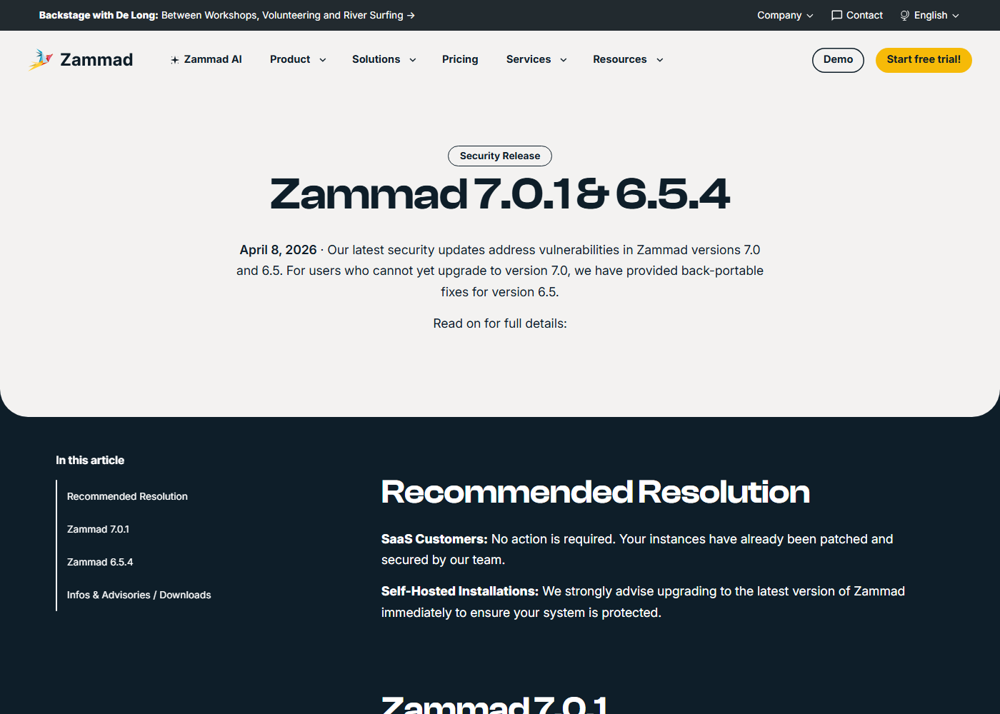
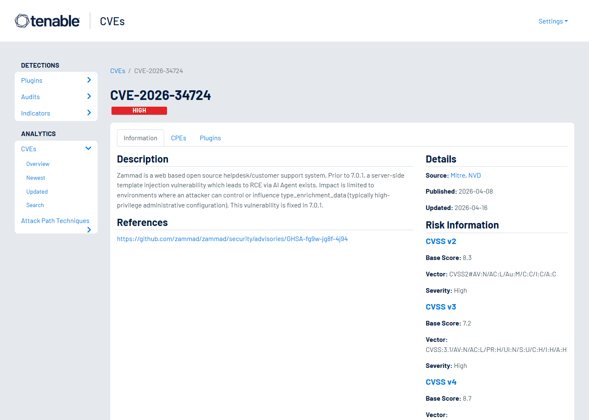
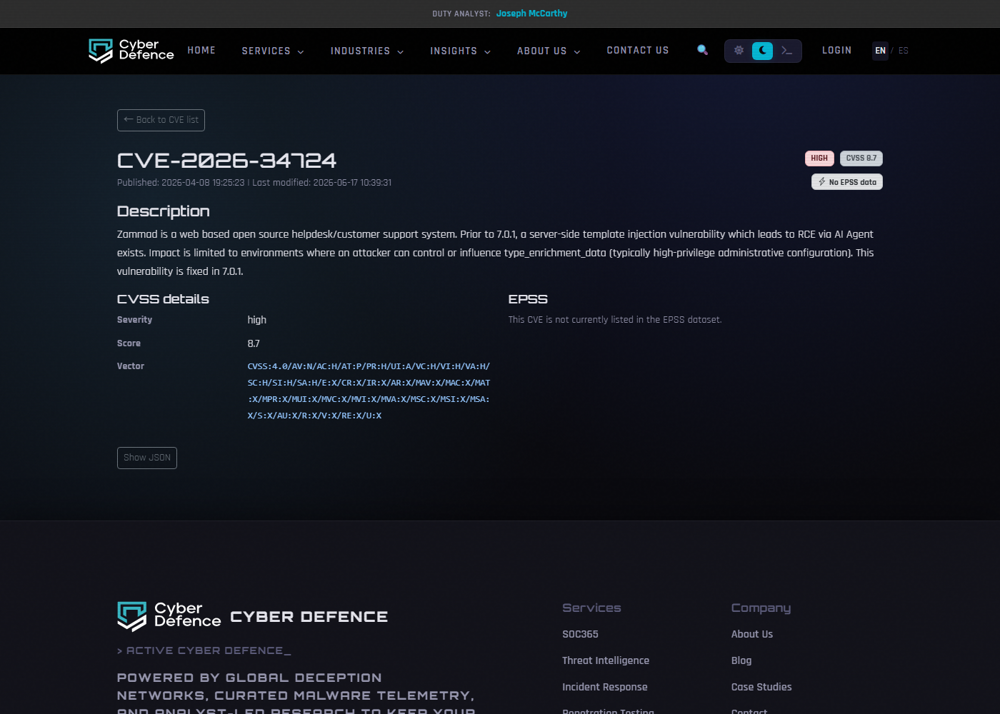

# Zammad AI Agent SSTI to RCE (2026)
> Zammad AI Agent 服务端模板注入到远程代码执行

| Field | Value |
|---|---|
| Category | Code Vulnerabilities |
| Severity | High |
| AI Tool | Zammad, Zammad AI Agent |
| Language | Ruby / Template engine |
| Real Incident | Yes |
| Reproducible | Yes |
| Disclosed | 2026-04-08 |
| CVE | CVE-2026-34724 |
| CVSS | 7.2 |

## TL;DR
Zammad's AI Agent feature allowed server-side template injection through type enrichment data, enabling RCE when an attacker could influence that configuration.
> Zammad AI Agent 的 type enrichment data 进入模板渲染路径，具备配置影响力的攻击者可触发 SSTI 并在应用进程上下文中执行代码。

---

## 详细分析 / Full Analysis

## 一、基本信息

Zammad 是开源客服与工单系统，AI Agent 能力用于增强工单处理、文本理解和辅助自动化。CVE-2026-34724 披露的是 AI Agent 类型增强数据进入服务端模板渲染时缺少足够限制，攻击者如果能够控制或影响 type_enrichment_data，就可以构造服务端模板注入，并在 Zammad 应用进程上下文中执行代码。公开公告同时强调，该前提通常需要较高权限的管理配置能力，因此它不是无认证公网 RCE，但在多管理员、插件化和复杂客服平台中仍然属于高影响漏洞。

## 二、事件核验与公开材料范围

NVD、Zammad GitHub security advisory、Zammad 7.0.1 发布说明和 Debian Security Tracker 对事实描述一致：漏洞存在于 7.0.1 之前，触发点是 AI Agent 相关配置数据，修复版本为 7.0.1。SentinelOne 的复核文章补充了 SSTI 风险和缓解措施。本文据此把它作为“AI 功能接入传统模板渲染路径”的真实漏洞案例，而不把它描述成无需权限的互联网扫描型事件。

### 证据矩阵

| 来源 | 类型 | 证明内容 |
|---|---|---|
| NVD: CVE-2026-34724 | 漏洞数据库 | Zammad AI Agent SSTI、影响条件和修复版本 |
| Zammad Advisory: GHSA-fg9w-jg8f-4j94 | 厂商公告 | RCE 影响、type_enrichment_data 前提和修复说明 |
| Zammad Release 7.0.1 | 发布说明 | 7.0.1 与 6.5.4 安全更新说明 |
| SentinelOne: CVE-2026-34724 | 复核资料 | SSTI 机制、影响和缓解建议 |
| Debian Security Tracker: CVE-2026-34724 | 发行版跟踪 | 发行版视角下的漏洞描述和状态 |
| Tenable: CVE-2026-34724 | 漏洞数据库 | Zammad AI Agent SSTI 到 RCE 的第三方记录 |
| Cyber Defence: CVE-2026-34724 | 漏洞数据库 | Zammad AI Agent RCE 的补充记录和 CVSS 信息 |

## 三、系统背景与触发条件

客服系统里的 AI Agent 往往要读取工单字段、客户资料、组织信息和自动化配置，再把这些上下文转成提示或动作。为了让不同业务对象进入模型处理，系统会设计 enrichment 或模板化机制。模板机制很适合拼接上下文，但如果模板表达式能被不受信任的配置控制，传统 SSTI 风险就会进入 AI Agent 功能。Zammad 的案例说明，新加的 AI 层并没有消除 Web 应用旧风险，反而可能把它们放到更高权限的数据流里。

## 四、攻击链路与处置过程

攻击链需要配置影响力。攻击者首先获得能够修改或影响 AI Agent type_enrichment_data 的权限，随后写入恶意模板表达式。当 AI Agent 处理相关数据并触发模板渲染时，表达式在服务端执行。若模板引擎可访问危险对象或方法，攻击者可提升为应用进程上下文中的命令执行。成功后，工单数据、客户资料、内部备注、集成凭据和自动化任务都可能受到影响。Zammad 通过 7.0.1 修复该问题，用户需要及时升级。

## 五、技术根因与 AI 风险归因

根因是 AI Agent 的上下文增强配置和服务端模板执行边界没有分离。AI 功能需要灵活组织上下文，但模板不是普通字符串替换；它可能携带表达式求值、对象访问和方法调用能力。把管理配置直接送入模板引擎时，系统必须明确哪些字段是数据、哪些字段是模板、哪些表达式被允许。缺少这些限制时，AI Agent 的上下文组装阶段就会变成代码执行阶段。

Zammad 案例的攻击前提不是最低权限用户直接打穿系统，而是“能配置 AI Agent 上下文的人”获得了模板执行能力。这个差异很重要，因为客服系统里的角色通常比服务器权限细得多：业务管理员可以维护工单字段和自动化规则，集成维护者可以配置外部系统，客服主管可以调整分类和路由，但这些角色本不应等同于应用服务器管理员。SSTI 把配置权限升级成进程执行权限，破坏的是业务管理面和基础设施管理面之间的边界。

AI Agent 功能会放大这个边界问题。为了让模型理解工单，系统会收集客户、组织、历史对话、分类、优先级和补充字段，再把这些信息拼进提示或工具调用。模板化是自然选择，因为不同团队希望自定义上下文结构。但模板引擎如果允许表达式求值，就不再只是格式化工具。攻击者不一定要写传统 exploit，只要找到能影响模板片段的配置位置，就可能让渲染阶段访问对象、调用方法或执行命令。

## 六、影响范围与治理建议

影响主要落在自托管 Zammad、开启 AI Agent 并允许多人配置自动化的环境。攻击者需要较高配置权限，但许多客服系统里管理员、集成维护者和外包运营角色并不完全等同于服务器管理员，一旦这些角色能够触发 RCE，权限边界就被突破。治理建议包括升级到 7.0.1 或后续安全版本，收紧 AI Agent 配置权限，对 enrichment 字段做变更审计，并检查历史配置中是否存在模板表达式异常。更广泛地说，AI 上下文模板应采用安全模板或纯数据映射，而不是通用模板执行。

排查时应关注 AI Agent 相关配置的变更历史，尤其是 type enrichment、上下文模板、自动化规则和集成字段。可疑信号包括模板中出现异常分隔符、对象访问表达式、系统命令关键字、编码字符串或与工单业务无关的变量引用。由于触发点可能在工单处理过程中，日志检索要把配置变更时间和随后 AI Agent 处理的工单时间线关联起来，而不是只搜索 Web 请求异常。

治理上，AI Agent 上下文生成应尽量采用声明式字段映射，而不是通用模板语言。业务管理员可以选择字段、顺序和显示名称，但不应获得表达式执行能力。确实需要条件逻辑时，应提供受限 DSL，并把可访问对象控制在纯数据结构内。对已经上线的系统，还应建立 AI Agent 配置评审流程：配置变更需要记录发起人、差异、影响对象和回滚方式，避免高价值客服数据在灵活配置中被引入执行风险。

在客服系统里，AI Agent 往往接触高价值文本数据：客户身份、合同问题、故障细节、内部处置备注和附件摘要。SSTI 到 RCE 不只是技术层面的服务器风险，也会让这些文本资产面临批量读取和篡改。攻击者如果控制应用进程，可以修改工单流转、植入自动回复、读取历史对话，甚至让 AI Agent 在后续处理中使用被污染的上下文。因此处置时应同时考虑服务器完整性和业务数据完整性。

产品设计上，可以把 AI Agent 配置拆成“业务可调”和“平台受控”两层。业务管理员决定哪些字段参与模型理解、文本如何命名、哪些意图触发自动化；平台管理员决定模板引擎能力、工具权限和执行隔离。两层分离后，业务团队仍能快速适配客服流程，但不会因为调整上下文格式而获得服务器执行能力。

## 七、结论

CVE-2026-34724 是传统代码漏洞和 AI Agent 功能交汇的案例。AI Agent 需要上下文，但上下文组装不能变成任意模板执行。对业务系统而言，新增 AI 功能时必须重新审计所有模板、脚本和自动化扩展点。

## 八、参考来源

- [NVD: CVE-2026-34724](https://nvd.nist.gov/vuln/detail/CVE-2026-34724)
- [Zammad Advisory: GHSA-fg9w-jg8f-4j94](https://github.com/zammad/zammad/security/advisories/GHSA-fg9w-jg8f-4j94)
- [Zammad Release 7.0.1](https://zammad.com/en/product/releases/7-0-1)
- [SentinelOne: CVE-2026-34724](https://www.sentinelone.com/vulnerability-database/cve-2026-34724/)
- [Debian Security Tracker: CVE-2026-34724](https://security-tracker.debian.org/tracker/CVE-2026-34724)
- [Tenable: CVE-2026-34724](https://www.tenable.com/cve/CVE-2026-34724)
- [Cyber Defence: CVE-2026-34724](https://www.cyber-defence.io/tools/cve/CVE-2026-34724)
