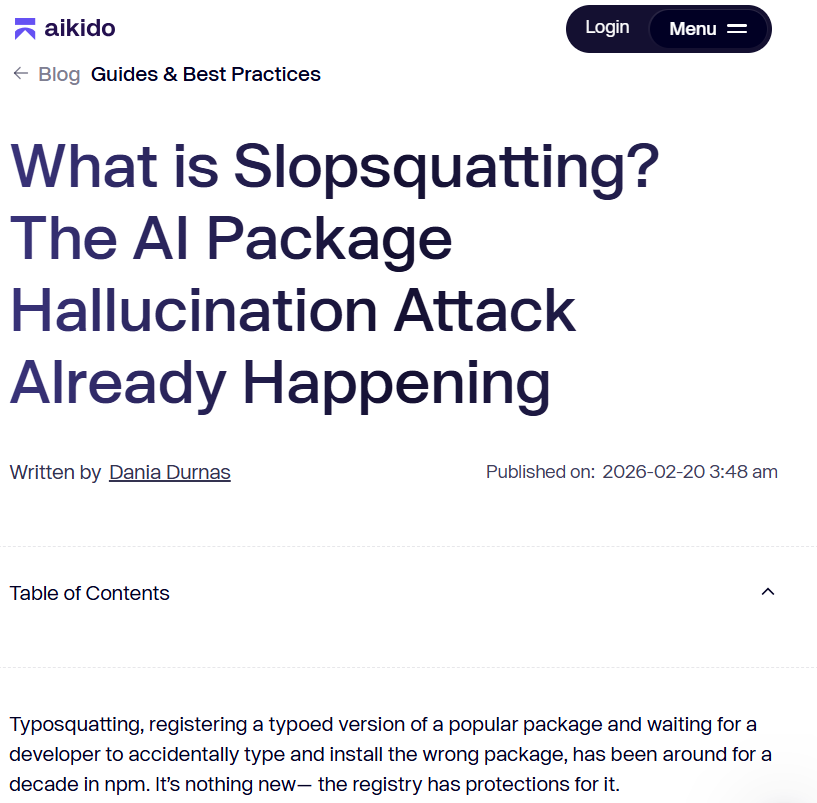
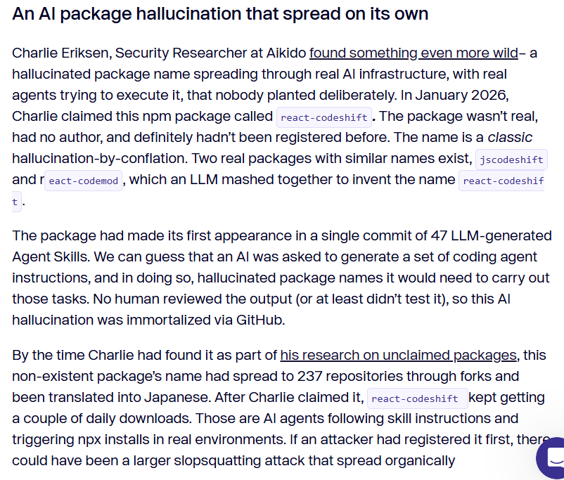
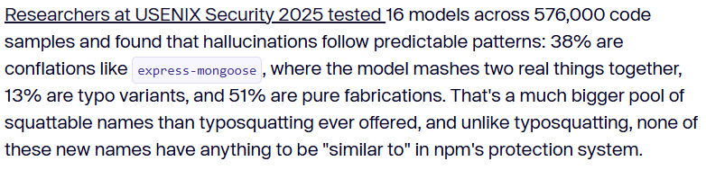

# AI 生成代码智能体幻觉自我传播导致供应链风险案例
## 基本信息
- 发生时间：2025-10 至 2026-01
- 公开时间：2026-01-28
- 风险类型：代码幻觉 / 供应链安全 / 过度依赖AI / 智能体攻击向量
- 影响范围：开源生态系统（npm）、GitHub Agent 基础设施（超 237 个开源仓库受波及）

## 一、案例介绍

**事件概述与详细经过**

2025年下半年至2026年初，随着 AI Agent（智能体）技术的爆发，供应链投毒演变出了更隐蔽的维度。大型语言模型（LLM）在被请求生成一套供自动化 Agent 执行的代码指令时，将真实的开源工具 `jscodeshift` 和 `react-codemod` 发生了概念混淆，凭空“幻觉”出了一个名为 `react-codeshift` 的虚假 npm 依赖包。

最令人担忧的是开发人员在面对 AI Agent 时深陷“自动化偏见”。某开发者利用大模型批量生成了 47 个 Agent 技能（Agent Skills）代码文件，其中包含了要求系统自动下载并执行 `react-codeshift` 的错误指令。该开发者在全程“零审查”、“零测试”的情况下，直接将这批代码合并公开到了 GitHub 仓库中。这导致这个纯粹由 AI 幻觉产生的虚假依赖被“永生”固化在了真实项目的基础设施中。一旦其他开发者引用这套模版，或 CI/CD 流水线运行这些 Agent 技能，系统就会自动去 npm 官方源拉取这个不存在的包。

**媒体报道与行业发酵** ：
这一标志性事件宣告了供应链投毒进入了无需人类干预的新阶段，在业界引发高度关注：
* 知名网络安全媒体《The Hacker News》对此进行了专题报道，并将其定义为高危的“幻觉抢注（Slopsquatting）”在自动化基础设施中的真实渗透。
* 垂直技术社区《Medium》上的 InstaTunnel 专栏发表长文，将这种无需人类复制粘贴、直接由 AI 写入配置并由机器自动触发的威胁正式命名为“智能体攻击向量（Agentic Attack Vector）”。

这起事件给全行业敲响了警钟，黑客不再需要欺骗人类的眼睛，只需预判大模型在生成配置文件时的幻觉，就能实施大规模的无差别后门植入。

**风险细节与深远影响** :

 **风险来源**：代码生成模型在生成安装指令、构建脚本、Agent 任务时，因训练数据混杂、知识覆盖不足，生成不存在的软件包名称，属于典型事实性错误。

 **扩散路径**：
 模型生成错误依赖，并由技术人员或者AI工具写入 YAML/Markdown 格式 Skill 文件；之后开发者没有进行仔细检查就直接提交入库导致模板被 Fork、翻译、复用；
自动化流程直接执行安装指令之后形成无人工干预的风险扩散

 **关键问题**：为了追求极致效率，盲目信任 AI 输出的工程配置与运行脚本，丧失了对第三方依赖的敏感度和核验意识。

 **实际危害**：
   * **跳过人类审查的直接执行**：虚假的依赖直接嵌入到了自动化 Agent 的底层执行逻辑中，避开了人类开发者在终端手动输入命令时的最后一道防线。
   * **静默的规模化感染**：若非安全研究员抢先占位注册，一旦黑客提前抢注该包并植入木马，所有拉取该配置的 200 多个项目的自动化流水线将在运行瞬间沦为“肉鸡”，导致内网穿透或代码资产被窃。

## 二、具体情况

进入智能体时代，代码生成模型的“包幻觉（package hallucination）”痼疾发生了危险的变异。

在 2024 年，AI 产生幻觉包后，还需要经过“开发者手动复制指令 -> 在终端粘贴运行”的步骤才能触发感染。但在 2026 年，大模型被大量用于编写 CI/CD 脚本、Dockerfile 配置文件以及 Agent 自动化操作步骤（Agent Skills）。

当幻觉包名被写入这些自动化配置文件后，系统会在构建或运行时通过 `$ npm install react-codeshift` 自动触发下载。这意味着漏洞触发过程被完全“机器化”了，实现了从“诱导人类犯错”到“自动化设施自产自销错误”的致命升级，项目在悄无声息中被供应链投毒。

## 三、Aikido Security 的发现与溯源

Aikido Security 的安全研究员 Charlie Eriksen 在 2026 年初对这起事件进行了完整的溯源验证。追踪并发现了 react-codeshift 这个虚假包名，并发现它被 237 个 GitHub 仓库所引用。Charlie Eriksen 发现，这些引用几乎全部存在于 AI Agent 的技能文件（如 Markdown 和 YAML 格式的指令）中。他关注的核心问题是：当幻觉代码脱离人类干预后，其传播速度和广度究竟有多可怕？Aikido Security 随后发表了一篇官方文章《Slopsquatting: The AI Package Hallucination Attack Already Happening》，专门讲述了 Charlie 的这项惊人发现。

**溯源规模和方法**

研究员通过监测异常的 npm 包名请求，逆向追踪到了 GitHub 上开源代码库的源头。重点分析了那 47 个由 AI 批量生成的 Agent Skills 配置文件。

**溯源结果**

- **极高的辐射范围**：追踪发现，这个根本不存在的虚假依赖 `react-codeshift` 已经被超过 237 个真实的 GitHub 开源项目仓库直接或间接引用。
- **群体性的审查缺失**：这 200 多个仓库的维护者，在拉取和合并这些包含 Agent 技能的代码时，无一例外地未能发现这个凭空捏造的依赖项。

**被固化的空包：react-codeshift**

为了防止真正的黑客利用这一漏洞，Charlie Eriksen 采取了白帽行动，在 npm 上抢先注册（Squatting）了 `react-codeshift` 这个空包，将其控制在安全状态。这一举动成功验证了“智能体攻击向量”的完整闭环，证实了如果不加以干预，大量生产流水线将直接执行下载，将理论上的幻觉变成了悬在开源生态头顶的真实利刃。

## 四、USENIX Security 2025 的大规模学术研究

在第 34 届 USENIX 安全大会上的重磅学术论文，题为《We Have a Package for You! A Comprehensive Analysis of Package Hallucinations by Code Generating LLMs》。在这个研究中，学者们对 16 个模型、超过 57 万个代码样本进行了测试，从学术层面量化证明了 AI 模型频繁捏造虚假包名的规律以及各种幻觉的比例分布。

研究团队为了保证实验的可复现性，将完整的数据流水线和检测代码托管在了 GitHub 上。

- 开源仓库地址：https://github.com/Spracks/PackageHallucination

**仓库内容构成**

- 实验数据 (Data)：包含他们用来测试大模型的各种提示词（基于 StackOverflow 和真实仓库数据构建）。

- 自动化检测脚本：包含他们如何通过启发式算法自动化提取大模型输出的 pip install 和 npm install 指令，并与官方源进行自动化比对以判定“幻觉”的代码。

- 缓解策略代码 (Mitigation)：仓库中甚至包含了他们如何使用 RAG（检索增强生成）和监督微调（Supervised Fine-Tuning）来降低模型幻觉率的具体实现代码。

在他们这篇论文发表之前，业界对于“AI 捏造包名”大多停留在类似 Lasso Security 那种单点测试，比如手工测几千个问题，抢注一两个包。这项研究也被视为该领域的“基石”。
而 Joseph Spracklen 的团队进行的是地毯式的量化研究：他们测试了涵盖商用和开源的 16 种不同的大语言模型。生成了高达 576,000 个代码样本。最终自动化识别出了高达 205,474 个独一无二的被 AI 凭空捏造出来的虚假包名。

通过海量数据得出了权威结论：商业闭源大模型的平均包幻觉率至少为 5.2%，而开源模型更是高达 21.7%。

## 五、危险之处

这件事的可怕之处，在于它打破了传统供应链安全的防御假设：

**无干预的自动化触发** — 传统的防御往往依赖开发者的警觉，但该漏洞由机器生成配置，由机器自动读取下载，全程无需人类“确认”，安全培训对这种触发机制完全失效。

**信任链断裂** — 开发者信任开源仓库，维护者盲目信任 AI Agent 编写的构建脚本。只要链条顶端的 AI 产生一次幻觉，恶意依赖就会顺着信任链瞬间流向所有分支。

**基础设施黑盒化** — 配置文件和 Agent 技能脚本往往被深埋在项目目录中，开发者极少会去逐行检查 `$ npm install` 后面跟着的几十个依赖项，导致隐蔽性极高。

## 六、关联报告风险点
对应《AI生成代码在野安全风险研究报告》第3章3.2节——代码幻觉导致的直接安全风险；3.3节——安全文化侵蚀以及5.2节——人工智能引入的脆弱性风险概况

​	在 3.2 节里，LLM 将真实工具的概念拼凑，捏造出 `react-codeshift` 并写入 Agent 脚本，是典型且难以察觉的高级代码幻觉。这个案例同样是一条完整的攻击链，且在 3.3 节的风险维度上体现得更为极端：在 3.3 节里，开发者“自动化偏见”的后果被急剧放大。不再仅仅是轻信一行安装命令，而是直接将包含 47 个技能的整套 AI 生成工程结构合并入库。这种“彻底放弃审核权”的做法，使得安全文化的侵蚀达到了触及基础设施安全的程度。

​	在报告的5.2节中，揭示了 AI 引入的漏洞呈现出更危险的结构性偏好——网络化倾向（Networking Tendency）。与主要依赖本地访问或物理接触触发的漏洞不同，AI 生成代码中的缺陷更显著地集中在网络攻击向量上。本案例中，Agent 的底层配置直接触发向外部 npm 源发起网络下载请求，这种无形中扩大的远程攻击面给系统边界防御带来了巨大压力。三者叠加，让一次模型的概率性胡言乱语，固化成了数百个真实项目的底层配置错误，如果被黑客利用，将直接演变为自动化投毒的重灾区。

### 修复与治理

结合报告第 6 章的风险缓解建议，针对此类 Agent 自动化场景的治理方案应严格落实以下防线进行修复和治理：

**建立多维度评价基准**
- 企业应在模型引入阶段建立基于成熟基准的“红蓝对抗测试（Red Team Testing）”和准入机制。必须专门针对大语言模型建立动态安全评估机制，将其作为模型接入和上线前的第一道防线。

**增强模型内在安全**
- 为解决模型训练数据中的知识滞后问题，建议采用检索增强生成（RAG）技术动态挂载最新 CVE 漏洞库和权威安全公告作为外部知识源。
- 结合约束解码（Constrained Decoding）技术，从抽象语法树（AST）层面强制约束模型输出，从底层逻辑阻断危险代码模式和非安全 API 的生成。

**人机协同治理**
- 必须在软件供应链流程中重建“零信任（Zero Trust）”机制。报告特别强调，对于全自动生成的代码，默认应严格执行沙箱隔离运行和动态应用安全测试（DAST）验证。
- 必须明确“开发者是代码安全的最终责任人”这一权责边界，防止因过度依赖工具而导致责任转移。随着 AI 生成代码比例的增加，开发者的角色正在从“代码编写者”转变为“审查者和验证者” 。

**紧急修复**
1. 在全球范围内从 GitHub 仓库、CI/CD 配置文件及 Agent 技能列表中移除对 `react-codeshift` 的引用，及时清理自动化环境。
2. 将环境依赖更新为真实的 `jscodeshift` 和 `react-codemod`等合法依赖。
3. 清理受影响项目的构建服务器与 npm 缓存。

## 七、总结

这是全球首例被公开披露的、由 AI 幻觉引发并借助 Agent 机制实现“自我传播”的供应链安全事件。它证明了 AI 代码风险已从“单点复制粘贴”演进为“自动化流水线群体感染”，极其有力地印证了报告中关于“随着 AI 比例增加，人类必须坚守审查者底线，否则自动化偏见将引发系统级灾难”的核心论断。

## 八、相关资源

**参考来源**
1. [Aikido Security: Slopsquatting - The AI Package Hallucination Attack Already Happening (Feb 20, 2026)](https://www.aikido.dev/blog/slopsquatting-ai-package-hallucination-attacks)
2. [InstaTunnel Medium: AI Hallucination Squatting - The New Agentic Attack Vector (Mar 25, 2026)](https://medium.com/@instatunnel/ai-hallucination-squatting-the-new-agentic-attack-vector-6e1366d77038)
3. [The Hacker News: Fake Python Spellchecker Packages on PyPI Delivered Hidden Remote Access Trojan (Jan 28, 2026)](https://thehackernews.com/2026/01/fake-python-spellchecker-packages-on.html)

**相关代码**

https://github.com/Spracks/PackageHallucination
