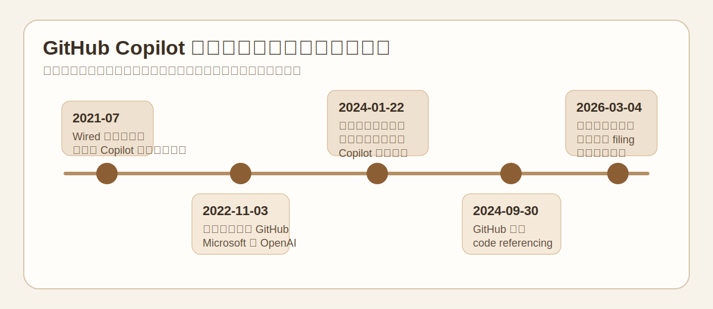
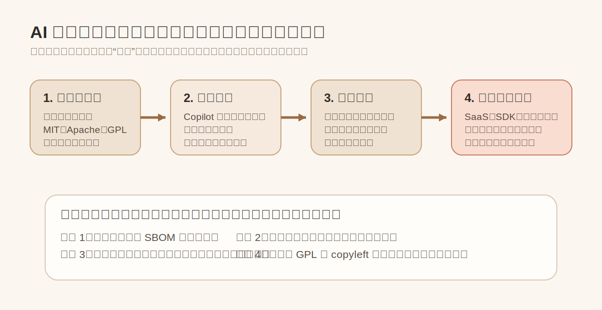
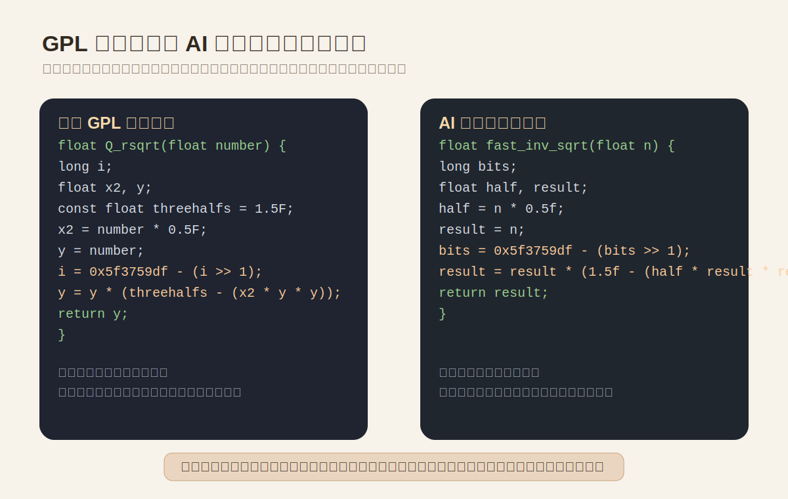
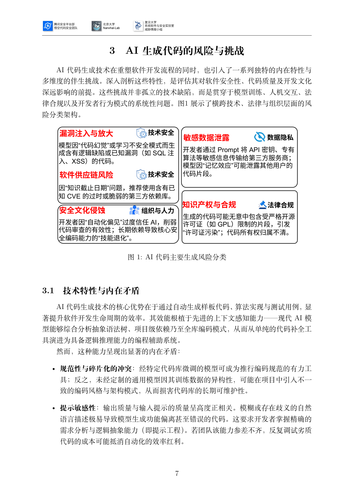
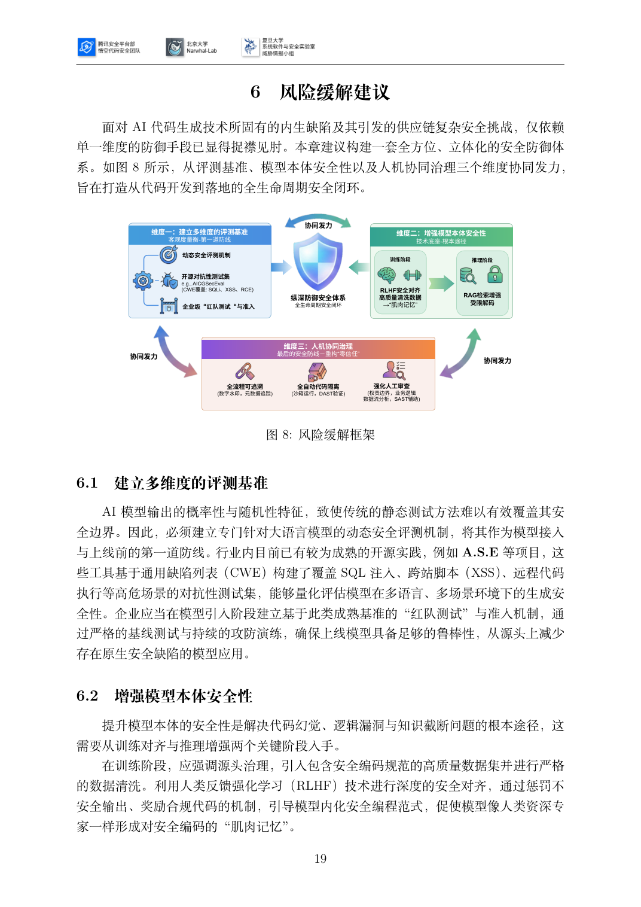

# GitHub Copilot 许可证污染与版权诉讼风险案例

本文选取 `J. Doe 1 et al. v. GitHub, Inc. et al.` 作为 AI 生成代码知识产权与开源合规风险的代表案例。它不是单纯的学术争论，而是已经进入美国联邦法院、并且和团队技术报告第 3 章点名的 `GPL` 许可证污染、代码所有权不清、Copilot 诉讼高度重合的现实样本。

这个案例的关键价值有三点。第一，它把“AI 可能复用受限开源代码”从抽象担忧推进到了有原告诉称、有法院裁定、有厂商补救机制的阶段。第二，它直接触达商业闭源项目最敏感的场景：开发者把 AI 输出粘进私有仓库时，往往拿不到来源、许可证、作者署名与修改历史。第三，它非常适合作为团队技术报告的呼应案例，因为报告第 3 章和第 6 章提到的风险点与缓解手段，几乎都能在这个案子里找到对应关系。



## 1. 案例结论

**案例类型：** AI 代码生成工具引发的开源许可证污染与版权争议  
**匹配场景：** 商业闭源项目误纳入 `GPL` 等强传染性代码片段，后续在对外发布、客户交付、投资审查、并购尽调中暴露合规风险  
**已公开事实：**

- 2022 年 11 月 3 日，GitHub 用户以匿名方式在美国加州北区联邦地区法院起诉 GitHub、Microsoft 和 OpenAI，核心指控是 Copilot/Codex 使用公开仓库代码训练，并在输出中省略原作者署名、版权管理信息和开源许可证要求。
- 2024 年 1 月 22 日，法院在部分驳回、部分保留的裁定中确认，原告对部分损害主张已经提出了足够具体的 Copilot 输出实例，并允许基于开源许可证违约的合同主张继续推进。
- GitHub 后续上线了 “public code match” 策略和 `code referencing` 功能，允许企业组织阻断或标记与公开代码匹配的建议。这本身说明厂商已经把来源可追溯问题视作必须治理的合规点。
- 截至 2026 年 3 月 4 日，北加州联邦地区法院案件页面仍显示本案有新的公开 filing，说明案件并未终局。

**本案最重要的启示：** AI 生成代码的风险不只在“生成出来的代码有没有漏洞”，还在“这段代码到底从哪里来”。一旦企业说不清来源，就可能同时面对版权归属争议、开源许可证履约缺口、客户合同违约和并购估值折价。

## 2. 为什么这个案子值得单独写

团队技术报告第 3 章已经明确写到：  
“生成的代码可能无意中包含受严格开源许可证如 GPL 限制的片段，引发许可证污染；代码所有权归属不清。”

本案正是这句话的现实化版本，而且公开证据链比很多“听说有人被 AI 坑了”的传闻完整得多：

1. 有公开起诉材料和法院裁定  
2. 有厂商侧产品政策变化  
3. 有公开报道和开发者社区示例  
4. 有足够典型的代码复用场景，便于写进团队报告和培训材料

## 3. 风险链路不是抽象概念，而是具体代码进入了闭源仓库

AI 代码助手最危险的地方，不是它一次性复制整份 GPL 项目，而是它给出一个看起来“只是算法实现”的片段，开发者顺手贴进了私有代码库。这样做会留下三个合规黑洞：

1. **来源黑洞。** IDE 中看见的是“建议”，不是仓库地址、提交记录、许可证文本。
2. **归属黑洞。** 开发者很容易误以为“这是模型现写的”，从而跳过开源归属审查。
3. **履约黑洞。** 一旦片段源自 `GPL`、`AGPL`、`LGPL` 或带署名要求的许可，企业可能需要补充声明、开放对应源码、提供许可证文本，或者至少进行替换和清理。



### 3.1 公开代码示例

Wired 在 2021 年关于 Copilot 的报道中提到，开发者 Armin Ronacher 测到 Copilot 可以吐出 Quake III 中著名的 `Q_rsqrt` 实现，甚至连原始注释里的粗口都保留下来。Quake III 源码后来以 `GPL` 方式公开，这个例子之所以经典，不在于算法本身多复杂，而在于它说明模型可能会把特征极强、辨识度很高的历史代码“背出来”。

下面的代码不是整段原样照抄，而是基于公开材料抽取出的**最小风险片段**，用来说明为什么商业闭源项目会陷入合规困境。



原始 GPL 代码中的关键特征如下：

```c
float Q_rsqrt(float number) {
    i = 0x5f3759df - (i >> 1);
    y = y * (threehalfs - (x2 * y * y));
}
```

如果 AI 助手给出的建议是下面这样，很多开发者会误以为只是“常见数学技巧”：

```c
float fast_inv_sqrt(float n) {
    bits = 0x5f3759df - (bits >> 1);
    result = result * (1.5f - (half * result * result));
    return result;
}
```

这类输出的问题不在变量名是否完全一致，而在于：

- 魔数 `0x5f3759df`、位移方式、牛顿迭代写法组合在一起，高度可识别
- 原始许可证、版权声明、作者信息和文件上下文在 AI 输出里全部消失
- 对闭源项目来说，工程师拿到的只是“可运行代码”，法务拿不到来源链

### 3.2 商业闭源项目是怎样踩坑的

设想一个商业游戏引擎、工业仿真软件或高性能图形库项目，开发者为了追求速度，把上面的 AI 建议直接贴进私有仓库：

```c
// proprietary engine/math/fast_math.c
float normalize_inverse(float input) {
    return fast_inv_sqrt(input);
}
```

这个动作在工程层面只需要 3 秒，但会立刻制造 4 个问题：

1. **代码来源不可证明。** 审计时无法说明这是自研、外包、复制开源还是 AI 建议。
2. **许可证义务不明。** 如果它实质上来源于 GPL 代码，企业就需要评估该片段是否构成复制、修改或衍生使用。
3. **客户交付风险上升。** 对外发版、SDK 授权、OEM 交付或嵌入式出货时，客户可能要求完整 `SBOM`、开源声明和权利保证。
4. **交易场景会被放大。** 投资、并购、上市、重大客户采购时，尽调团队最怕看到“来源不明但已经进入核心产品”的代码。

## 4. 诉讼到底在争什么

这个案子的争点并不是一句“训练公开代码是否合法”就能概括。更精确地说，争议集中在三层。

### 4.1 第一层：AI 输出是否构成受保护代码的复制或近似复制

根据 2024 年 1 月 22 日的法院裁定，原告在修订后的起诉材料中加入了若干具体实例。裁定写到，原告主张 Copilot 输出“更常见的是 modification”，也就是只做了语义上无关紧要的改动，或者重建了同一算法。这个表述非常关键，因为现实中的企业风险往往就卡在这里：

- 不是整段一模一样，所以开发者肉眼未必能认出
- 但又不是完全独立创作，因此法务不能轻率地把它当作“全新代码”

### 4.2 第二层：署名和版权管理信息是否在输出过程中被剥离

原告诉求中反复强调的一点是，原始代码在 GitHub 仓库里本来带着作者信息、许可证和版权管理信息 `CMI`，而 Copilot 输出给用户的代码片段通常不带这些信息。  
这意味着企业拿到的不是“附带来源说明的引用”，而是“脱离上下文的可粘贴片段”。

对工程师而言，这只是更简洁。  
对法务而言，这恰恰是最难处理的状态。

### 4.3 第三层：开源许可证到底算不算合同义务

2024 年 1 月 22 日的裁定里，法院没有把基于开源许可证违约的合同主张全部打掉。这一点尤其值得企业重视，因为它意味着本案的风险并不只停留在抽象版权论战，还可能落到更传统、更熟悉的合同与许可履约逻辑上。

换句话说，企业真正需要担心的不只是“会不会被说侵权”，还包括：

- 有没有违反许可证的署名要求
- 有没有遗漏许可证文本或修改说明
- 有没有把本应公开的义务藏进了私有产品
- 有没有在客户合同中作出超出自身权利范围的保证

## 5. 诉讼进展与时间线

下面只列已经从公开来源核实到的关键节点：

- **2022 年 11 月 3 日**  
  北加州联邦地区法院立案。原告匿名起诉 GitHub、Microsoft、OpenAI。
- **2024 年 1 月 22 日**  
  法院作出部分驳回、部分保留的裁定。对于 Doe 1、Doe 2、Doe 5，法院认为原告已经给出足以支撑损害主张的 Copilot 输出实例。基于开源许可证的合同主张仍在案内。
- **2024 年 9 月 30 日**  
  围绕 `DMCA 1202(b)` 的问题，案件获准进入中间上诉程序。公开法律跟踪页面和第九巡回上诉法院公开镜像均显示，相关上诉在 2024 年底正式开启。
- **2024 年 12 月 23 日**  
  第九巡回上诉案号 `24-7700` 开立。
- **2026 年 3 月 4 日**  
  北加州联邦地区法院官方案件页面显示，本案仍有新的公开 filing，案件未终局。

这里必须强调两点：

- **本案截至 2026 年 4 月 16 日没有公开终局判决。**
- **因此，本文讨论的是“真实存在且已经进入诉讼程序的合规风险”，不是“被法院最终认定已经侵权的既判事实”。**

## 6. 为什么商业闭源项目和并购尽调最怕这种问题

这个案子最容易被低估的地方，是很多工程师把它理解成“平台和开源社区的价值观冲突”。  
但在企业场景里，它会直接变成财务和交易问题。

Black Duck 长期做软件并购审计。其公开材料明确提醒：一旦代码库里混入 `GPL` 等 copyleft 代码，问题常常会在交易后期才暴露，并可能导致估值下降、交割延迟、加长 escrow，极端情况下交易直接失败。Black Duck 还披露，在其审计的大量交易中，`68%` 的代码库存在许可证冲突。

把这条经验放回 Copilot 案件，就能看到一个非常现实的尽调画面：

1. 买方或大客户要求目标公司提交 `SBOM`、开源清单、AI 使用政策和代码来源证明  
2. 目标公司只能回答“部分代码由开发者借助 Copilot 编写，但没有逐段留痕”  
3. 审计方进一步发现某些核心模块与公开仓库高度相似  
4. 法务无法确认许可证边界，于是要求替换、重写、补声明、设赔偿上限或冻结部分对价

目前我没有检索到一个**已经公开判决、且明确写明“因为 Copilot 代码来源不明导致某起并购失败”**的法院案例。  
因此，这一部分应当表述为：**公开诉讼已经证明风险真实存在，公开的并购审计数据说明这种风险在交易场景会被放大，但“具体哪一单交易因此失败”通常不会公开披露。**

这比凭空编造一个并购案例更稳妥，也更适合写进团队技术报告。

## 7. 与团队技术报告的直接呼应

### 7.1 报告第 3 章的风险分类，几乎就是本案的目录

团队报告第 3 章把 AI 生成代码风险分成技术安全、数据隐私、法律合规、组织与人力四类。其中“知识产权与合规”明确写到：  
“生成的代码可能无意中包含受严格开源许可证如 GPL 限制的片段，引发许可证污染；代码所有权归属不清。”

这张图来自团队报告第 7 页：



把它和 Copilot 案件对照，可以一一映射：

- **报告中的“许可证污染”** 对应本案中最核心的 GPL/开源许可证争议
- **报告中的“代码所有权归属不清”** 对应 AI 输出缺少来源链、作者署名和许可证信息
- **报告中的“自动化偏见”** 对应工程师把 Copilot 建议误当成原创实现，直接入库

### 7.2 报告第 6 章给出的治理思路，正好是本案的补救清单

团队报告第 19 页提出了三条主线：建立多维度评测基准、增强模型本体安全性、人机协同治理。  
这不是抽象框架，拿来应对 Copilot 类风险非常具体：

- **建立多维度评测基准**  
  不能只评测生成代码能不能运行，还要评测与公开代码的相似度、许可证命中率、来源可追溯性、`SBOM` 可生成性。
- **增强模型本体安全性**  
  需要控制训练数据清洗、公开代码匹配过滤、引用提示、`RAG` 权威知识源和受限解码，降低模型直接复现训练数据的概率。
- **人机协同治理**  
  要求开发者在提交 AI 生成代码时保留来源说明，结合 `SAST`、`SCA`、许可证扫描和人工评审做最后把关。



因此，这个案例不是团队报告之外的新议题，而是对报告现有结论的现实补强。

## 8. 企业真正该怎么防

仅靠一句“开发者自己注意”不够。  
对 AI 代码助手，企业至少需要把下面几件事制度化：

1. **把 AI 输出当作第三方代码处理。**  
   默认进入 `SCA`、许可证扫描、相似度比对和人工复核流程。
2. **开启或强制 `public code match` 策略。**  
   对 GitHub Copilot 企业版用户，优先阻断或标记与公开代码匹配的建议。
3. **在提交环节保留 AI 来源元数据。**  
   记录使用了哪个工具、在哪个时间段、是否接受了整段建议、是否做过人工重写。
4. **建立高风险代码清单。**  
   算法实现、加密库、编解码器、驱动、图形引擎、数据库内核、协议栈等模块，要比普通业务代码更严格。
5. **把 AI 生成代码纳入客户合同和并购尽调材料。**  
   至少准备 AI 使用政策、开源治理制度、扫描报告和重点模块来源证明。
6. **对来源不明的历史 AI 代码做追溯治理。**  
   如果说不清来源，就不要赌法务解释空间，优先重写、替换、留痕。

## 9. 信息缺口与使用边界

这个案例公开材料也有边界，写入正式报告时要把不确定性说清楚：

- 原告匿名，部分代码示例在公开裁定中做了遮蔽处理
- 没有公开终局判决，不能把“诉讼中指控”写成“法院已经认定的侵权事实”
- 我没有找到公开披露的、由 Copilot 直接触发的并购失败判决案例
- 但这并不削弱案例价值，因为公开诉讼、产品政策变化和开源尽调数据已经足以说明：**风险是真实的，交易场景会放大风险**

## 10. 参考资料

### 法庭文书与官方页面

- 北加州联邦地区法院案件页，`DOE 1 et al v. GitHub, Inc. et al`, Case No. `4:22-cv-06823-JST`  
  https://cand.uscourts.gov/cases-e-filing/cases/422-cv-06823-jst/doe-1-et-al-v-github-inc-et-al
- Justia，2024 年 1 月 22 日裁定，`Document 195`  
  https://law.justia.com/cases/federal/district-courts/california/candce/4%3A2022cv06823/403220/195/
- Justia，第九巡回上诉案 `Doe, et al. v. Github, Inc., et al.`, Case No. `24-7700`  
  https://dockets.justia.com/docket/circuit-courts/ca9/24-7700

### 厂商文档与产品机制

- GitHub Docs, `Code suggestions that match public code`  
  https://docs.github.com/en/copilot/concepts/completions/code-suggestions
- GitHub Blog, `Code referencing now generally available in GitHub Copilot and with Microsoft Azure AI`, 2024-09-30  
  https://github.blog/news-insights/product-news/code-referencing-now-generally-available-in-github-copilot-and-with-microsoft-azure-ai/

### 开发者社区与媒体报道

- WIRED, `GitHub's Commercial AI Tool Was Built From Open Source Code`, 2021-07-07  
  https://www.wired.com/story/github-commercial-ai-tool-built-open-source-code/
- Knowing Machines, `Doe 1 v. GitHub` 法律案例说明  
  https://knowingmachines.org/knowing-legal-machines/legal-explainer/cases/doe-1-v-github

### 开源与并购尽调资料

- Black Duck Blog, `Essential Software Due Diligence for Secure Tech M&A`  
  https://www.blackduck.com/blog/software-due-diligence/
- Black Duck, `M&A Due Diligence`  
  https://www.blackduck.com/solutions/mergers-and-acquisitions.html
- Black Duck Blog, `Black Duck and GenAI: AppSec for AI Generated Code`  
  https://www.blackduck.com/blog/appsec-for-ai-generated-code.html

### 论文与研究

- Nicholas Carlini et al., `Extracting Training Data from Large Language Models`, USENIX Security 2021  
  https://arxiv.org/abs/2012.07805
- Hammond Pearce et al., `Asleep at the Keyboard? Assessing the Security of GitHub Copilot's Code Contributions`, IEEE S&P 2022  
  https://arxiv.org/abs/2108.09293

### 公开代码来源

- id Software, `Quake III Arena`, `q_math.c` 中的 `Q_rsqrt` 实现  
  https://github.com/id-Software/Quake-III-arena/blob/master/code/game/q_math.c

