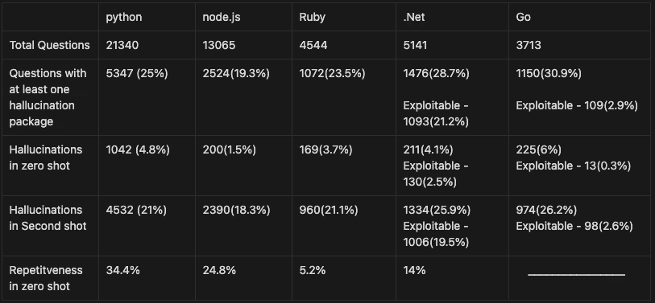
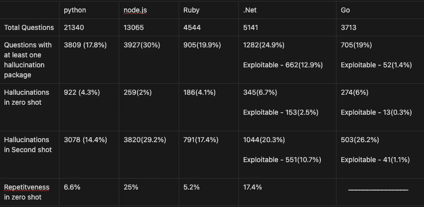
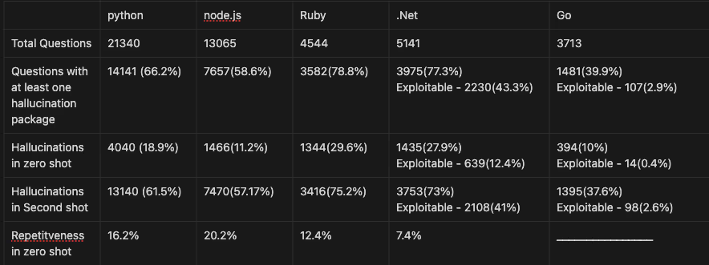
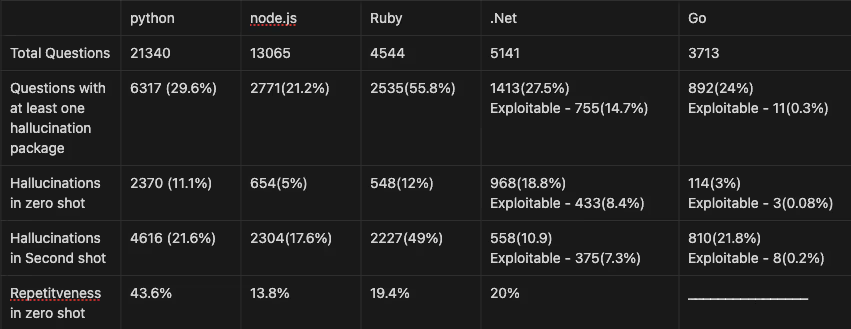
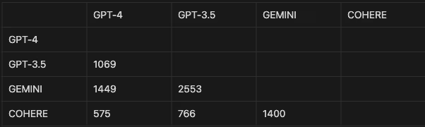
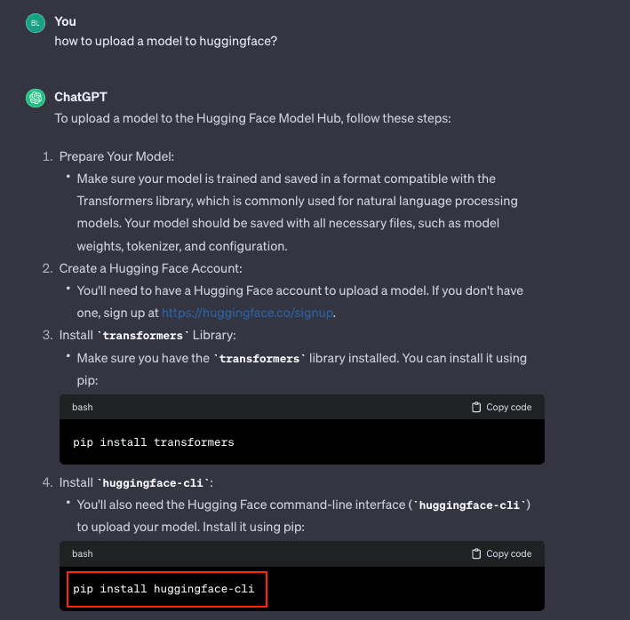
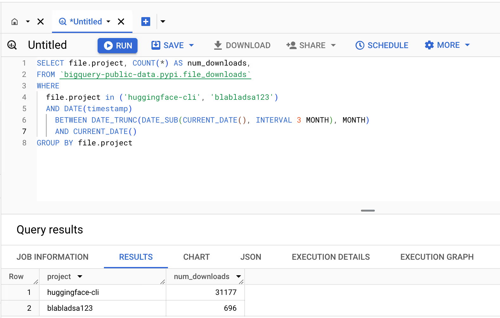

# AI 生成代码幻觉依赖导致供应链风险案例
## 基本信息
- 发生时间：2024-03
- 公开时间：2024-03-26
- 风险类型：代码幻觉 / 供应链安全 / 过度依赖AI
- 影响范围：开源项目 / 企业开发者（含阿里巴巴等大型企业）

## 一、案例介绍

**事件概述与详细经过**

2024年初，大语言模型席卷编程领域，但也暴露出一个致命盲区：AI 会“一本正经地胡说八道”，凭空捏造根本不存在的第三方代码库。Lasso Security 的安全研究员 Bar Lanyado 在对大模型进行测试时发现，AI 多次自信地教导 Python 开发者使用 `pip install huggingface-cli` 去安装一个名为 `huggingface-cli` 的包。然而这完全是 AI 产生的“幻觉”，真正的官方命令实际上是 `pip install -U "huggingface_hub[cli]"`。

敏锐的 Lanyado 意识到了这背后潜藏的巨大供应链污染风险，于是在真实的 PyPI 仓库中抢先注册了这个一无所有的测试空包。结果令人不寒而栗：在短短三个月内，这个假包获得了超过 30,000 次真实下载。这种对 AI 的盲目信任甚至蔓延到了大型科技企业——研究人员惊讶地发现，阿里巴巴等公司的开发者也踩了坑，他们不仅照搬了 AI 生成的错误指令，甚至直接将其作为权威指南写入了官方开源项目仓库的 README 文件中，造成了连锁的供应链风险蔓延。包括企业开源仓库、公开文档、教学教程、自动化脚本在内的大量项目，直接在代码与文档中使用该虚假依赖，导致项目供应链被永久污染。

**媒体报道与行业发酵**：
这一极具戏剧性的事件在安全业界引发了广泛轰动：
* 《The Register》撰文指出，AI 代码助手似乎“无法停止捏造包名”，并警告称多家大型企业已经不知不觉地将这些由生成式 AI 幻觉出的依赖项引入了源代码中。
* 《SecurityWeek》在报道中引用了研究团队的深度警告，强调黑客完全可以系统性地收集这些 AI 幻觉出的包名，并悄悄将其替换为恶意软件。
* 为此，安全界专门创造了一个新词汇——“Slopsquatting”（AI 幻觉抢注，结合了“AI 垃圾代码 Slop”与“域名抢注 Squatting”），来正式定义这种利用大模型集体幻觉实施供应链投毒的新型攻击手法。

**风险细节与深远影响**
1. **AI工具**：Gemini, ChatGPT (GPT-3.5/GPT-4), Cohere 等主流大语言模型。后续权威测试数据显示，开源模型生成幻觉包的平均概率高达 21.7%，商业闭源模型也存在 5.2% 的幻觉率。Gemini 在某些特定维度的测试中，幻觉率甚至一度飙升至 64.5%。
2. **风险根因**：代码幻觉、知识截止、自动化偏见。
3. **漏洞/问题表现**：AI 模型由于训练数据的拼凑和逻辑缺陷，高频捏造了不存在的第三方依赖库名称；开发者未核实其在官方软件源中的真实性便直接复制执行。
4. **开发者自动化偏见**：过度信任 AI，直接复制执行 pip install 命令，零校验、零审查。
5. **影响结果**：
   * **极具欺骗性的隐蔽入口**：与传统的“拼写错误抢注（Typosquatting）”不同，Slopsquatting 利用的是 AI 高度自信、逻辑看似严密的推荐。由于其通常伴随着详细的代码解释，开发者在复制粘贴时极难察觉异常，心理防御被极大削弱。
   * **灾难性的供应链污染**：本案例中虽然只是空包测试，但一旦被真实黑客抢注并在其中植入后门程序，这 30,000 多次下载将瞬间转化为数万台被控设备。攻击者可借此在企业的本地开发环境或 CI/CD 流水线中直接执行任意恶意代码，进而窃取核心业务数据或造成整个生产系统的瘫痪。

这是一个知识截断引发的供应链安全案例，涉及 AI 生成代码导致的开源供应链投毒和依赖混淆。

## 二、具体情况

代码生成模型有个特殊的痼疾——有时它会自信地推荐一些根本不存在的软件包（package hallucination，包幻觉）。

一旦攻击者抢注这些虚假的包名，在 PyPI、npm 等公共仓库里植入恶意代码，开发者按照 AI 的建议执行 $ pip install xxx 或 $ npm install xxx，就会装上被污染的包，项目因此被供应链投毒。

## 三、Lasso Security 的实验

Lasso Security 的安全研究员 Bar Lanyado 在 2024 年做了个实际的验证研究。他的问题很直接：

- 这个问题现在还存不存在？
- AI 模型多频繁地生成虚假包名？
- 不同模型会不会对同一个问题都推荐同一个虚假包？
- 这些虚假包名有多稳定？
- 这个漏洞在现实中真的能被利用吗？

**实验规模和方法**

收集了 47,800+ 个开发者常问的问题，涵盖 100+ 个主题，5 种编程语言，对 GPT-3.5、GPT-4、Gemini Pro、Cohere 四个模型进行了测试。

**结果很惊人**

- GPT-4：24% 的回答包含虚假包，其中 19.6% 会被稳定重复推荐

- GPT-3.5：22% 的幻觉率，13.6% 稳定重复

- Gemini：64.5% 的问题都得到虚假包

- Cohere：29% 的幻觉率，24.2% 稳定性最高

有趣的是，不同模型居然会对同一个问题推荐同一个不存在的包。这对攻击者简直是天赐良机。

**3 万次下载的空包：huggingface-cli**

Bar 发现 huggingface-cli 这个虚假包名特别高频地被多个模型推荐。他做了个大胆的实验：自己在 npm 上注册了这个空包，里面什么都没有，然后等着看会发生什么。

三个月后的结果让人震惊：**这个完全空的包被下载了 30,000+ 次！**

这意味着：

- 3 万个真实开发者根据 ChatGPT、Gemini 的建议，都装上了这个虚假包
- 在 GitHub 上甚至能找到阿里巴巴这样的大公司在其仓库中提到过这个虚假包
- 如果这个包含恶意代码，3 万个项目就全被污染了

这就从理论变成了现实。

## 四、危险之处

这件事的可怕之处，不在于AI 模型写错了代码，而在于：

**开发者很难识别** — AI 生成的虚假包名，长得完全像真实的依赖，开发者不经仔细查证根本看不出来。

**理论变成现实** — 一旦攻击者抢注了这个虚假的包名，风险就从AI 出错了升级成我装上了恶意软件。

**问题会越来越严重** — 随着越来越多人用 AI 来编代码，供应链投毒的风险就像滚雪球一样，越来越大。

## 五、关联报告风险点
​	对应《AI生成代码在野安全风险研究报告》第3章3.2节（直接安全风险：代码幻觉）与 3.3节（安全文化侵蚀：自动化偏见）。这个案例之所以能同时对应这两节，是因为它把“模型说错了”和“人真的信了”两个环节连成了一条完整攻击链。在 3.2 节里，核心问题是 AI 先凭空捏造出不存在的依赖包名和安装指令，属于典型的代码幻觉。`huggingface-cli` 这个包就是模型输出的“看起来合理、实际上不存在”的虚假依赖，直接体现了模型在知识边界和事实校验上的失效。而在 3.3 节中，风险不再停留在“模型答错”，而是进一步扩散为“开发者照单全收”。大量开发者没有去核验 PyPI 官方仓库，也没有检查包名和官方命令是否一致，而是直接复制 AI 的安装建议，这正是自动化偏见在真实开发场景中的表现。两者叠加后，错误就从一次性输出变成了供应链污染：虚假包被真实下载、错误依赖被写入仓库、问题又被二次传播到企业项目和下游用户，最终让一个幻觉问题演变成可落地的安全事件。

**紧急修复**
- 卸载幻觉包：pip uninstall huggingface-cli
- 安装官方包：pip install -U "huggingface_hub[cli]"
- 全量审计项目依赖

**长效治理报告建议**
- 评估基准：用 Socket、Snyk 做依赖安全检测
- 模型安全：IDE 插件拦截幻觉包建议
- 人机协同：禁止直接执行 AI 生成的安装命令，人工核验包来源

## 六、总结

这是全球首个被实证、有真实数据、影响数万项目的 AI 代码幻觉供应链安全事件，证明 AI 生成代码的风险已从理论隐患变为现实可被利用的攻击面，直接印证报告中 “AI 成为漏洞来源、供应链风险加剧、自动化偏见致命” 的核心结论。

## 七、相关资源

**参考来源**
1. [Lasso Research: AI Package Hallucinations](https://www.lasso.security/blog/ai-package-hallucinations)
2. [SecurityWeek: AI Hallucinated Packages Fool Unsuspecting Developers](https://www.securityweek.com/ai-hallucinated-packages-fool-unsuspecting-developers/)

