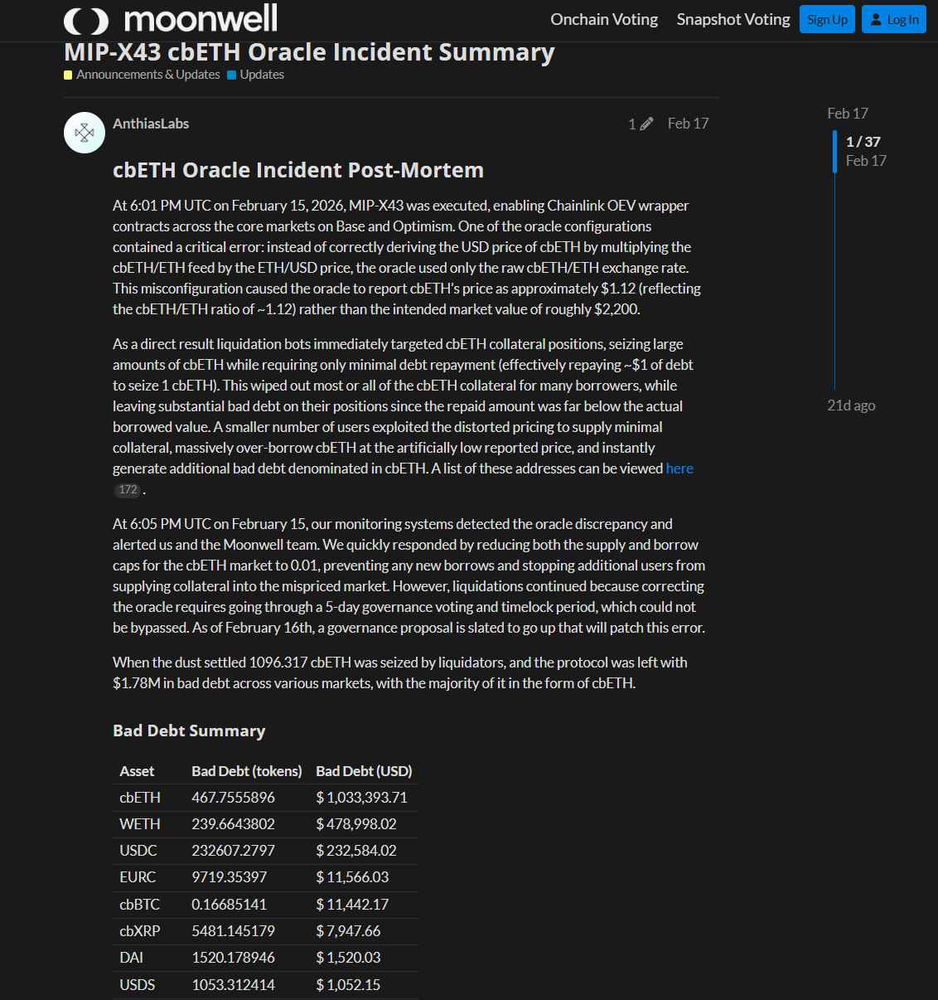
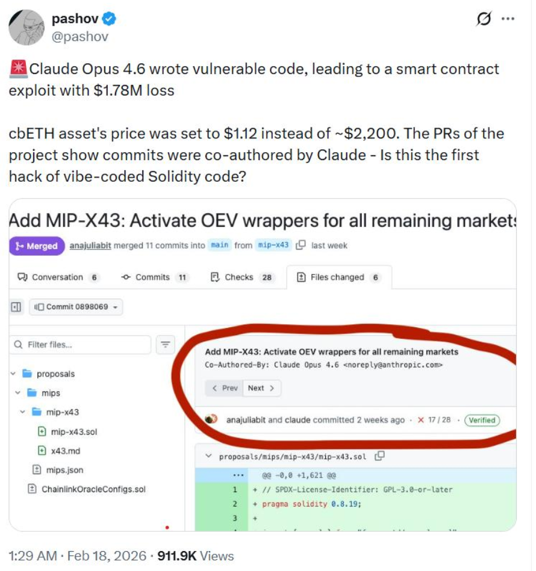
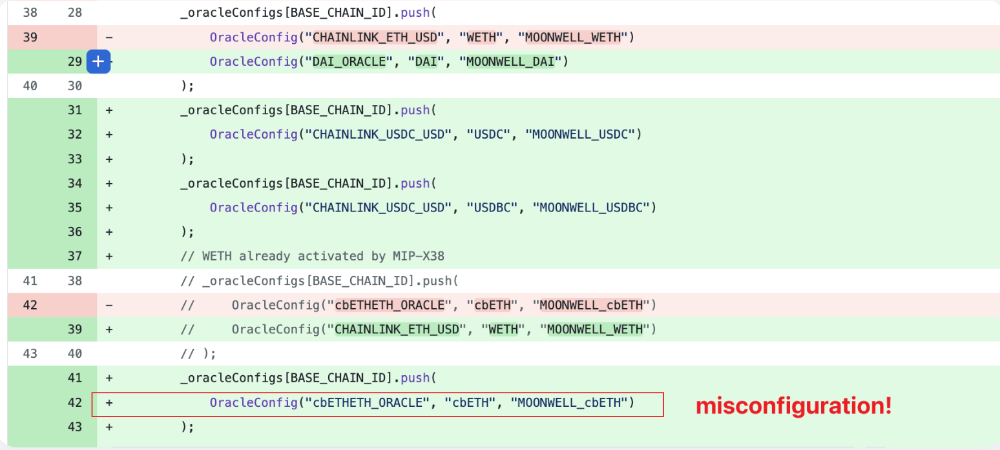
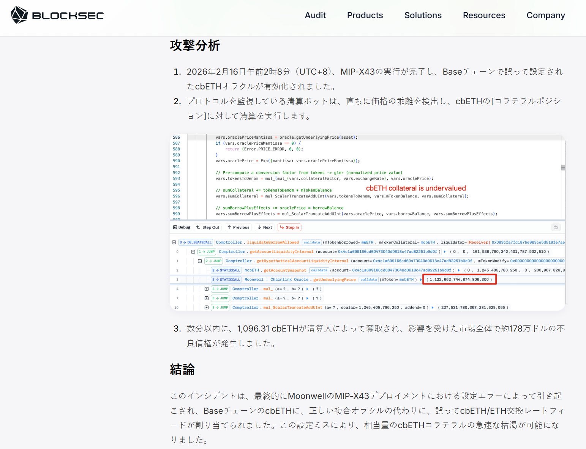
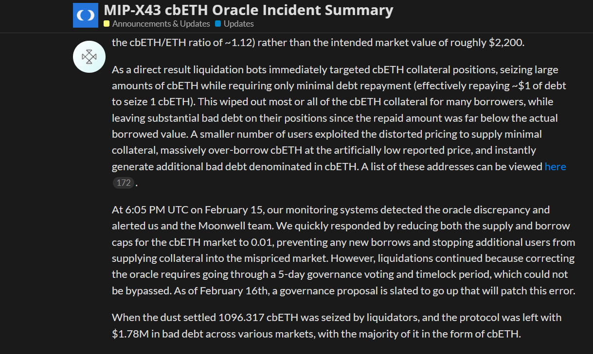
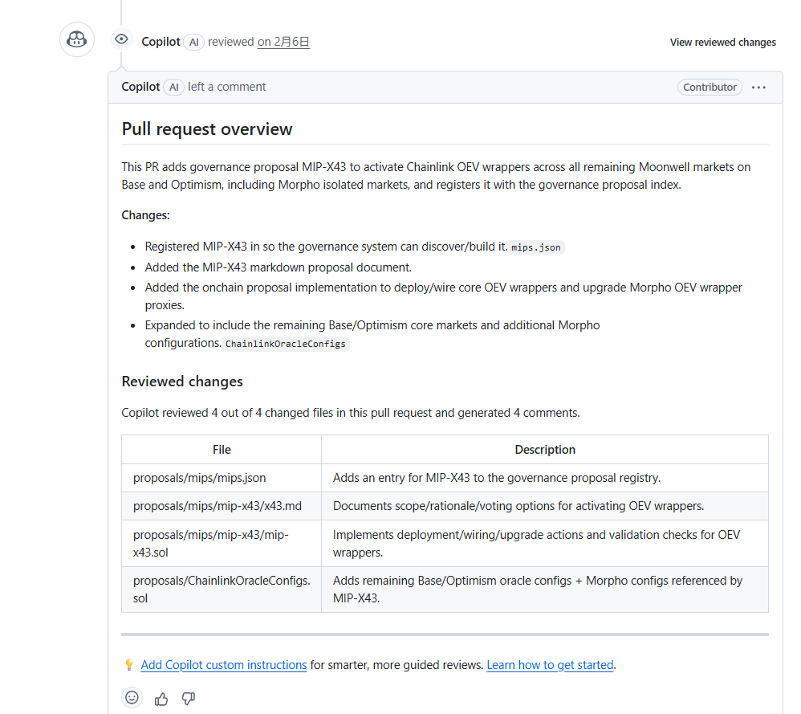
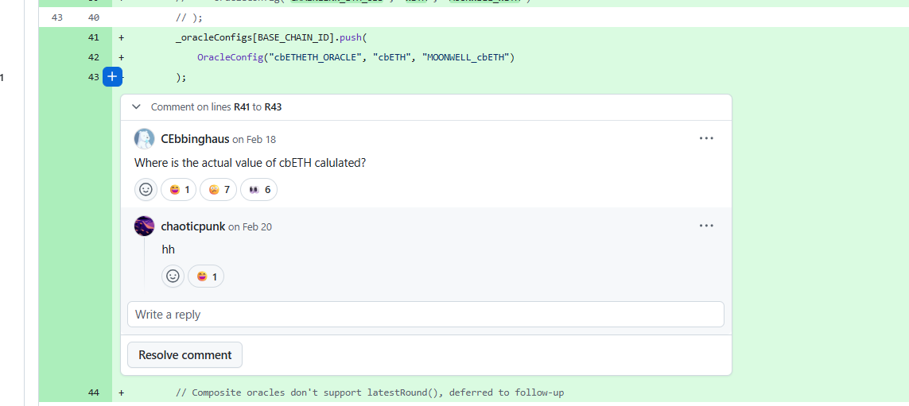
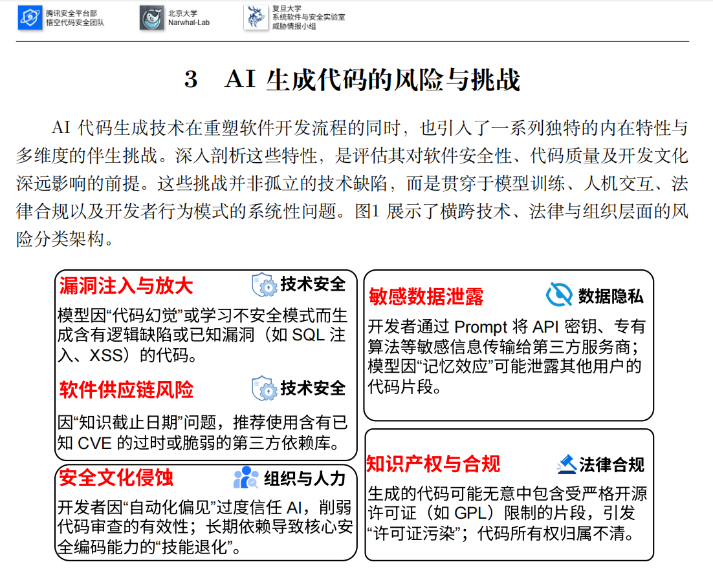
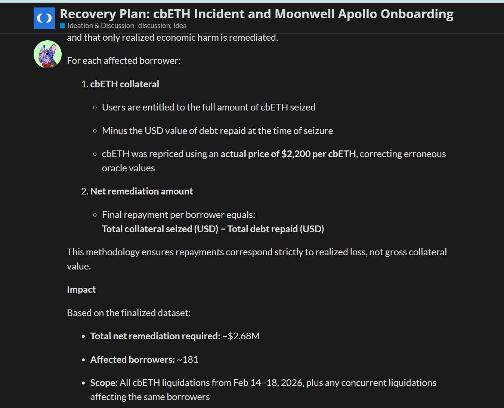
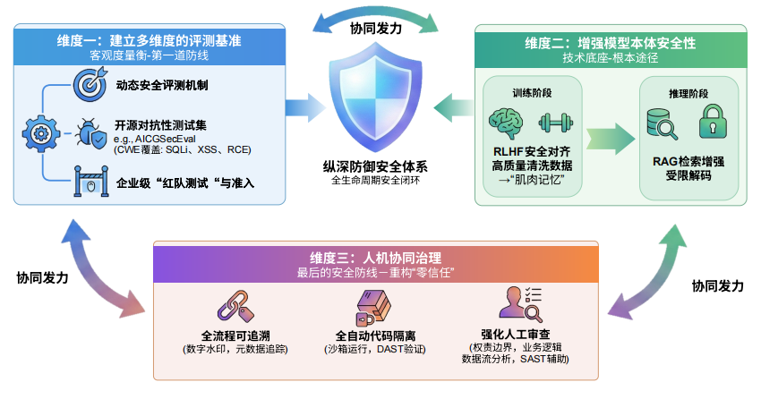

# Moonwell cbETH 预言机配置事故分析：AI 辅助开发链路中的金融语义校验失效

## 基本信息

案例时间：2026 年 2 月
事件对象：Moonwell DeFi 借贷协议，Base 链 cbETH Core Market
事件类型：预言机配置错误导致的链上清算事故
损失规模：Moonwell 官方复盘确认，清算人夺取 1096.317 枚 cbETH，协议形成 1,779,044.83 美元坏账
风险归类：AI 辅助开发流程风险
本案例可作为团队报告中 AI 代码生成风险从代码片段扩展到开发流程、业务验证和运行治理的补充案例

## 摘要

2026 年 2 月，Moonwell 协议在执行 MIP-X43 治理提案后发生 cbETH 预言机配置事故。官方复盘显示，cbETH 的美元价格本应由 `cbETH/ETH` 汇率与 `ETH/USD` 价格共同推导，实际部署后仅使用了 `cbETH/ETH` 原始汇率，导致系统将 cbETH 报价为约 1.12 美元，而非约 2200 美元。错误价格触发清算机器人集中执行清算，最终造成 1096.317 枚 cbETH 被清算，协议形成 1,779,044.83 美元坏账。([Moonwell Governance Forum](https://forum.moonwell.fi/t/mip-x43-cbeth-oracle-incident-summary/2068))

该事件与 AI 辅助开发存在公开可验证的关联。Moonwell GitHub PR #578 中包含 `Co-Authored-By: Claude Opus 4.6` 记录，同时该 PR 请求并获得了 Copilot AI review，合并前显示 28 项检查通过。([GitHub](https://github.com/moonwell-fi/moonwell-contracts-v2/pull/578)) 但现有公开证据不足以证明致命配置完全由 Claude 独立生成，也不足以排除人工修改、确认和合并决策的作用。因此，本案例更适合定义为 AI 辅助开发参与下的高风险金融逻辑验证失败，而不是单一模型导致的链上事故。

《AI 生成代码在野安全风险研究报告》（下称团队报告）指出，AI 代码生成已从局部补全扩展到软件开发全生命周期，风险也不再局限于代码片段本身，而是延伸到开发流程、审查机制、供应链治理和开发者安全文化。 Moonwell 事故表明，在智能合约与 DeFi 场景中，AI 参与代码生成与代码审查后，关键风险可能表现为业务语义校验缺失、预言机单位错配、上线前仿真不足和治理纠错受限。



## 一、事件核验与证据边界

Moonwell 官方复盘由 Anthias Labs 发布于 Moonwell 治理论坛。复盘显示，MIP-X43 于 2026 年 2 月 15 日 18:01 UTC 执行，目标是在 Base 与 Optimism 核心市场启用 Chainlink OEV wrapper 合约。其中一个预言机配置存在关键错误，系统没有通过 `cbETH/ETH × ETH/USD` 推导 cbETH 的美元价格，而是直接使用了 `cbETH/ETH` 原始汇率。该配置使 cbETH 价格被报告为约 1.12 美元。官方复盘同时确认，清算机器人随即针对 cbETH 抵押仓位执行清算，以极低债务偿还成本夺取高价值抵押品，并造成协议坏账。([Moonwell Governance Forum](https://forum.moonwell.fi/t/mip-x43-cbeth-oracle-incident-summary/2068))

BlockSec 对该事件的独立技术分析与官方复盘一致。其周报将 Moonwell 事件归类为配置错误，指出 Base 链 cbETH 被错误配置为 `cbETH/ETH` exchange rate feed，而不是包含 `ETH/USD` 价格的 composite oracle。BlockSec 进一步说明，该配置使协议将原始兑换率作为 cbETH 的美元价格，导致 cbETH 抵押品被约 2200 倍低估。([BlockSec](https://blocksec.com/ja/blog/weekly-web3-security-incident-roundup-feb-16-feb-22-2026))

该事件被外界与 AI 辅助开发联系起来，主要依据来自 Moonwell GitHub PR #578。该 PR 的主题为 Add MIP-X43: Activate OEV wrappers for all remaining markets，页面显示多个提交包含 `Co-Authored-By: Claude Opus 4.6 <noreply@anthropic.com>`。同一 PR 还显示开发者请求 Copilot review，Copilot 对 4 个变更文件进行了 AI review。PR 最终于 2026 年 2 月 10 日合并，合并前显示 28 checks passed。([GitHub](https://github.com/moonwell-fi/moonwell-contracts-v2/pull/578))



证据边界需要明确。GitHub 元数据可以证明 AI 参与了相关 PR 的代码产出或辅助开发流程，也可以证明 Copilot 对该 PR 做过 AI review。但这些记录并不能证明致命配置完全由 Claude 独立生成，也不能证明人类开发者没有修改、接受或合并相关代码。Cointelegraph 对安全审计员 Pashov 的采访显示，Pashov 将事件与 Claude 关联，是因为受影响 PR 中存在多个 Claude co-author 提交；但他同时指出，该类预言机错误并非 AI 独有，资深 Solidity 开发者也可能犯类似错误，根本问题在于缺乏足够严格的检查和端到端验证。([TradingView](https://www.tradingview.com/news/cointelegraph%3A17d2ac684094b%3A0-moonwell-hit-by-1-78m-exploit-as-ai-vibe-coding-debate-reaches-defi/))

Moonwell cbETH 事故是一起官方确认的预言机配置错误，相关代码变更流程存在可验证的 AI 辅助开发与 AI review 记录，事故暴露的是 AI 参与后的金融业务语义校验、人工复核和治理处置机制不足。

## 二、系统背景与事故触发条件

Moonwell 是部署于 Base、Optimism 等网络的 DeFi 借贷协议。借贷协议依赖预言机为抵押品和债务资产提供价格，用于计算抵押价值、借款额度、健康因子和清算条件。预言机价格错误会直接改变协议对资产价值的判断，因此属于核心安全边界。

cbETH 是 Coinbase Wrapped Staked ETH，其价格并不是单一美元报价。正常情况下，系统需要先读取 cbETH 相对 ETH 的兑换率，再乘以 ETH 的美元价格，才能得到 cbETH 的美元价值。事故中的错误配置仅使用 cbETH/ETH 汇率。由于该汇率约为 1.12，系统将 cbETH 错误视为约 1.12 美元资产，而不是约 2200 美元资产。([Moonwell Governance Forum](https://forum.moonwell.fi/t/mip-x43-cbeth-oracle-incident-summary/2068))



该错误在工程上具有隐蔽性。`cbETH/ETH` 数据源本身存在且返回有效数值，返回值为正，也能通过部分基础检查。问题不在于数据源无效，而在于数据源含义与协议后续逻辑所需的美元价格不一致。此类错误较难被普通格式检查、正数检查或局部静态分析直接发现，需要对资产类型、价格单位、预言机路径和清算后果进行整体校验。

该特征与团队报告中关于 AI 生成代码风险的判断一致。团队报告指出，AI 代码生成风险并不局限于传统注入类漏洞，也可能表现为语法正确但语义上存在严重逻辑缺陷的代码；同时，AI 输出容易诱发自动化偏见，使开发者降低对输出结果的审查强度。 Moonwell 事故中的错误并不表现为合约无法运行，而是表现为业务含义错误。该类型风险对 DeFi 协议尤为关键，因为错误价格会立即进入清算机制并转化为资产损失。

## 三、事故经过与处置过程

MIP-X43 执行后，错误配置的 cbETH 预言机开始报告约 1.12 美元价格。官方复盘显示，清算机器人立即针对 cbETH 抵押仓位执行清算。由于协议认为 1 枚 cbETH 仅值约 1 美元，清算人能够通过偿还极低金额的债务夺取真实市场价值约 2200 美元的 cbETH 抵押品。官方复盘还指出，除清算机器人外，少数用户利用错误定价供应极少抵押品并超额借出 cbETH，进一步制造以 cbETH 计价的坏账。([Moonwell Governance Forum](https://forum.moonwell.fi/t/mip-x43-cbeth-oracle-incident-summary/2068))

BlockSec 的分析描述了相同攻击过程。MIP-X43 执行完成后，错误配置的 cbETH 预言机被激活；监控协议的清算机器人识别到价格偏差，并对 cbETH 抵押仓位执行清算；数分钟内，1,096.31 枚 cbETH 被清算人夺取，影响市场形成约 178 万美元坏账。([BlockSec](https://blocksec.com/ja/blog/weekly-web3-security-incident-roundup-feb-16-feb-22-2026))



官方复盘显示，Moonwell 与 Anthias Labs 的监控系统在 18:05 UTC 检测到预言机异常，并触发告警。团队随后将 cbETH 市场的供给上限和借款上限下调至 0.01，阻止新增借款和新增抵押进入错误定价市场。但由于修正预言机需要经过 5 天治理投票和 timelock，无法绕过该流程，既有仓位的清算仍继续发生。([Moonwell Governance Forum](https://forum.moonwell.fi/t/mip-x43-cbeth-oracle-incident-summary/2068))



由此可见，事故链路并非单点失误。AI 辅助参与的 PR 进入代码流程，自动化审查和常规检查未能识别价格语义错误，人类审查未能在合并前发现 cbETH/USD 推导缺失，治理流程将配置带上链，运行时监控虽较快发现异常，但治理时延限制了即时修复能力。链上清算机制随后根据错误价格自动执行，形成实质损失。

## 四、代码变更与审查链路分析

PR #578 的变更范围包括治理提案注册、MIP-X43 文档、链上提案实现以及 `ChainlinkOracleConfigs.sol` 中的预言机配置扩展。Copilot 对 4 个变更文件进行了 review，涵盖 `mips.json`、`x43.md`、`mip-x43.sol` 和 `ChainlinkOracleConfigs.sol`。([GitHub](https://github.com/moonwell-fi/moonwell-contracts-v2/pull/578)) OpenZeppelin Code Inspector 也在 PR 中生成了报告摘要。PR 后续由人工 reviewer 审批，并在 28 项检查通过后合并。([GitHub](https://github.com/moonwell-fi/moonwell-contracts-v2/pull/578))



从公开记录看，相关提交中存在一些局部防御性修改。例如 GitHub 页面记录了修复 int256 validation、通过 try/catch 跳过重复 oracle 部署、移除未使用 import、用 `assertTrue(answer > 0)` 捕获负数价格等内容，并标注了 Claude Opus 4.6 co-author。([GitHub](https://github.com/moonwell-fi/moonwell-contracts-v2/pull/578)) 这些修改有助于提升局部代码健壮性，但无法验证 cbETH 的最终输出是否为美元价格，也无法判断 1.12 对 cbETH 是否属于合理市场报价。

PR 页面中还出现事故后评论，评论位置指向 `ChainlinkOracleConfigs.sol` 中的 cbETH 配置：

```solidity
_oracleConfigs[BASE_CHAIN_ID].push(
    OracleConfig("cbETHETH_ORACLE", "cbETH", "MOONWELL_cbETH")
);
```

评论直接询问 cbETH 的实际价值在哪里计算。([GitHub](https://github.com/moonwell-fi/moonwell-contracts-v2/pull/578)) 该评论虽然发生在事故后，但其指向的问题正是事故根因：配置引用了 `cbETHETH_ORACLE`，但缺少将 cbETH/ETH 汇率进一步转换为 cbETH/USD 的步骤。



该链路体现了 AI 辅助开发时代审查目标的错位。AI 可参与代码生成，也可参与代码 review；自动化工具可检查部分语法、结构和常规风险。人工 reviewer 可确认变更符合治理提案形式。但在 DeFi 价格逻辑中，关键问题是资产最终价格的业务含义是否正确。若审查流程没有显式验证价格单位、价格数量级、组合路径和清算结果，即使多层审查同时存在，也仍可能遗漏核心风险。

## 五、AI 参与的责任边界与风险性质

PR #578 中存在 Claude co-author 记录和 Copilot AI review 记录，说明 AI 工具参与了该变更流程。([GitHub](https://github.com/moonwell-fi/moonwell-contracts-v2/pull/578)) 但项目方官方复盘将根因定义为预言机配置错误，并未将事故直接归因于 Claude。([Moonwell Governance Forum](https://forum.moonwell.fi/t/mip-x43-cbeth-oracle-incident-summary/2068))

Cointelegraph 采访中，Pashov 将该事件与 Claude 关联，依据是受影响 PR 中存在多个 Claude co-author 提交；但他同时指出，不应将该错误视为 AI 独有缺陷，类似预言机错误也可能由资深 Solidity 开发者引入，核心问题是缺乏足够严格的检查和端到端验证。([TradingView](https://www.tradingview.com/news/cointelegraph%3A17d2ac684094b%3A0-moonwell-hit-by-1-78m-exploit-as-ai-vibe-coding-debate-reaches-defi/)) 这一判断与本报告的证据边界一致。

本案的风险性质应概括为 AI 参与高风险代码变更后，验证机制没有同步提高。AI 生成或辅助修改的代码可能具有较强形式完整性，局部检查也可能看起来合理；但金融业务逻辑需要验证资产价值、价格单位、换算关系和极端情况下的协议行为。此类验证超出普通代码格式检查和局部 API 检查范围，需要协议级上下文。该风险与团队技术报告的核心框架一致。团队报告在能力分析中指出，AI 代码生成已覆盖从微观辅助到宏观自动化构建的多个环节；在风险分析中指出，自动化偏见可能削弱代码审查有效性；在治理建议中强调，开发者需要从代码编写者转向审查者与验证者。 Moonwell 事件显示，在智能合约和 DeFi 场景中，验证者职责不仅包括阅读代码，还包括复算价格路径、验证单位语义、模拟清算结果和评估治理时延。

## 六、对团队技术报告风险框架的补充

团队报告将 AI 代码安全风险分为直接安全风险、间接与合规性风险以及组织与人力风险，并特别强调自动化偏见和安全文化侵蚀。 Moonwell 事件可补充该框架中的一个现实场景：AI 参与不一定直接表现为典型漏洞代码，也可能通过配置错误、业务语义错配和审查目标偏移进入高风险系统。

该事件首先补充了代码幻觉与语义缺陷的讨论。团队报告中提到，AI 可能生成语法正确但语义存在严重逻辑缺陷的代码。 Moonwell 的错误配置同样满足这一特征。`cbETH/ETH` feed 并非无效数据源，返回值也不是异常值；但将其直接作为美元价格输入借贷协议，语义上完全错误。该案例说明，AI 相关风险不能仅通过语法、类型、地址或返回值合法性检查覆盖，必须纳入业务语义层面的验证。



 Moonwell 事故可归入 AI 代码生成风险框架中的多维交叉区域，而不是单一智能合约漏洞。该事件补充了 AI 在漏洞生命周期中角色演变的讨论。团队报告指出，AI 既可能辅助修复，也可能成为缺陷来源，并强调 AI 在生成、修复、重构和维护流程中的双重作用。 Moonwell 案例中，AI 不仅参与代码产出，也参与了 PR 审查。由于 Copilot review 未识别价格路径错误，AI review 本身也成为需要评估的对象。该案例表明，组织不能只评估 AI 会生成什么，还需要评估 AI 审查会遗漏什么。同时该事件补充了人机协同治理的讨论。团队报告提出，应在软件供应链流程中重构零信任机制，强化人工审查，并明确开发者是代码安全最终责任人。 Moonwell 事故中，AI 参与、自动检查、人类审批和 DAO 治理均未阻止错误上线，说明零信任原则应覆盖 AI 代码、AI review、治理提案和预言机配置。对于 DeFi 协议，零信任验证的核心不只是代码来源可信，还包括价格路径可信、单位可信、清算结果可信和应急处置可信。

## 七、损失影响与后续治理

官方复盘中的坏账汇总显示，事故造成多资产坏账，总额为 1,779,044.83 美元。其中 cbETH 坏账约 1,033,393.71 美元，WETH 坏账约 478,998.02 美元，USDC 坏账约 232,584.02 美元，另涉及 EURC、cbBTC、cbXRP、DAI、USDS、AERO、MORPHO、wstETH 等资产。([Moonwell Governance Forum](https://forum.moonwell.fi/t/mip-x43-cbeth-oracle-incident-summary/2068)) 该结果表明，错误预言机价格会通过借贷协议仓位结构扩散，影响不止单一抵押品。

官方论坛的后续恢复计划进一步扩大了影响口径。恢复计划称，2026 年 2 月 14 日至 18 日期间，一部分在 Base 上供应 cbETH 抵押品的用户遭遇非正常市场风险导致的清算，相关行为与 MIP-X43 协议机制有关。链上复核识别出约 181 名借款人，总净损失约 268 万美元，并提出以 treasury 资金和未来协议收入组合进行补偿。([Moonwell Governance Forum](https://forum.moonwell.fi/t/recovery-plan-cbeth-incident-and-moonwell-apollo-onboarding/2084))



该后续治理说明，AI 辅助开发相关风险的影响范围并不止于代码层面。一项错误配置进入链上系统后，会经过清算机制影响用户仓位，经过治理流程影响补偿安排，并经过社区讨论影响协议信誉。团队报告中提出的全生命周期安全治理框架，在此类事件中应覆盖需求理解、代码生成、PR 审查、治理执行、运行监控、事故补偿和复盘改造等阶段。

## 八、缓解建议

Moonwell 事故暴露出的核心问题是金融业务语义没有被纳入强制验证。后续治理不应停留在增加人工审查或减少 AI 使用，而应建立面向高风险 DeFi 逻辑的可执行验证制度。

对于预言机配置，应建立价格路径验证机制。每个资产的价格来源应形成可审计配置图，明确原始 feed、汇率路径、组合 oracle、精度缩放、输出单位和最终使用位置。任何新增或替换预言机的治理提案，应在合并前输出 fork 环境下的最终资产美元价格，并与独立价格源进行对照。对于 cbETH、wstETH、rETH 等衍生资产，应强制检查相对汇率是否已经转换为美元价格。

对于 AI 参与的代码变更，应建立更严格的审查触发条件。PR 中出现 AI co-author、AI 生成说明或 AI review 记录时，应将其作为审查路径信息纳入归档，而不是作为质量保证信号。涉及预言机、清算、抵押率、资产上限、治理执行和升级路径的变更，应要求独立人工复算关键业务不变量。审查重点应从代码形式转向协议结果，包括价格单位、数量级、清算结果、极端值行为和治理失败模式。

对于测试体系，应增加价格 sanity check 与端到端清算模拟。单元测试应覆盖返回值为正、地址有效和合约可部署等基础条件，但不能止于此。集成测试应在 fork 环境中执行完整治理提案，验证所有受影响资产的最终报价，并模拟主要仓位在新价格下的健康因子和清算行为。对于 cbETH 事故类型，测试中应明确断言 cbETH/USD 不得出现与主流市场价格数量级不一致的输出。对于运行时防护，应建立预言机异常断路器。监控系统检测到价格与参考源偏离超过阈值时，应触发受限保护状态。保护状态可以暂停相关市场清算、冻结新增借款、关闭新增抵押或切换到保守模式。该机制不应绕过治理修复预言机本身，但应在治理修复完成前阻止损失继续扩大。断路器的触发条件、权限边界、审计日志和恢复流程应在协议上线前明确。

使用 AI review 应建立能力评估基准。团队报告提出建立多维度评测基准以度量 AI 生成代码安全性。 在 DeFi 场景中，该思路应扩展到 AI 审查能力评估。评测集应覆盖预言机单位错配、衍生资产价格路径缺失、精度缩放错误、清算边界异常、治理执行顺序错误和升级后配置不一致等场景。AI review 只有在明确能力边界后，才适合作为辅助审查工具进入生产开发流程。



团队报告风险缓解框架图中 Moonwell 事件对应的治理位置：评测基准不足、模型与 AI review 上下文不足、人机协同治理不足、全流程可追溯不足。

## 九、结论

Moonwell cbETH 预言机配置事故是一起已发生且已由项目方复盘确认的 DeFi 安全事件。事故直接原因是 cbETH 美元价格推导链路错误，系统将 `cbETH/ETH` 汇率直接作为 cbETH 美元价格，导致 cbETH 被严重低估，清算机器人随即利用错误价格执行清算，最终形成 1096.317 枚 cbETH 被清算和 1,779,044.83 美元协议坏账。([Moonwell Governance Forum](https://forum.moonwell.fi/t/mip-x43-cbeth-oracle-incident-summary/2068))

该事件与 AI 辅助开发存在公开证据关联。PR #578 中存在 Claude Opus 4.6 co-author 记录，Copilot 对该 PR 进行了 AI review，合并前显示 28 项检查通过。([GitHub](https://github.com/moonwell-fi/moonwell-contracts-v2/pull/578)) 但从证据严谨性看，该事件是AI 参与了高风险金融代码变更和审查流程，而现有流程没有对价格语义、资产单位和清算后果进行充分验证。

Moonwell 案例对团队技术报告具有补充意义。该案例不是典型注入漏洞，也不是单纯的智能合约权限错误，而是 AI 辅助开发流程中业务语义校验不足的链上后果。它说明，在 AI 代码生成逐步进入软件开发全生命周期后，安全治理必须从代码片段审查扩展到业务不变量验证、AI review 能力评估、治理执行校验和运行时应急控制。对于 DeFi 等资金密集型系统，AI 产出可以作为开发效率工具，但不能作为安全正确性的证明。最终安全责任仍应落在可验证的工程流程、明确的审查边界和可执行的治理控制上。

## 参考来源

1. Moonwell Governance Forum，MIP-X43 cbETH Oracle Incident Summary。该来源用于核验事故时间、错误定价方式、监控响应、治理时延、1096.317 cbETH 清算规模和 1,779,044.83 美元坏账。([Moonwell Governance Forum](https://forum.moonwell.fi/t/mip-x43-cbeth-oracle-incident-summary/2068))
2. Moonwell GitHub PR #578，Add MIP-X43: Activate OEV wrappers for all remaining markets。该来源用于核验 Claude Opus 4.6 co-author、Copilot AI review、OpenZeppelin Code Inspector、28 checks passed 以及 cbETHETH_ORACLE 配置评论。([GitHub](https://github.com/moonwell-fi/moonwell-contracts-v2/pull/578))
3. BlockSec，Web3 Security Incident Weekly Roundup, Feb. 16–22, 2026。该来源用于第三方核验 Moonwell 事故类型、预言机配置错误、约 2200 倍低估、攻击过程和损失规模。([BlockSec](https://blocksec.com/ja/blog/weekly-web3-security-incident-roundup-feb-16-feb-22-2026))
4. Cointelegraph via TradingView，Moonwell hit by $1.78M exploit as AI vibe coding debate reaches DeFi。该来源用于核验 Pashov 对 AI 参与的判断，以及其关于该错误并非 AI 独有、核心问题是缺少严格检查和端到端验证的谨慎表述。([TradingView](https://www.tradingview.com/news/cointelegraph%3A17d2ac684094b%3A0-moonwell-hit-by-1-78m-exploit-as-ai-vibe-coding-debate-reaches-defi/))
5. Moonwell Governance Forum，Recovery Plan: cbETH Incident and Moonwell Apollo Onboarding。该来源用于核验事故后续恢复计划、约 181 名借款人和约 268 万美元净损失口径。([Moonwell Governance Forum](https://forum.moonwell.fi/t/recovery-plan-cbeth-incident-and-moonwell-apollo-onboarding/2084))
6. Decrypt，Oracle Error Leaves DeFi Lender Moonwell With $1.8 Million in Bad Debt。该来源用于补充媒体层面对约 1 美元错误价格、约 2200 美元真实价格、99.9% 折价和清算影响的描述。([Decrypt](https://decrypt.co/358374/oracle-error-leaves-defi-lender-moonwell-1-8-million-bad-debt))
7. Rekt，Moonwell。该来源用于补充外部安全分析对 PR 审查链路、价格 sanity check 缺失和 AI 参与争议的梳理。([rekt](https://rekt.news/moonwell-rekt))
8. 《AI 生成代码在野安全风险研究报告》。建立本案例与 AI 代码生成风险分类、漏洞生命周期分析和人机协同治理框架之间的关系。
