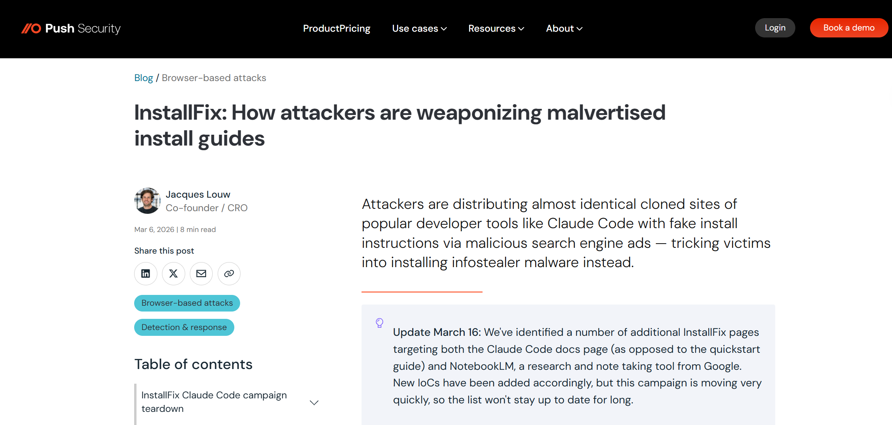
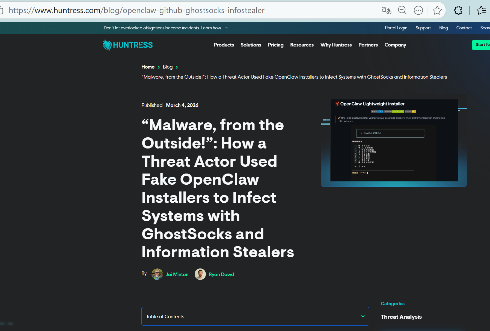
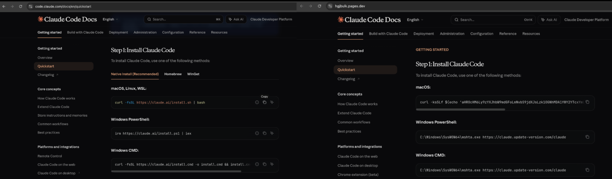
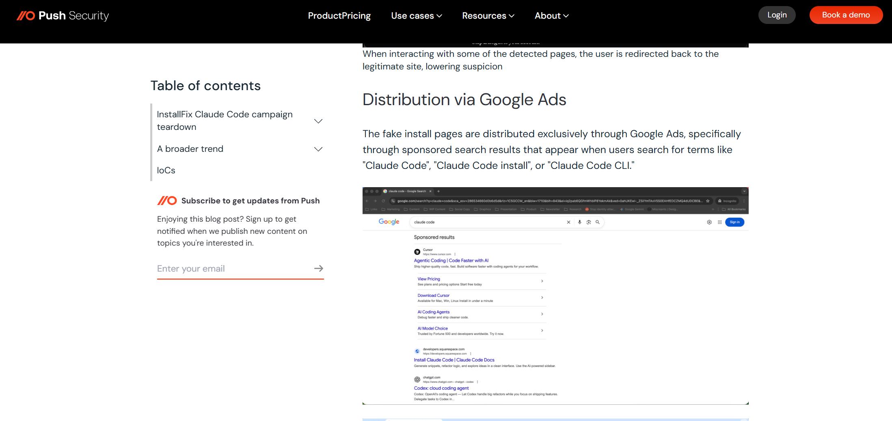
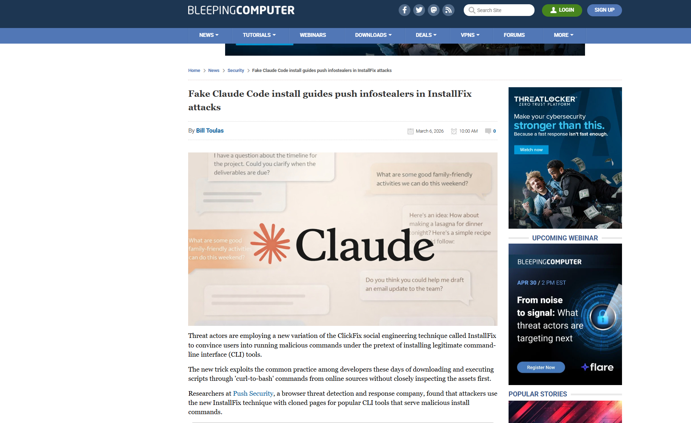
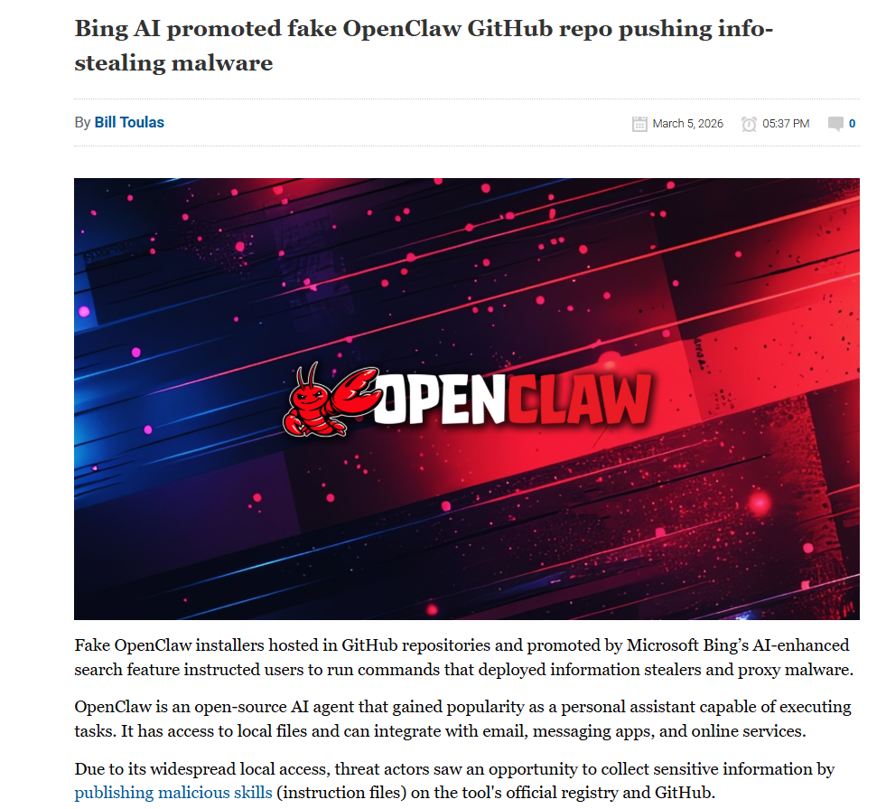
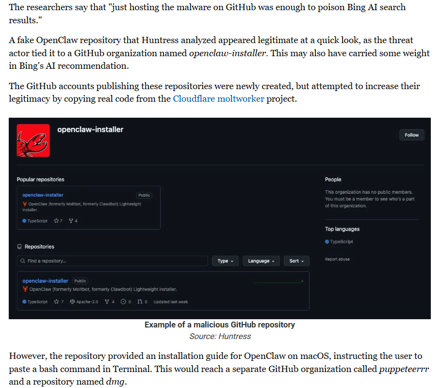

# AI 编码工具安装链路被滥用案：Google Ads 假 Claude Code 安装页与 Bing AI 误推荐 OpenClaw 恶意安装器

## 基本信息

案例时间：2026 年 2 月至 2026 年 3 月  
案例类型：AI 编码工具生态安全事件  
归类：安全文化与开发者能力退化相关案例，安全文化侵蚀

## 一、案例概述

随着 Claude Code、OpenClaw 等 AI 编码工具和 AI Agent 的快速普及，开发者获取工具的方式也发生了显著变化。越来越多的用户不再从项目主页、官方发布页和仓库签名机制出发完成安装，而是先从搜索引擎、AI 搜索摘要、媒体文章、社交平台和聚合教程中寻找一行即可执行的安装命令。团队原报告已经指出，AI 代码生成正在从局部补全工具扩展为覆盖开发全生命周期的生态系统，风险也随之从代码本体外溢到软件供应链、开发习惯和组织治理层面。换言之，AI 工具一旦成为开发流程中的基础设施，围绕这些工具的安装入口、推荐路径和分发渠道本身，就会成为攻击者优先争夺的新攻击面。

2026 年初，公开研究连续披露了两起具有代表性的事件。第一起事件由 Push Security 发现。攻击者通过 Google 搜索广告投放与 Claude Code 官方文档高度相似的伪造安装页面，页面整体布局、品牌元素和导航结构几乎不变，只替换安装命令，从而诱导用户在本地终端执行恶意脚本。Push Security 将这一模式命名为 InstallFix，并强调其危险之处不在于页面伪装本身，而在于它利用了开发者已经形成的操作习惯，即看到安装说明后直接复制命令到终端执行。BleepingComputer、Help Net Security 和 Malwarebytes 的后续报道都延续了这一结论，说明这并不是单一研究者的孤立发现，而是获得了多方复核的公开事件。

InstallFix：攻击者如何利用恶意安装指南作为武器

第二起事件由 Huntress 披露。攻击者围绕 OpenClaw 创建了伪装成安装器的恶意 GitHub 组织和仓库，并因外观、命名和托管平台的综合迷惑性，获得了 Bing AI 搜索结果的直接推荐。Huntress 在原始技术报告中明确写到，这些恶意仓库于 2026 年 2 月 2 日至 2 月 10 日期间存在，既包含针对 Windows 的恶意安装器，也包含针对 macOS 的一行式 bash 安装流程，最终会投递信息窃取器与 GhostSocks 代理恶意软件。BleepingComputer 与 Malwarebytes 的报道则进一步强化了这一点：攻击者几乎不需要复杂的 SEO 投毒，只要把恶意内容托管在 GitHub，并包装成足够像真的安装仓库，AI 搜索系统就可能在回答中把它呈现为可信来源。

这些事件的关键，不在于攻击者做出了一个多复杂的利用链，而在于他们抓住了 AI 编码工具扩散后的一个新现实：开发者安装工具时，越来越少从官方站点、官方仓库或包管理器页面逐层确认来源，越来越多是直接从搜索结果、AI 搜索摘要、媒体文章或教程里复制一行命令执行。原报告在开篇和第 3 章已经指出，AI 代码生成正在从局部补全扩展到覆盖开发全生命周期，软件供应链的风险边界也随之向外围延伸，不再只落在代码仓库、依赖包和构建产物上，而是进一步延伸到工具获取、推荐入口和使用习惯。这个案例正好落在这条边界外移的链路上。这两个事件共同说明，AI 代码安全问题已经不再局限于模型生成的函数、脚本和依赖是否安全，还扩展到开发者如何找到工具、如何判断来源、如何执行安装命令，以及 AI 推荐系统如何影响这一过程。它们不是最典型的代码幻觉注入漏洞，但非常适合作为原报告在安全文化侵蚀、生态风险扩展和人机协同治理方面的实证补充。

## 二、为什么这一案例应当纳入原报告

这个案例关键在于它展示了 AI 编码生态在现实世界中的另一条高风险攻击链：攻击者不需要先进入代码仓库，也不需要污染官方发行包，只要控制用户看到的安装入口和推荐结果，就可以把本该属于开发工具分发链的正常流程，重构为一条恶意软件投递链。受攻击的对象并不是普通消费软件，而是已被原报告明确纳入 AI 代码生成生态的一体化开发平台与 AI 软件工程工具。报告第 2 章已经把 Claude Code 等一体化开发平台、Devin 与 OpenHands 等 AI 软件工程师代理视作软件开发新生态的重要组成部分；当这类工具本身成为开发流程基础设施时，围绕它们的安装、分发、推荐和首次执行，自然也就成为软件供应链的一部分。

原报告强调，AI 进入软件开发后，安全问题不再只发生在生成代码本身，也会外溢到供应链安全、开发习惯和组织治理。这个案例里，真正出问题的不是 IDE 里那段补全代码，而是开发者获取工具的入口：搜索广告、AI 摘要、伪装 README、假安装命令、伪造 GitHub 组织，这些过去常被视为外围问题的环节，已经进入同一条攻击链。原报告第 3 章给出的风险分类图里，已经明确把安全文化侵蚀作为一类独立风险，指出开发者因自动化偏见而过度信任 AI，可能削弱代码审查有效性，并导致技能退化。这个案例里，自动化偏见不再表现为“模型写了一段代码，开发者没审就用了”，而是表现为AI 搜索给出的安装入口、看起来像官方的页面、看起来很熟悉的一行命令，被默认当成可信内容直接执行。本质没有变，仍然是把机器给出的结果当成经过验证的答案。报告指出，AI 不只是代码生成工具，也正在进入漏洞修复、开发决策与软件维护过程。这个案例里，Bing AI 的问题并不是生成了漏洞代码，而是在开发前置决策中给出了错误背书；Claude Code 假安装页的问题也不是代码逻辑错误，而是工具安装链路被劫持。也就是说，AI 对安全的影响已经从代码内容本身，进一步扩展到了来源判断、安装决策和执行路径。报告提出，风险缓解要从建立多维度评测基准、增强模型本体安全性、人机协同治理三个层面同时推进，并强调要重构零信任机制，明确开发者是代码安全最终责任人。

## 三、事件 A：Google Ads 假 Claude Code 安装页与 InstallFix 攻击

Push Security 在 2026 年 3 月的原始技术报告中指出，攻击者利用 Google Ads 购买与 Claude Code 安装相关的搜索结果曝光位，并将用户导向与官方页面极为相似的伪造文档页。页面保留了 Anthropic Claude Code 文档的整体视觉风格、品牌标识和侧边导航，仅把安装命令替换为指向攻击者基础设施的恶意命令。Push Security 将这种基于真实安装流程的社会工程攻击称为 InstallFix，意在强调它和传统 ClickFix 的差别：受害者不是被迫修复一个虚假的系统故障，而是在执行本来就合理的安装动作。

从攻击原理上看，这次事件的关键不是页面设计得多像官方，而是命令执行链路几乎完全复用了开发者对 CLI 工具的既有认知。Anthropic 官方文档本身就提供 Claude Code 的标准安装方式，包括 npm 全局安装，以及更新后的 shell 和 PowerShell 安装形式。这意味着，用户在看见类似的一行命令时，本能上不会认为这是一种高风险行为。也正因为官方安装流程已经教育了用户要相信文档中的一行命令，攻击者才能在伪造页面里只替换这一行内容，而保留其余全部结构，从而把信任直接转移到恶意基础设施上。

媒体复核进一步说明了这一攻击的危险性。BleepingComputer 指出，攻击者借助 Google Ads 使恶意页面在 Claude Code install 和 Claude Code CLI 等关键词下获得优先展示，页面除安装命令外的所有链接都跳转回 Anthropic 官方站点，因此即使用户执行了恶意命令，后续浏览流程看起来仍然是正常的，受害者未必会立刻意识到安装链路已经被劫持。Help Net Security 也强调，这类页面与真实页面的区别细微到用户几乎只能通过命令里嵌入的 URL 来辨认，而开发者在日常使用中往往并不会逐字符核查远程命令的下载地址。

这起事件值得纳入案例库的地方，是它把一个过去被视为常规开发动作的步骤，重新定义为了安全关键点。以往团队往往将注意力集中在仓库代码、依赖清单、构建产物和生产环境，而忽略安装入口的可信性判断。但对 Claude Code 这样的 AI 编码工具而言，安装页面本身就已经是供应链的一部分；一旦这一入口被仿冒，风险会在工具尚未真正安装前就完成投递。从报告的框架看，这件事不是单纯的广告欺诈就能概括的。更准确地说，它属于 AI 编码工具生态扩张后，分发入口与使用习惯共同暴露出的新型供应链风险。原报告第 3 章提到，模型的知识截止、训练偏差和交互方式会引入新的系统性问题；这里虽然不是模型参数层面的缺陷，但同样属于 AI 工具大规模落地后被带出来的新型系统性问题。工具安装页不再只是文档页面，它已经是供应链入口的一部分。只要入口被仿冒，攻击就可以在用户还没真正装上工具前完成。这起事件还说明，很多开发者已经把文档中的命令视为低风险动作。过去组织做供应链安全治理，注意力更多集中在依赖包、镜像、二进制产物、CI/CD 环节，而不会把安装文档本身视为重点核验对象。但这个案例说明，对 AI 编码工具来说，安装说明本身就应该纳入核验范围。因为一旦用户的第一步就是在本地终端执行来自假页面的命令，后面的仓库审查、依赖扫描、镜像签名都已经来不及发挥作用了。

## 四、事件 B：Bing AI 误推荐 OpenClaw 恶意安装仓库

Huntress 在 2026 年 3 月的公开报告中详细分析了另一种更具 AI 推荐特征的攻击方式。研究发现，攻击者构造了与 OpenClaw 品牌相关的 GitHub 组织和仓库，例如 openclaw-installer，并在其中发布恶意安装说明和载荷。当用户在 Bing 中搜索 OpenClaw Windows 时，AI 搜索结果直接把这一恶意仓库作为推荐安装入口呈现给用户。也就是说，这里不是用户在众多结果中误点了一个普通链接，而是 AI 搜索系统本身在结果摘要中完成了错误背书。

Huntress 的原始报告给出的技术细节比媒体摘要更完整。报告明确写到，恶意仓库与 GitHub 组织在 2026 年 2 月上旬短暂存在，仓库中包含针对 macOS 的 bash 一行安装命令，并在发布页面中放置 Windows 可执行文件。研究者在深入分析后确认，Windows 侧会投递信息窃取器和 GhostSocks，macOS 侧则会投递 AMOS。更关键的是，Huntress 强调，攻击者仅仅把恶意内容托管在 GitHub，并用看似合理的组织名与 README 进行伪装，就足以污染 Bing 的 AI 搜索推荐。这说明对 AI 推荐系统来说，平台信誉、组织命名和仓库外观可能比真正的来源验证更容易影响排序和答案拼接。

BleepingComputer 与 Malwarebytes 的报道强化了这一结论。BleepingComputer 直接引用了研究者的判断，即单纯把恶意安装器放在 GitHub 上就足以污染 Bing AI 的答案。Malwarebytes 则指出，这类攻击之所以特别危险，是因为 OpenClaw 作为本地运行的开源 AI 助手，本身就拥有访问文件、与云服务交互、操作聊天应用和读取配置文件等高权限能力。用户一旦为安装器输入管理员权限或执行一行脚本，后果并不止于浏览器密码泄露，还可能影响本机中与 AI Agent 配置相关的 API Key、认证信息和自动化工作流上下文。

事件的危险性还体现在 GhostSocks 的二次利用价值上。Huntress 指出，GhostSocks 可将受害主机变成代理节点，使攻击者可以通过受害者自己的网络环境发起后续活动，从而绕过很多基于登录位置、设备指纹和行为异常的风控与反欺诈系统。换言之，信息窃取器只是第一步，后续账号接管与身份冒用才是更具现实破坏性的延伸。

## 五、案例与原报告重点内容的对应关系

如果只从表面上看，这两起事件都可以被写成搜索广告欺诈或假安装器投毒，似乎和 AI 代码安全关系不够直接。但这种理解会忽略一个更重要的事实：这里被攻击的对象不是普通办公软件，不是泛消费类应用，而是正在成为软件开发新基础设施的 AI 编码工具与 AI Agent。原报告已经明确把 Claude、ChatGPT、GitHub Copilot 等对话式 AI 与一体化开发平台纳入 AI 代码生成生态，把 Claude Code、Devin、OpenHands 等更高自治度工具视为软件工程范式变化的重要代表。对于这样的生态而言，安装、分发、推荐和首次执行不再是外围问题，而是开发供应链的起点。

原报告明确把自动化偏见、过度信任和技能退化列为重要风险。这个案例表明，开发者对 AI 的过度信任已经不只发生在代码评审阶段，也发生在工具安装阶段。用户看到 AI 摘要、广告入口或看似熟悉的文档格式时，往往默认其已经被平台或系统验证，这就是自动化偏见在安装链路上的具体体现。报告里讨论的是 AI 既可能引入问题，也可能修复问题。这个案例进一步说明，AI 对安全的影响并不限于“生成”和“修复”，还会进入“发现、选择、下载、执行”这些更前置的决策环节。Bing AI 的错误推荐就是典型例子：它不是漏洞代码的直接来源，却是风险入口的放大器。报告强调要构建零信任机制，强化人工审查，明确开发者是最终责任人。这个案例说明，所谓零信任不能只落实在生成代码上，也要落实在安装命令、推荐来源、仓库身份和下载入口上。开发者在 AI 时代的验证职责，已经从审查 pull request，前移到了审查一行安装命令。报告指出，随着 AI 代码比例上升，开发者正在从单纯的代码编写者转向审查者与验证者。

在本案例中，这一角色变化被推得更早了：开发者甚至要在安装工具之前就承担起验证者职责，核查安装命令是否来自官方域名，搜索结果是否为广告，GitHub 仓库是否真属于官方组织，AI 推荐是否只是表面可信而缺乏来源证明。换句话说，AI 时代的验证义务不再始于 pull request，而是始于 curl、bash、irm 和 iex 这些最常见的一行命令。其次，这一案例证明了原报告关于软件供应链边界被重塑的判断。过去讨论供应链，更多聚焦在依赖包、CI/CD、签名和发布产物。现在，搜索广告平台、AI 搜索摘要、GitHub 组织名、恶意 README、安装脚本托管站点都已经进入同一条风险链。攻击者并没有污染 Anthropic 官方仓库，也没有入侵 OpenClaw 官方项目，但依然可以借助平台信誉与 AI 推荐，让用户主动执行恶意命令。这种从分发入口切入的攻击方式，恰恰印证了原报告所谓风险已经从代码本体扩展到开发流程外围设施的判断。这个案例还能对应原报告中对自动化偏见的现实解释。自动化偏见不只发生在接受模型补全时，也发生在接受 AI 排序和 AI 概括时。Bing AI 的错误推荐使用户误以为结果已经被系统验证；Claude Code 假安装页则利用了开发者对于官方安装流程的熟悉感。表面看是广告仿冒和仓库伪装，深层看则是人机协作中信任分配失衡。报告里强调，AI 无法保证零误报与零风险，因此必须由人工保持最终裁决权。这一原则在这里不是抽象治理口号，而是可以直接落地的处置逻辑。

## 六、风险与影响分析

从攻击收益看，这类事件的价值远高于普通账号密码窃取。Claude Code、OpenClaw 等工具被安装和运行的主机，往往同时保存浏览器会话、密码管理器信息、SSH Key、开发者令牌、云平台访问凭证、API Key、本地源代码和测试环境配置。Push Security 指出，假 Claude Code 页面最终投递的是信息窃取恶意软件，目标包含密码、Cookies、加密钱包和系统凭证。Huntress 则进一步指出，OpenClaw 运行环境中还可能存在高价值的 AI Agent 配置、自动化脚本和敏感工作流上下文，因此主机一旦被感染，损失不只体现在个人账号，而可能扩展到开发环境、代码仓库和企业 SaaS 访问链。

这类事件攻击门槛也具有明显的可复制性。攻击者无需从零编写复杂利用链，不必争夺官方仓库权限，只要拥有广告投放能力、页面克隆能力或仓库伪装能力，就有可能借助 AI 工具的流量红利获利。Push Security 把这一模式概括为对 curl-to-bash 文化的利用，Huntress 则证明了 GitHub 平台信誉和 AI 搜索结果摘要足以被组合成一种新的分发欺骗模式。二者说明，围绕 AI 编码工具品牌的投毒不会是偶发事件，而会随着更多用户把这些工具纳入日常工作流而持续出现。

他们还意味着传统的应用安全边界已经不够。若企业依然把工具安装视为员工个人行为，而非开发安全链的一部分，就无法对恶意搜索广告、伪造 README、假安装命令和 AI 推荐错误形成有效控制。原报告强调，零信任治理应覆盖全流程可追溯管理，并要求人类工程师始终掌握对软件安全状态的最终裁决权。本案例正好说明，这一要求应当向前延伸到工具发现、工具下载与工具安装阶段。

## 七、治理建议

针对这类案例，最紧迫的治理任务不是单纯教育用户少点广告，而是把 AI 编码工具的安装和引导流程正式纳入软件供应链安全治理。组织应当建立 AI 工具安装白名单，明确官方域名、官方 GitHub 组织、官方包管理器入口和签名验证方式，禁止从搜索广告、AI 搜索摘要、社交平台二次转载和陌生 README 中直接复制安装命令。安装命令本身也应被当作代码一样对待，需要经过来源核验、域名核验和脚本内容核验。这个建议和原报告中关于开发者是安全最终责任人、人机协同必须保留人工裁决权的结论是一致的。

在技术控制层面，企业可以在终端和浏览器侧增加几类约束。第一，对 PowerShell、bash 和 zsh 中来自互联网的一行式远程执行命令建立监控与阻断策略，特别是 curl 直接管道执行和远程脚本即时解释一类模式。第二，对访问高风险新域名、广告跳转域名、云页面托管站点和短生命周期 GitHub 组织进行告警。第三，对开发者机器启用更严格的会话保护、令牌轮换和浏览器凭据隔离，以降低信息窃取器带来的级联损失。虽然这些措施不完全属于 AI 安全范畴，但在 AI 编码工具已成为常用开发基础设施的前提下，它们实际上是在防护 AI 代码生态的入口层。

在模型与平台侧，搜索系统和 AI 摘要服务也需要承担更高的安全责任。对安装命令、下载链接、CLI 获取方式这类高风险内容，平台不应仅凭页面外观、托管站点信誉或历史抓取结果进行推荐，而应显式引入官方来源校验、组织身份校验和危险命令提示。原报告提出通过外部知识源提升模型上下文感知能力，这一思路在这里同样成立：当 AI 推荐系统涉及安装说明时，最少应优先核对官方文档、官方仓库、包管理器签名与发布组织，而非把看起来像官方的内容直接纳入答案。

## 八、结论

这不是一个传统意义上由模型直接写出脆弱代码的案例，但它依然是 AI 代码安全语境下极具代表性的现实事件。它表明，随着 Claude Code、OpenClaw 等工具进入开发主流程，真正需要治理的对象已经不只是模型输出，而是围绕这些工具形成的整条生态链。攻击者可以利用搜索广告伪装官方安装页，也可以让 AI 搜索系统错误推荐恶意仓库，从而在开发者尚未写下第一行代码之前，就完成恶意软件投递和凭证窃取。原报告中关于自动化偏见、安全文化侵蚀、供应链边界重塑以及人机协同治理的论述，在这个案例上都能找到非常直接的现实映射。换言之，这个案例证明了 AI 代码安全问题不仅存在于生成环节，也存在于安装、分发、推荐和执行这些更前置、也更容易被忽视的入口环节。

## 九、参考来源

### 技术报告与原始研究

1. Push Security, InstallFix  
   https://pushsecurity.com/blog/installfix

2. Huntress, How Fake OpenClaw Installers Spread GhostSocks Malware  
   https://www.huntress.com/blog/openclaw-github-ghostsocks-infostealer

3. Anthropic 官方 Claude Code 安装文档  
   https://docs.anthropic.com/en/docs/claude-code/setup

4. OpenClaw 官方 GitHub 组织页  
   https://github.com/openclaw

### 媒体与二次核验报道

5. BleepingComputer, Fake Claude Code install guides push infostealers in InstallFix attacks  
   https://www.bleepingcomputer.com/news/security/fake-claude-code-install-guides-push-infostealers-in-installfix-attacks/

6. Help Net Security, Fake Claude Code install pages highlight rise of InstallFix attacks  
   https://www.helpnetsecurity.com/2026/03/09/fake-claude-code-install-pages-installfix-attacks/

7. Malwarebytes, Fake Claude Code install pages hit Windows and Mac users with infostealers  
   https://www.malwarebytes.com/blog/news/2026/03/fake-claude-code-install-pages-hit-windows-and-mac-users-with-infostealers

8. BleepingComputer, Bing AI promoted fake OpenClaw GitHub repo pushing info-stealing malware  
   https://www.bleepingcomputer.com/news/security/bing-ai-promoted-fake-openclaw-github-repo-pushing-info-stealing-malware/

9. Malwarebytes, Beware of fake OpenClaw installers, even if Bing points you to GitHub  
   https://www.malwarebytes.com/blog/news/2026/03/beware-of-fake-openclaw-installers-even-if-bing-points-you-to-github

### 背景研究材料

10. Using AI-based coding assistants in practice: State of affairs, perceptions, and ways forward  
    https://www.sciencedirect.com/science/article/pii/S0950584924002155

11. Adoption of AI-coding assistants in programming education: exploring trust and learning motivation through an extended technology acceptance model  
    https://link.springer.com/article/10.1007/s40692-025-00375-w

12. Stack Overflow, Mind the gap: Closing the developer AI trust gap  
    https://stackoverflow.blog/2026/02/18/closing-the-developer-ai-trust-gap/
