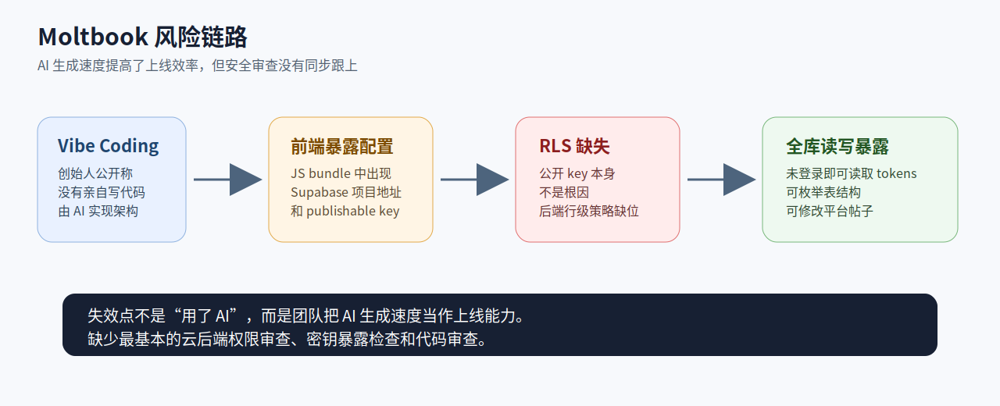
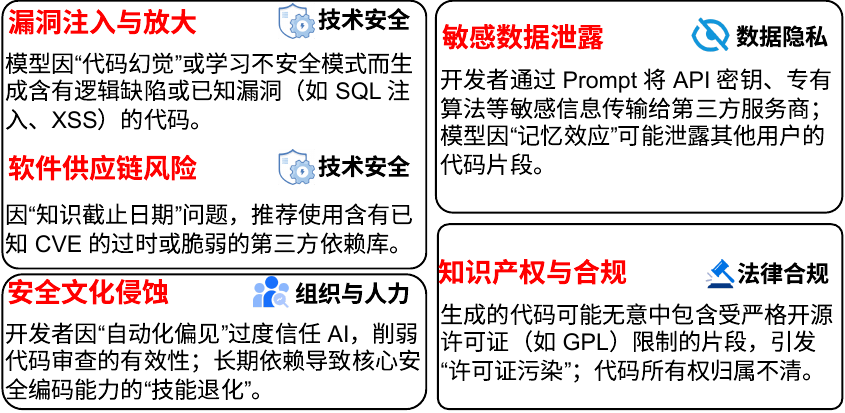
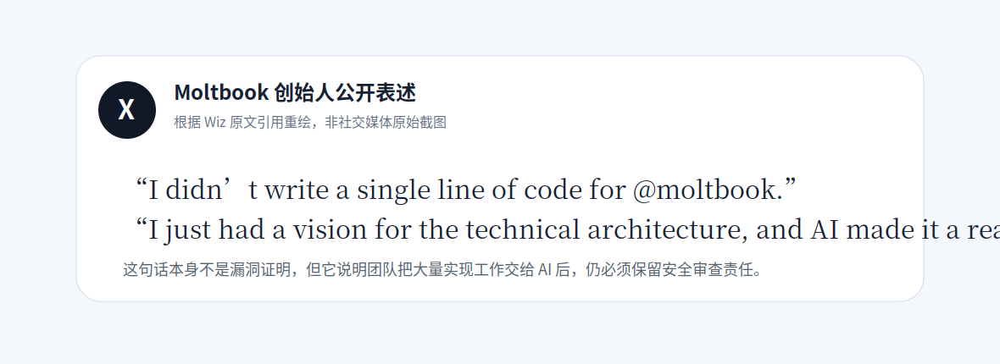
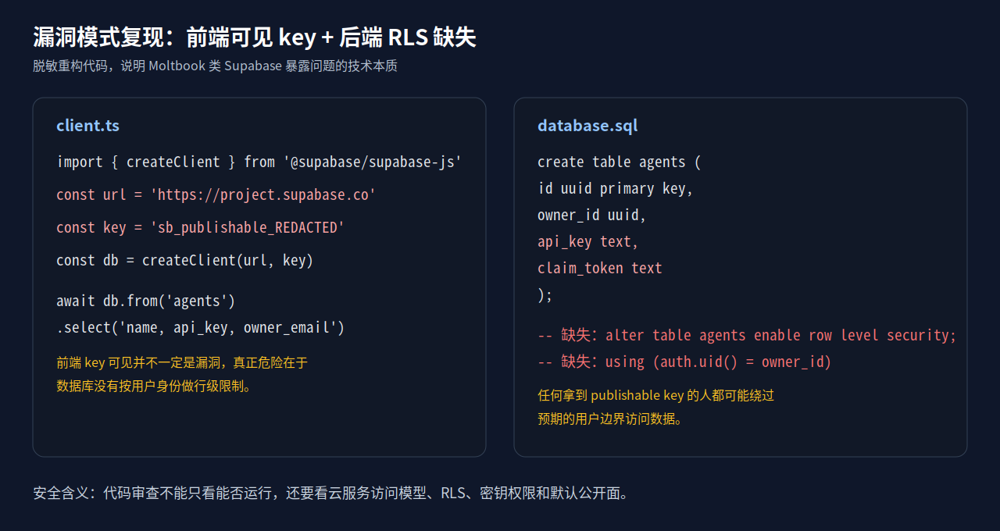
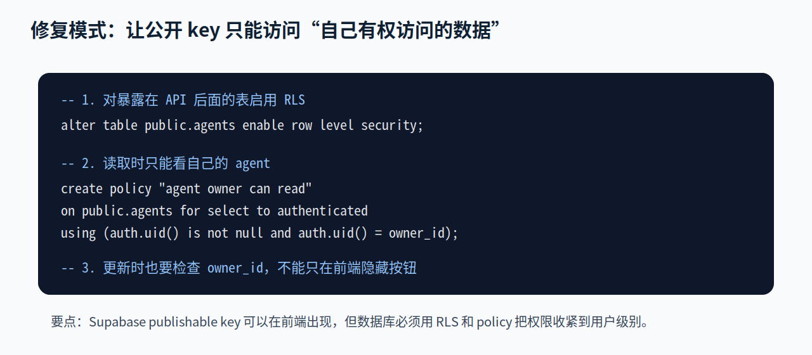
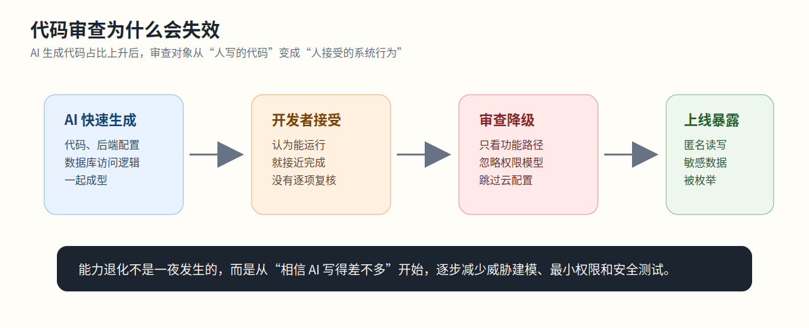
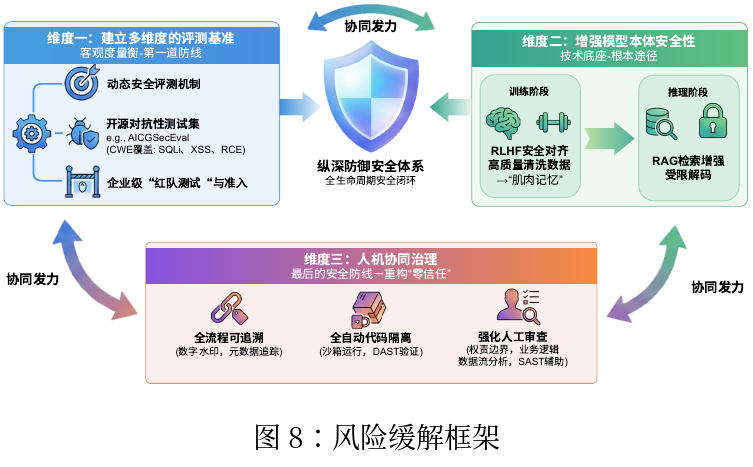

# Moltbook “vibe coding” 数据库暴露案例分析

本文选取 2026 年 Wiz Research 披露的 Moltbook 数据库暴露事件，作为“安全文化与开发者能力退化”方向的行业案例。该事件的关键在于团队把 AI 生成速度当成上线能力，却没有同步完成云后端权限审查、敏感字段隔离和代码审查。



## 1. 案例摘要

| 项目     | 内容                                                                            |
| -------- | ------------------------------------------------------------------------------- |
| 案例类型 | 过度依赖 AI 代码生成导致的安全审查失效                                          |
| 匹配方向 | 安全文化侵蚀、自动化偏见、开发者安全能力退化、代码审查形式化                    |
| 涉及系统 | Moltbook，面向 AI agent 的目录与评测平台                                        |
| 核心问题 | 前端可见 Supabase 配置，后端缺少有效 Row Level Security，导致未授权读写         |
| 公开影响 | Wiz 称可访问超过 1.5 million API tokens、约 35,000 用户邮箱、平台帖子和内部配置 |
| 处置情况 | Wiz 负责任披露后，Moltbook 约一小时内修复                                       |
| 证据边界 | 公开资料能证明暴露面和可行攻击路径，不能证明披露前已有攻击者实际滥用            |

一句话概括：**AI 生成代码让系统更快成型，但没有替团队完成权限模型设计；代码能运行，不等于可以安全上线。**

## 2. 与团队技术报告的对应关系

团队技术报告第 3 章把 AI 生成代码风险分成技术安全、数据隐私、法律合规、组织与人力四类。其中“安全文化侵蚀”明确提到：开发者因自动化偏见过度信任 AI，削弱代码审查的有效性；长期依赖会导致核心安全编码能力退化。



Moltbook 案例主要对应“安全文化侵蚀”，同时牵连“漏洞注入与放大”和“敏感数据泄露”。它不是单个代码缺陷，而是一个完整失效过程：AI 快速生成系统，开发者接受结果，审查没有覆盖云数据库权限，最终导致敏感数据暴露。

## 3. 事件事实

Moltbook 创始人曾在 X 上公开表达：自己没有亲自写代码，只提出技术架构设想，AI 将其实现。Wiz 原文引用了这一表述，用来说明该平台具有明显的 “vibe coding” 特征。



Wiz 研究人员分析 Moltbook 前端 JavaScript 后，发现其中包含 Supabase 后端地址和 publishable key。这个发现本身不必然构成漏洞，因为 Supabase 客户端 key 设计上可以出现在浏览器端。

真正的问题在后端：研究人员使用这些前端可见配置访问 Supabase 后，发现数据库没有通过 RLS 将访问范围限制在当前用户权限内。结果是，外部人员可以构造请求读取本不应公开的数据，甚至修改平台帖子。

Wiz 披露的可访问内容包括：

- 超过 1.5 million API tokens
- 约 35,000 用户邮箱
- AI agent claim tokens
- Agent 定义、项目元数据和平台配置
- 用户帖子与评论内容

## 4. 漏洞剖析

很多人会把这个问题简单理解为“前端 key 泄露”。这个说法不准确。Supabase 的 publishable key 或 anon key 可以放在前端，前提是数据库层启用了正确的 Row Level Security 和访问策略。

Moltbook 类问题可以拆成三步：

1. 前端 bundle 暴露 Supabase URL 和 publishable key。
2. 外部人员用这些信息直接请求 Supabase API。
3. 数据库缺少有效 RLS，导致匿名或低权限角色可以跨用户读写数据。



下面是脱敏复现代码，用来说明技术本质。它不是 Moltbook 的真实源码。

```ts
import { createClient } from "@supabase/supabase-js";

const supabaseUrl = "https://project.supabase.co";
const publishableKey = "sb_publishable_REDACTED";

const db = createClient(supabaseUrl, publishableKey);

// 如果后端没有 RLS，攻击者可以枚举敏感表
const { data } = await db
  .from("agents")
  .select("name, owner_email, api_key, claim_token");
```

对应的危险数据库状态如下：

```sql
create table public.agents (
  id uuid primary key,
  owner_id uuid,
  name text,
  owner_email text,
  api_key text,
  claim_token text
);

-- 危险点：没有启用 RLS
-- alter table public.agents enable row level security;

-- 危险点：没有限制用户只能读取自己的行
-- using (auth.uid() = owner_id)
```

审查时真正该问的问题不是“前端代码能不能运行”，而是：

- `agents` 表是否启用了 RLS？
- `api_key`、`claim_token` 是否允许从前端读取？
- 匿名角色是否能访问这张表？
- 更新、删除和插入是否也受策略限制？

## 5. 修复思路

修复不是把 key 混淆到前端代码里。浏览器端请求无法真正隐藏。正确做法是把敏感访问放回服务端，或者在数据库层严格启用 RLS。



基本修复示例如下：

```sql
alter table public.agents enable row level security;

create policy "agent owner can read"
on public.agents
for select
to authenticated
using (
  auth.uid() is not null
  and auth.uid() = owner_id
);

create policy "agent owner can update"
on public.agents
for update
to authenticated
using (auth.uid() = owner_id)
with check (auth.uid() = owner_id);
```

同时，应将 `api_key`、`claim_token` 等字段从前端列表接口中移出。列表接口只返回 agent 名称、描述、公开评分等低敏字段。敏感字段应由服务端 API 读取，并由服务端完成身份校验、权限判断和审计记录。

## 6. 安全文化失效点



Moltbook 暴露出的不是单一技术失误，而是开发流程中的安全责任弱化。

**自动化偏见。** 开发者容易认为 AI 生成的架构和代码已经足够合理，只需要做功能修补。Wiz 引用的创始人公开表述显示，AI 在实现层面承担了很大比例的工作，但安全责任仍然必须由人承担。

**安全编码能力被旁路。** Supabase、Firebase、BaaS 等平台降低了后端开发门槛，也放大了误配风险。RLS、最小权限、服务端代理、敏感字段隔离是基本安全能力。如果团队长期依赖 AI 拼接功能，却不训练这些能力，最后能做出界面，但守不住数据。

**代码审查流于形式。** 审查者如果只看页面是否能展示 agent 列表，就会漏掉权限模型。对 AI 生成代码的审查，应重点检查数据流、权限流、敏感字段和云配置，而不是只看 diff。

**上线速度压过威胁建模。** Vibe coding 的优势是快，但安全边界设计不能靠速度解决。数据库表、访问角色、公开字段、管理接口、日志和密钥轮换，都需要上线前单独检查。

## 7. 可能后果

根据 Wiz 披露的数据类型，该漏洞可能带来四类后果。

- 用户隐私暴露：邮箱地址和平台行为数据可用于钓鱼、社工或用户画像。
- Agent 控制权风险：API tokens 和 claim tokens 如果可用，攻击者可能冒充或接管平台中的 AI agent。
- 内容完整性破坏：研究人员能够修改平台帖子，说明攻击者也可能发布虚假内容、替换链接或植入恶意提示。
- 供应链扩散：Moltbook 面向 AI agent 生态，篡改 agent 信息可能影响下游用户和第三方服务。

公开资料没有证明这些后果已经发生。本文讨论的是暴露面和可行攻击路径，不将研究发现夸大为已确认的大规模入侵。

## 8. 治理建议

团队报告第 6 章强调三条治理路线：建立多维度评测基准，增强模型本体安全性，强化人机协同治理。



结合 Moltbook 案例，可落到以下治理动作。

**第一，把 AI 生成代码当作未审查代码。** 不能因为它来自工具，就降低审查标准。

**第二，建立云后端上线清单。** Supabase、Firebase、Appwrite、Hasura 等平台都应检查公开 key、匿名角色、RLS、Storage policy、管理 API 和服务端密钥。

**第三，在 CI 中设置阻断项。** 公开 schema 下表未启用 RLS、敏感字段可被匿名查询、前端 bundle 包含服务端密钥、生产环境允许宽松 CORS，都应阻断发布。

**第四，保留人工安全审查。** AI 生成代码比例越高，越需要人检查系统性假设。审查者不能只看 diff，还要看数据流、权限流和云资源配置。

**第五，开展面向 AI 编码的安全训练。** 培训重点不应只是不泄露 prompt，还应包括最小权限、secret 管理、RLS、OAuth 回调、WebHook 校验、依赖验证和日志脱敏。

**第六，建立 AI 代码使用留痕。** PR 模板中应说明是否使用 AI 生成代码，是否人工审查过鉴权、敏感字段和云配置。

## 9. 行业研究支撑

Stanford 等研究者在《Do Users Write More Insecure Code with AI Assistants?》中发现，使用 AI 助手的参与者更容易写出不安全代码，而且更容易认为自己的答案是安全的。这与 Moltbook 案例中的自动化偏见相吻合。

Hammond Pearce 等人在《Asleep at the Keyboard?》中评估 GitHub Copilot 生成代码的安全性，发现 Copilot 在多个安全任务中会生成存在漏洞的建议。这说明 AI 代码建议不能被当作可信安全基线。

Veracode 在 2025 GenAI Code Security Report 中测试多个大模型生成的代码，报告称相当比例的 AI 生成代码存在常见安全缺陷。行业数据和 Moltbook 案例共同说明，AI 生成代码进入工程流程后，必须配套审查、扫描和发布控制。

## 10. 可直接用于报告正文的短段落

Moltbook 案例显示，AI 生成代码带来的组织风险不只表现为单个漏洞，而是会改变团队对安全责任的理解。Wiz 披露该平台由 AI 快速实现后，研究人员在前端代码中发现 Supabase 访问配置，并进一步确认后端缺少有效的行级安全策略，导致用户邮箱、AI agent API tokens 和平台内容存在未授权访问风险。该事件说明，当开发者过度相信 AI 生成结果，并将“功能可运行”视为上线标准时，最小权限、数据库访问控制和代码审查等基础安全环节会被弱化。团队技术报告中提到的“自动化偏见”和“安全编码能力退化”在该案例中具有直接体现。

## 11. 参考资料

### 案例与厂商文档

- Wiz Research, [Exposed Moltbook Database Reveals Millions of API Keys](https://www.wiz.io/blog/exposed-moltbook-database-reveals-millions-of-api-keys)
- Supabase Docs, [Row Level Security](https://supabase.com/docs/guides/database/postgres/row-level-security)
- Supabase Docs, [API Keys](https://supabase.com/docs/guides/getting-started/api-keys)

### 研究与行业资料

- Neil Perry, Megha Srivastava, Deepak Kumar, Dan Boneh, [Do Users Write More Insecure Code with AI Assistants?](https://arxiv.org/abs/2211.03622)
- Hammond Pearce et al., [Asleep at the Keyboard? Assessing the Security of GitHub Copilot&#39;s Code Contributions](https://arxiv.org/abs/2108.09293)
- Veracode, [2025 GenAI Code Security Report](https://www.veracode.com/wp-content/uploads/2025_GenAI_Code_Security_Report_Final.pdf)

### 团队技术报告

- `/root/LLK/代码生成案例报告/AI_GenCode_Technical_Capability_Report_CN.pdf`
- 重点呼应：第 3 章“AI 生成代码的风险与挑战”，第 6 章“风险缓解建议”
