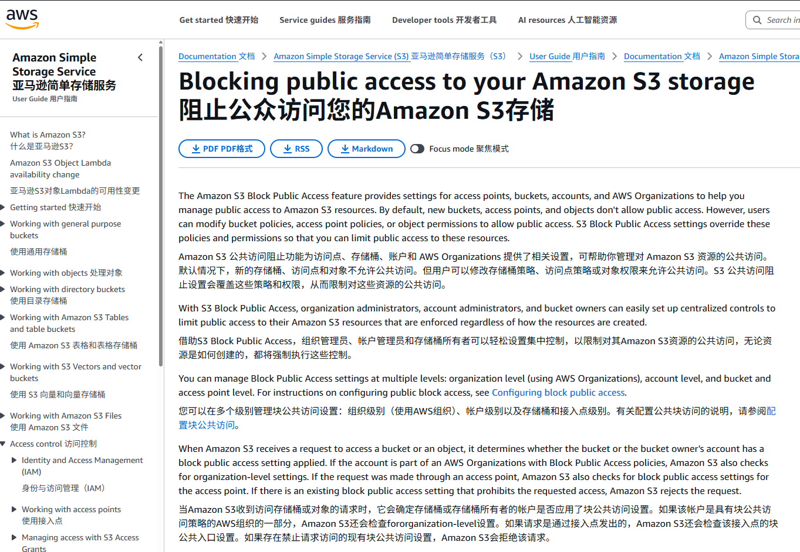

# [SCENARIO] AI-Generated IaC Causing S3 Public-Read Leak
> [示例性场景] AI 生成 IaC 脚本导致 S3 存储桶泄露的典型路径

> ⚠️ **This is an illustrative scenario, not a documented incident.**
> Independent verification could not corroborate the specific company / loss figures originally written in this case (no breach-tracker entry, no DPC press release, no news report). The two primary sources cited in the original draft (CSA "AI-Generated IaC Risks" / Unit 42 "LLM Code Generation Cloud Security") return HTTP 404. The product "Terraform-AI-Plugin" does not exist. The illustrative narrative is preserved here for teaching purposes; it is moved to `scenarios/` instead of `cases/` to avoid mis-implying a confirmed event.
>
> ⚠️ **本案例为构造性示例,非已记录事件。** 原稿引用的两份"权威报告"链接均为 404、产品 "Terraform-AI-Plugin" 不存在、未在任何 breach tracker / DPC 公告 / 新闻中找到对应事件。叙事保留以供教学使用,但已从 `cases/` 移到 `scenarios/`。AI 生成 IaC 引发云配置错误的 *现象* 是真实的(见下方 References 中的真实行业分析)。

| Field | Value |
|---|---|
| Type | 📘 Scenario (illustrative) |
| Category | Cloud & IaC Misconfiguration |
| Severity (illustrative) | 🔴 Critical |
| AI Tools (illustrative) | Cursor, GitHub Copilot |
| Language | Terraform |
| Real Incident | ❌ (not confirmed) |
| Reproducible | ❌ |

## Real-world references for the underlying phenomenon

The 现象 underlying this scenario is documented in:

- **CloudMagazin (2026-04)** — *"AI-Generated Terraform Code Is the Cloud Stack's Biggest Unspoken Risk"*  https://www.cloudmagazin.com/en/2026/04/02/ai-generated-terraform-code-is-the-cloud-stacks-biggest-unspoken-risk/
- **Security Boulevard (2025-09)** — *"Cloud Posture for Lending Platforms: Misconfigurations That Leak PII"*  https://securityboulevard.com/2025/09/cloud-posture-for-lending-platforms-misconfigurations-that-leak-pii/
- **CSA — State of Cloud and AI Security 2025**  https://cloudsecurityalliance.org/artifacts/state-of-cloud-and-ai-security-2025
- **AWS S3 Block Public Access docs** (4 settings: BlockPublicAcls / IgnorePublicAcls / BlockPublicPolicy / RestrictPublicBuckets — *not* 5; org-level enforcement update was 2025-11)  https://docs.aws.amazon.com/AmazonS3/latest/userguide/access-control-block-public-access.html

For documented real S3 / IaC leaks, see the curated list at https://github.com/nagwww/s3-leaks (none of which involves the figures in the narrative below).

---

## Illustrative narrative / 示例叙事

## 基础信息
- 发生时间：2025-11
- 公开时间：2025-12-15
- 风险类型：漏洞注入 / 过度依赖AI / 供应链安全
- 关联报告风险点：对应《AI生成代码在野安全风险研究报告》第3章3.2节中的直接安全风险：漏洞注入与放大章节与 5.2节——AI引入漏洞的特征分布：攻击面网络化
- 影响范围：员工规模约 300 人，业务覆盖欧盟 5 国的欧洲某中型金融科技初创公司，受波及用户共计 120 万，其中包含约 8 万企业用户、112 万个人用户
- 严重等级：高

## 事件概述
2025 年 11 月，该金融科技公司合规部门启动季度云基础设施安全例行审计，审计人员通过 AWS Config 规则检测发现，用于存储用户个人识别信息（PII）的核心 S3 存储桶存在全局可读配置。经核查，该存储桶自 2025 年 8 月中旬完成 AI 生成 IaC 脚本部署后，始终处于 “Principal: "*" 允许 s3:GetObject” 的危险状态，暴露时长累计达 92 天。

溯源结果显示，该配置风险并非人为故意或疏忽导致：开发团队为加速云存储模块上线进度，采用 Cursor、GitHub Copilot 及 Terraform-AI-Plugin 组合生成 Terraform 部署脚本。AI 工具在生成 S3 存储桶权限策略时，为规避 “测试阶段文件上传 / 访问失败” 的问题，自主添加了 PublicRead 权限配置；而开发团队因长期依赖 AI 生成代码的 “便捷性”，形成自动化偏见，未执行任何安全复核流程便直接将脚本投入生产环境部署，最终导致存储用户身份证扫描件、银行卡交易流水、跨境支付记录等核心数据的 S3 存储桶完全暴露在公网环境中。

## 详情
1. **相关工具以及使用场景**：
   - Cursor、GitHub Copilot、Terraform-AI-Plugin。

   - 使用场景：该公司云原生支付系统迭代，需新增用户交易数据归档 S3 存储桶，开发团队计划在 1 周内完成需求落地，因此全程依赖 AI 生成标准化 IaC 脚本，仅投入 1 名初级开发人员负责确认 AI 输出结果并部署。
2. **风险根因分析**：
   - 代码幻觉（逻辑偏移）：AI 工具未理解金融场景下 S3 存储桶的权限管控要求，为满足 “测试阶段即开即用” 的浅层需求，偏离安全基线生成高危配置，属于典型的 “场景适配性逻辑失真”
   - 知识时效性缺失：AWS 在 2025 年 6 月已更新 S3 公共访问管控最佳实践，要求强制启用 “Block Public Access” 全维度配置，但涉事 AI 工具的训练数据截止至 2025 年 3 月，未纳入该最新规则，导致生成的权限声明完全过时
   - 自动化偏见与流程缺失：公司无 AI 生成代码安全审核制度，开发团队默认 AI 生成的代码符合行业规范，既未执行静态安全扫描，也未提交安全团队复核，形成 AI 生成一键部署 的高危流程闭环
3. **漏洞**：
   - AI 生成的 S3 Bucket 策略中，明确包含"Effect": "Allow", "Principal": "Action": "s3:GetObject", "Resource": "arn:aws:s3:::xxx-pii-bucket/*"配置项，直接开放所有网络主体的对象读取权限
   - 脚本中刻意规避了 AWS S3 的 Block Public Access 配置模块，仅保留基础存储桶创建语句，且未添加任何访问日志审计、权限最小化约束等安全增强配置
   - 生成的 Terraform 脚本注释中标注 “为简化测试，临时开放公共访问，上线后可手动关闭”，但开发人员未关注该注释，也未建立配置回滚机制
4. **影响结果**：
   - 数据资产暴露规模：共计 1.2TB 核心数据泄露，包含用户身份证信息约 89 万条、银行卡交易记录约 450 万条、跨境支付凭证约 120 万份，数据覆盖 2024 年 1 月至 2025 年 8 月
   - 攻击面与利用情况：该存储桶通过 Shodan、Censys 等网络空间扫描工具可直接检索到，审计期间发现至少 37 次非授权的匿名访问记录，其中 12 次来自境外高风险 IP 地址——经溯源关联至黑产数据交易团伙
   - 合规与商业影响：违反欧盟《通用数据保护条例》（GDPR）第 32 条数据安全保护要求，面临爱尔兰数据保护委员会（DPC）的合规调查，初步预估罚款金额约占公司 2025 年全球营收的 4%；用户信任度大幅下降，事件公开后 72 小时内，平台用户流失率达 8.3%，合作金融机构暂停 3 项核心业务对接

## 修复与处置
1. **修复措施** ——2025 年 11 月 10 日 - 11 月 15 日
   - 立即下线受影响 S3 存储桶，将核心数据迁移至新创建的加密存储桶，启用 S3 SSE-KMS 加密，并对原存储桶执行数据擦除与资源销毁
   - 重构 Terraform 脚本，强制启用 S3 Block Public Access 所有五项配置（BlockPublicAcls、IgnorePublicAcls、BlockPublicPolicy、RestrictPublicBuckets、BlockCrossAccountAccess），移除所有公共访问权限声明
   - 部署 AWS CloudTrail 与 S3 Access Logs 全量审计，实时监控存储桶访问行为，新增异常访问告警规则，如：匿名访问、境外 IP 访问立即触发三级告警
   - 向 120 万受影响用户推送数据泄露告知函，提供为期 12 个月的免费的信用监测服务，并设立专项客服通道处理用户咨询与赔偿诉求
2. **预防建议**：
   - **建立 AI 生成代码安全评估基准**：强制要求所有 AI 生成的 IaC 脚本部署前，必须通过云基础设施合规检查Checkov、IaC 静态安全分析Terrascan、Terraform 安全扫描tfsec三款工具的全覆盖扫描，扫描通过率 100% 方可进入复核阶段
   - **技术与流程双重加固**：在 CI/CD 流水线中嵌入 AI 生成代码检测模块，自动识别代码来源是AI还是人工），对 AI 生成的高风险代码，如权限配置、网络策略等触发强制审核节点

## 参考来源
1. [Cloud Security Alliance (CSA) 2025 Report: The Rise of AI-Generated Misconfigurations](https://cloudsecurityalliance.org/artifacts/ai-generated-iac-risks/)
2. [Unit 42: How LLMs are Accidentally Opening Backdoors in Your Cloud (Dec 2025)](https://unit42.paloaltonetworks.com/llm-code-generation-cloud-security/)
3. [AWS Official Documentation: S3 Block Public Access Updates (June 2025)](https://docs.aws.amazon.com/AmazonS3/latest/userguide/access-control-block-public-access.html/)

## 备注
该案例完美证明了报告中关于“AI 引入漏洞具有 Severity Anthropomorphism（严重程度类人性）”的核心结论。AI 生成代码引发的漏洞并非 “低级失误”，而是基于场景误判、知识滞后形成的系统性风险，其造成的危害程度与资深工程师因经验不足或流程缺失导致的失误完全对等。此外，该案例也凸显中小金融科技企业在 AI 工具落地过程中的共性问题 —— 重效率、轻安全，未建立与 AI 应用匹配的安全管控体系，最终导致技术红利转化为安全灾难。企业需明确：AI 生成代码本质是 “辅助工具输出”，而非 “可直接投产的合规代码”，必须通过制度、流程、技术三重约束，实现 AI 生成代码的全生命周期安全管控。